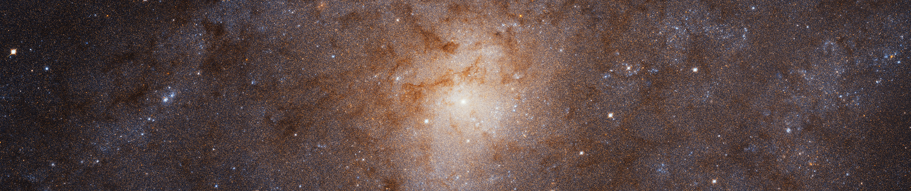
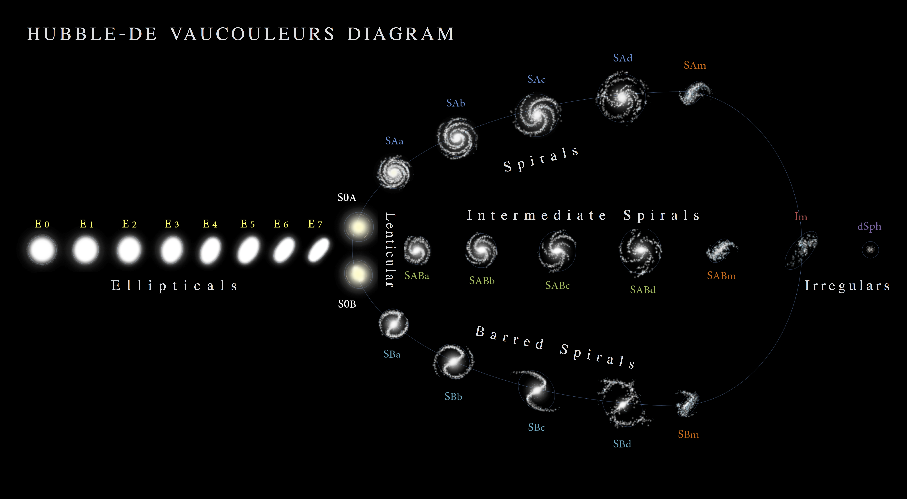
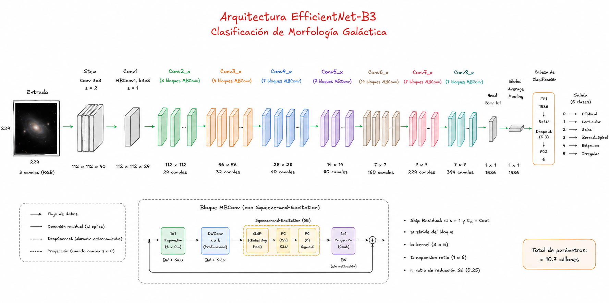
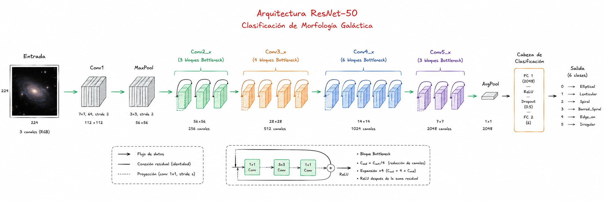
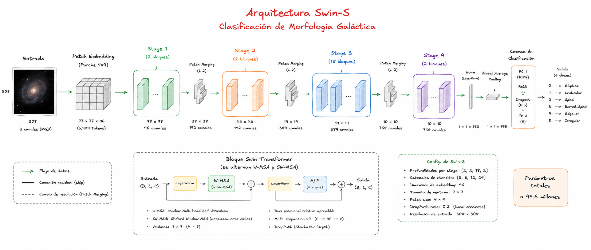
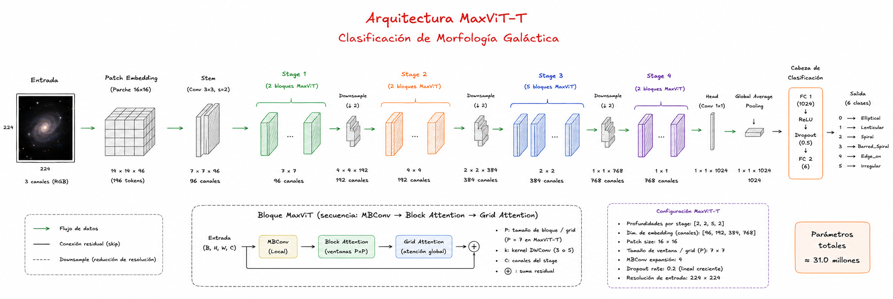

# GalaxyMorph ML

**Analisis y clasificacion de la morfologia galactica utilizando tecnicas de aprendizaje profundo basadas en redes neuronales convolucionales**

---



---

## Tabla de contenidos

1. [Contexto del proyecto](#1-contexto-del-proyecto)
2. [Problematica](#2-problematica)
3. [Fundamento cientifico](#3-fundamento-cientifico)
4. [Objetivos](#4-objetivos)
5. [Requisitos del sistema](#5-requisitos-del-sistema)
6. [Que resolvemos](#6-que-resolvemos)
7. [Dataset](#7-dataset)
8. [Pipeline de notebooks](#8-pipeline-de-notebooks)
9. [Modelos y arquitecturas](#9-modelos-y-arquitecturas)
10. [Resultados comparativos](#10-resultados-comparativos)
11. [Estructura del proyecto](#11-estructura-del-proyecto)
12. [Instalacion y uso](#12-instalacion-y-uso)
13. [Requisitos de hardware](#13-requisitos-de-hardware)
14. [Referencias](#14-referencias)

---

## 1. Contexto del proyecto

La clasificacion morfologica de galaxias es la piedra angular de la astrofisica extragalactica y la cosmologia observacional moderna. La morfologia de una galaxia no es una caracteristica arbitraria: codifica informacion fisica vital sobre su historia de formacion, la dinamica orbital de sus poblaciones estelares, el contenido de gas interestelar y la evolucion estructural del universo a lo largo del tiempo cosmico. Comprender si una galaxia exhibe brazos espirales ricos en gas donde nacen estrellas jovenes, o si es un elisoide dominado por poblaciones estelares antiguas, permite reconstruir directamente el historial de fusiones, la distribucion de materia oscura y las tasas de formacion estelar a distintos corrimientos al rojo.



La sistematizacion de las formas galacticas tiene una historia de mas de un siglo. En 1926, Edwin Hubble introdujo el primer esquema clasificatorio formal, conocido como el "Diapason de Hubble", dividiendo las galaxias en elipticas, espirales e irregulares. Gerhard de Vaucouleurs (1959) extendio este modelo asignando un indice numerico continuo (tipo T) que abarca desde galaxias elipticas compactas hasta irregulares, e incorporo subtipos para espirales barradas y estructuras en anillo. Allan Sandage reconocio formalmente las galaxias lenticulares (S0) como clase de transicion. Esta evolucion del esquema taxonomico refleja la naturaleza intrinsecamente continua de la morfologia galactica: las fronteras entre categorias no son discretas sino graduales, lo que convierte la clasificacion en un problema estadisticamente complejo.

Con la llegada de los grandes relevamientos digitales, el volumen de imagenes galacticas ha crecido de forma exponencial. El telescopio espacial Euclid, lanzado en 2023, fotografio 1.2 millones de galaxias en su primer ano de operaciones; en una sola liberacion anticipada de datos presento 380,000 galaxias capturadas en apenas 63 grados cuadrados del cielo. El Observatorio Vera C. Rubin (LSST) producira 10 terabytes de datos crudos cada noche, generara 10 millones de alertas transitorias diarias y consolidara, a lo largo de sus 10 años de operacion, una base de datos de 15 petabytes con 20,000 millones de galaxias catalogadas. A esta escala, la clasificacion visual humana es matematicamente inviable.

---

## 2. Problematica

### 2.1. El cuello de botella clasificatorio

La astrofisica profesional es una disciplina academica con un pool de talento muy reducido en comparacion con la escala del cosmos que pretende analizar. La Union Astronomica Internacional registra aproximadamente 200,000 investigadores activos en todo el mundo. El proyecto Galaxy Zoo demostro empiricamente el limite de la fuerza bruta humana: 80,000 voluntarios necesitaron tres años de esfuerzo colaborativo continuo para obtener clasificaciones morfologicas estadisticamente confiables de apenas 300,000 galaxias. Al ritmo de Galaxy Zoo, clasificar los catalogos del LSST tomaria decenas de miles de años.

Si el LSST arrojara 20,000 millones de galaxias, cada uno de los 200,000 astronomos del planeta tendria que clasificar manualmente 100,000 imagenes. Incluso dedicando 24 horas al dia sin descanso, el tiempo requerido superaria con creces la duracion de la carrera academica de cualquier individuo.

### 2.2. Desafios tecnicos de la clasificacion automatica

La clasificacion automatica de morfologia galactica presenta desafios especificos que la distinguen de la clasificacion de imagenes naturales convencional:

**Desbalance de clases severo.** La distribucion de morfologias en el universo no es uniforme. Las galaxias elipticas y espirales son significativamente mas frecuentes que las lenticulares o irregulares. En el dataset de este proyecto, la clase minoritaria (Irregular) tiene 4.2x menos representacion que las clases mayoritarias, sesgando los clasificadores hacia las clases dominantes si no se aplica correccion.

**Ambiguedad en la frontera E/S0.** La transicion entre galaxias elipticas (E) y lenticulares (S0) es intrinsecamente continua. Incluso clasificadores humaños entrenados presentan desacuerdo en esta frontera, especialmente a inclinaciones intermedias y en imagenes de baja relacion senal-ruido. Esta ambiguedad es un limite fisico del problema, no un defecto del metodo de clasificacion.

**Sesgo por corrimiento al rojo (redshift).** Las galaxias mas lejanas se ven inherentemente mas pequenas y tenues, provocando que los voluntarios pasen por alto caracteristicas finas (como brazos espirales delgados) y las clasifiquen erroneamente como esferas difusas. El catalogo de Hart et al. (2016) corrige este sesgo matematicamente mediante fracciones de voto debiased, simulando como habrian votado los humaños si todas las galaxias estuvieran a una distancia ideal.

**Invariancia a la orientacion y escala.** Las galaxias no tienen orientacion canonica: una espiral puede aparecer inclinada en cualquier angulo. Las estructuras relevantes (brazos, barra, bulbo) deben reconocerse independientemente de la posicion y escala en la imagen. La orientacion afecta adicionalmente la interpretacion: una galaxia espiral vista de canto es indistinguible morfologicamente de una lenticular sin informacion espectroscopica complementaria.

**Gradiente de dificultad morfologica.** Clases como Edge_on tienen un sello visual inequivoco (disco fino, banda oscura central) y son faciles de clasificar con alta precision. Otras como Lenticular o Irregular requieren capturar caracteristicas de escala global (ausencia de brazos, textura irregular, asimetria) que son inherentemente mas dificiles de codificar.

---

## 3. Fundamento cientifico

El esquema de clasificacion empleado en este proyecto sigue la secuencia de Hubble-de Vaucouleurs, con seis categorias derivadas del arbol de decision morfologico de Galaxy Zoo 2:

| Indice | Clase         | Descripcion morfologica                                                                                                                                                         |
| ------ | ------------- | ------------------------------------------------------------------------------------------------------------------------------------------------------------------------------- |
| 0      | Elliptical    | Perfil de brillo suave tipo de Vaucouleurs (n~4), sin estructura de disco, sin brazos ni barra. Rotacion dominada por dispersion de velocidades. Poblaciones estelares antiguas |
| 1      | Lenticular    | Disco con abultamiento central (bulbo), sin brazos espirales detectables. Transicion dinamica entre elipticas y espirales. Poco gas interestelar                                |
| 2      | Spiral        | Brazos espirales bien definidos con formacion estelar activa, disco dominante, sin barra central evidente                                                                       |
| 3      | Barred_Spiral | Estructura de barra central con brazos espirales que emergen de sus extremos. La barra es una concentracion lineal de estrellas que atraviesa el nucleo                         |
| 4      | Edge_on       | Galaxia de disco vista de canto (~90 grados de inclinacion). El disco delgado y el abultamiento central son visibles, pero la presencia o ausencia de brazos no es distinguible |
| 5      | Irregular     | Morfologia perturbada, asimetrica o en interaccion. No encaja en ninguna categoria del diagrama de Hubble. Frecuentemente resultado de fusiones o mareas gravitacionales        |

Las etiquetas se derivan aplicando el arbol de decision jerarquico de Galaxy Zoo 2 con un umbral de confianza de 0.6 sobre las fracciones de voto debiased (Hart et al., 2016). Una galaxia recibe una etiqueta morfologica unicamente si al menos el 60% de los voluntarios respondieron coherentemente en la misma direccion del arbol de decision. Las galaxias con votos repartidos difusamente entre multiples opciones se excluyen del conjunto final como casos de ambiguedad intrinseca.

---

## 4. Objetivos

### 4.1. Objetivo general

Disenar e implementar un sistema de clasificacion automatica de morfologia galactica basado en redes neuronales convolucionales (CNN) y Vision Transformers, capaz de procesar de forma masiva y reproducible los catalogos astronomicos modernos con una precision comparable al consenso humano experto, evaluando y comparando multiples arquitecturas de aprendizaje profundo bajo condiciones identicas de entrenamiento y evaluacion.

### 4.2. Objetivos especificos

**Construccion y curacion del dataset.** Consolidar un dataset astronomico etiquetado y balanceado a partir del catalogo Galaxy Zoo 2, aplicando umbralización de confianza (theta >= 0.6), correccion del sesgo por redshift y particion estratificada en subconjuntos de entrenamiento, validacion y prueba.

**Diseno del pipeline de preprocesamiento.** Desarrollar un flujo de normalizacion de imagenes que corrija ruido luminico, artefactos instrumentales y desequilibrio de clases, garantizando la calidad y reproducibilidad de los datos de entrada al modelo.

**Implementacion de arquitecturas de aprendizaje profundo.** Implementar, configurar y entrenar cuatro arquitecturas (EfficientNet-B3, ResNet-50, Swin-S y MaxViT-T) adaptadas a la clasificacion de imagenes astronomicas, con tecnicas de aumento de datos y fine-tuning diferencial desde pesos preentrenados en ImageNet.

**Evaluacion y validacion comparativa.** Comparar el rendimiento de las arquitecturas implementadas mediante metricas de clasificacion (F1-macro, precision y recall por clase), determinando el modelo con mayor capacidad de generalizacion ante datos no vistos y analizando la relacion entre rendimiento y costo computacional.

---

## 5. Requisitos del sistema

### 5.1. Requisitos funcionales

| ID    | Requisito                                                                                                                                        |
| ----- | ------------------------------------------------------------------------------------------------------------------------------------------------ |
| RF-01 | El sistema debe aceptar como entrada imagenes JPEG de galaxias de 424x424 pixeles                                                                |
| RF-02 | El sistema debe clasificar cada imagen en una de seis categorias morfologicas: Elliptical, Lenticular, Spiral, Barred_Spiral, Edge_on, Irregular |
| RF-03 | El sistema debe generar una probabilidad de pertenencia por clase para cada imagen analizada (vector de logits softmax)                          |
| RF-04 | El sistema debe poder procesar multiples imagenes en modo batch para inferencia eficiente                                                        |
| RF-05 | El sistema debe producir reportes de metricas de evaluacion: F1-macro, matriz de confusion, precision y recall por clase                         |

### 5.2. Requisitos no funcionales

| ID     | Categoria        | Requisito                                                                                                          |
| ------ | ---------------- | ------------------------------------------------------------------------------------------------------------------ |
| RNF-01 | Precision        | El modelo debe alcanzar un F1-macro >= 0.75 sobre el conjunto de prueba                                            |
| RNF-02 | Escalabilidad    | El sistema debe ser capaz de procesar al menos una imagen por segundo en fase de inferencia sobre hardware con GPU |
| RNF-03 | Reproducibilidad | El pipeline de preprocesamiento y particion del dataset debe ser completamente determinista (semilla fija)         |
| RNF-04 | Trazabilidad     | Cada muestra debe ser identificable hasta su fuente original mediante el identificador SDSS (dr7objid)             |

### 5.3. Requisitos de datos

| ID    | Requisito                                                                                                             |
| ----- | --------------------------------------------------------------------------------------------------------------------- |
| RD-01 | Dataset fuente: Galaxy Zoo 2 (catalogo de Hart et al., 2016), con imagenes del SDSS DR7                               |
| RD-02 | Minimo de muestras por clase segun disponibilidad del catalogo (clase Irregular: ~5,927 muestras)                     |
| RD-03 | Umbral de confianza para etiquetado: >= 60% de consenso entre clasificadores humaños sobre fracciones debiased        |
| RD-04 | Distribucion de particion: 70% entrenamiento / 15% validacion / 15% prueba, con estratificacion por clase morfologica |

---

## 6. Que resolvemos

Este proyecto implementa y evalua un pipeline completo de clasificacion automatica de morfologia galactica con las siguientes contribuciones:

- **Etiquetado sistematico** de 111,129 galaxias del catalogo Galaxy Zoo 2 aplicando el arbol de decision morfologico con umbral de confianza calibrado.
- **Particion estratificada** reproducible del dataset (70/15/15 entrenamiento/validacion/test) preservando la distribucion de clases.
- **Comparativa de cuatro arquitecturas** de distintas familias (CNN eficiente, CNN clasica, Vision Transformer jerarquico, Transformer hibrido CNN-atencion), todas entrenadas bajo identicas condiciones de regularizacion, optimizacion y evaluacion.
- **Infraestructura de entrenamiento reproducible** con AMP (mixed precision), early stopping, checkpointing completo por epoca y reanudacion sin perdida de estado.
- **Evaluacion cuantitativa** sobre test set aislado con F1-macro, accuracy, matrices de confusion por clase y analisis de eficiencia parametros/rendimiento.

---

### Paradigma de aprendizaje seleccionado

El problema se formaliza como aprendizaje supervisado sobre 111,129 pares etiquetados (imagen, etiqueta_morfologica). Este paradigma fue seleccionado despues de descartar las siguientes alternativas:

**IA simbolica / sistemas expertos.** Un sistema basado en reglas explicitas requereria codificar manualmente las condiciones visuales que distinguen cada morfologia. Esto es inviable por tres razones: (1) la ambiguedad intrinseca de los datos (las fracciones de voto son distribuciones continuas, no etiquetas discretas); (2) la explosion combinatoria del espacio de caracteristicas (orientacion, distancia, brillo superficial, artefactos instrumentales, contaminacion de objetos vecinos); (3) la inconsistencia documentada del criterio humano, cuantificada estadisticamente por Willett et al. (2013) y Hart et al. (2016) mediante el sesgo por redshift.

**Aprendizaje no supervisado.** Los metodos de clustering no garantizan que sus agrupaciones correspondan a las categorias del esquema de Hubble-de Vaucouleurs. Sin supervision, el algoritmo podria agrupar por brillo superficial, tamano angular o relacion senal-ruido en lugar de por morfologia intrinseca.

El aprendizaje supervisado con etiquetas derivadas del consenso humano de Galaxy Zoo es la unica estrategia que optimiza directamente la concordancia con el criterio astronomico experto, permite cuantificar el rendimiento mediante metricas establecidas y escala de forma predecible con el volumen de datos.

---

## 7. Dataset

**Galaxy Zoo 2** es un proyecto de ciencia ciudadana que recogio clasificaciones morfologicas detalladas de ~300,000 galaxias del Sloan Digital Sky Survey (SDSS). Las clasificaciones se generaron mediante votacion de voluntarios a traves de 11 preguntas jerarquicas sobre la morfologia de cada objeto. El catalogo publicado por Hart et al. (2016) aplica una correccion del sesgo por corrimiento al rojo, produciendo fracciones de voto debiased que simulan como habrian votado los clasificadores si todas las galaxias estuvieran a una distancia estandar.

| Propiedad                         | Valor                                              |
| --------------------------------- | -------------------------------------------------- |
| Fuente                            | Galaxy Zoo 2 (Hart et al., 2016)                   |
| Catalogo base                     | SDSS DR7                                           |
| Galaxias totales disponibles      | ~243,000 imagenes JPEG (424x424 px, 3 canales RGB) |
| Galaxias etiquetadas (umbral=0.6) | 111,129                                            |
| Clases                            | 6                                                  |
| Particion entrenamiento           | 77,790 (70%)                                       |
| Particion validacion              | 16,670 (15%)                                       |
| Particion test                    | 16,669 (15%)                                       |
| Estratificacion                   | Si, por clase morfologica                          |

### 7.1. Metodologia de etiquetado

Cada galaxia recorre el arbol de decision jerarquico de GZ2. El umbral de confianza theta = 0.6 determina si una fraccion de voto debiased es suficientemente consensuada para propagar la clasificacion al siguiente nivel del arbol. Se aplica el siguiente sistema de prioridad jerarquica:

1. Si la fraccion de voto para "disco" supera theta, la galaxia entra en la rama de espirales o lenticulares.
2. Dentro de la rama de espirales, se determina si existe barra central (Barred_Spiral vs. Spiral).
3. Si la fraccion de voto para "forma redondeada" supera theta sin estructura de disco, la galaxia es clasificada como Elliptical.
4. Las galaxias con inclinacion >60 grados (mayoria de voto para "visto de canto") se asignan a Edge_on independientemente de sus brazos.
5. Irregular se asigna con la prioridad mas baja: galaxias que ninguna otra rama del arbol reclama con confianza suficiente.
6. Las galaxias que no superan theta en ninguna rama del arbol se excluyen como casos de ambiguedad intrinseca.

Para evitar que las clases mas frecuentes dominen el entrenamiento y distorsionen las representaciones aprendidas, se aplica un cap suave de 25,000 muestras por clase. Las clases con mas de 25,000 galaxias disponibles (Elliptical, Spiral, Barred_Spiral) se submuestrean mediante muestreo aleatorio estratificado. El resultado es una razon de desbalance residual de 4.2x entre la clase mayoritaria (25,000) y la clase minoritaria (Irregular, ~5,927), que se gestiona durante el entrenamiento mediante pesos de clase en CrossEntropyLoss.

### 7.2. Distribucion de clases

**Distribucion de clases (conjunto etiquetado, post-cap):**

| Clase         | n       | Fraccion | Peso de clase |
| ------------- | ------- | -------- | ------------- |
| Elliptical    | ~27,800 | 25.0%    | 0.74          |
| Lenticular    | ~18,800 | 16.9%    | 1.09          |
| Spiral        | ~27,700 | 24.9%    | 0.74          |
| Barred_Spiral | ~27,700 | 24.9%    | 0.74          |
| Edge_on       | ~13,900 | 12.5%    | 1.40          |
| Irregular     | ~6,200  | 5.6%     | 3.12          |

Los pesos de clase se calculan como la inversa de la frecuencia normalizada respecto a la clase mas frecuente y se aplican a la funcion de perdida (CrossEntropyLoss) durante el entrenamiento. Se prefirio este enfoque sobre el sobremuestreo sintetico de Irregular porque la clase Irregular es intrinsecamente heterogenea: cualquier muestra artificial generada no representaria la variabilidad real de morfologias perturbadas.

### 7.3. Particion y trazabilidad

La particion 70/15/15 se realiza mediante `train_test_split(stratify=morph_label)` para preservar la distribucion de clases en los tres subconjuntos. Los splits se exportan como `train.csv`, `val.csv` y `test.csv` con las columnas `[dr7objid, asset_id, img_filename, morph_label]`, garantizando la trazabilidad de cada muestra hasta su identificador SDSS original (requisito RNF-04). El conjunto de prueba (test set) se mantiene completamente aislado durante todo el proceso de entrenamiento y validacion; solo se utiliza en la evaluacion final del notebook `09_evaluation.ipynb`.

Los archivos del dataset deben colocarse en `data/` siguiendo la estructura indicada en la seccion de instalacion. Las imagenes no se incluyen en este repositorio por su volumen (~12 GB).

---

## 8. Pipeline de notebooks

El proyecto se organiza como una secuencia de notebooks Jupyter con responsabilidades separadas. Cada notebook es autocontenido y puede ejecutarse de forma independiente si sus dependencias (checkpoints, splits) estan disponibles.

| #   | Notebook                               | Descripcion                                                                                                                                                        | Estado   |
| --- | -------------------------------------- | ------------------------------------------------------------------------------------------------------------------------------------------------------------------ | -------- |
| 01  | `01_eda.ipynb`                         | Analisis exploratorio: inspeccion del catalogo CSV, mapeo de IDs, inventario de imagenes, arbol de decision morfologico, distribucion de clases, muestras visuales | Completo |
| 02  | `02_dataset_preparation.ipynb`         | Etiquetado duro (threshold=0.6), cap por clase, particion 70/15/15 estratificada, exportacion de splits CSV a `data/splits/`                                       | Completo |
| 03  | `03_image_preprocessing.ipynb`         | Definicion de `GalaxyDataset`, pipeline de transforms, DataLoaders, verificacion de pesos de clase                                                                 | Completo |
| 04  | `04_train_efficientnet_b3.ipynb`       | Entrenamiento de EfficientNet-B3 (version Kaggle, 2xT4)                                                                                                            | Completo |
| 04L | `04_train_efficientnet_b3_local.ipynb` | Entrenamiento de EfficientNet-B3 (version local, RTX 5060 Ti)                                                                                                      | Completo |
| 05  | `05_train_resnet50_local.ipynb`        | Entrenamiento de ResNet-50                                                                                                                                         | Completo |
| 06  | `06_train_swins_local.ipynb`           | Entrenamiento de Swin-S                                                                                                                                            | Completo |
| 07  | `07_train_swint_local.ipynb`           | Entrenamiento de Swin-T                                                                                                                                            | Completo |
| 08  | `08_train_maxvit_local.ipynb`          | Entrenamiento de MaxViT-T                                                                                                                                          | Completo |
| 09  | `09_evaluation.ipynb`                  | Evaluacion comparativa de los 4 modelos sobre test set                                                                                                             | Completo |

Todos los notebooks de entrenamiento (04-08) siguen una estructura uniforme de 27 celdas con secciones estandarizadas: instalacion, imports, configuracion, pipeline de datos, definicion de modelo, infraestructura de entrenamiento, reanudacion desde checkpoint, funciones de entrenamiento/validacion, loop de entrenamiento, curvas de aprendizaje, evaluacion final y resumen.

---

## 9. Modelos y arquitecturas

Se entrenaron y compararon cuatro arquitecturas representando distintas familias de modelos para vision por computadora. Todos los modelos parten de pesos preentrenados en ImageNet-1K y se ajustan en dos fases: calentamiento de la cabeza de clasificacion seguido de fine-tuning completo del backbone con learning rate diferencial.

### EfficientNet-B3

EfficientNet (Tan y Le, 2019) introduce el escalado compuesto: profundidad, anchura y resolucion se escalan simultaneamente usando coeficientes derivados mediante NAS. B3 es la tercera variante ($\phi=3$), con ~10.7 M parametros. El bloque fundamental es el MBConv con Squeeze-and-Excitation (SE), que recalibra los canales de forma adaptativa.

**Cabeza personalizada:** `classifier[1] = nn.Linear(1536, 6)`



| Parametro           | Valor                                              |
| ------------------- | -------------------------------------------------- |
| Pesos preentrenados | EfficientNet_B3_Weights.IMAGENET1K_V1              |
| IMAGE_SIZE          | 224 px                                             |
| CROP_SIZE           | 320 px                                             |
| BATCH_SIZE          | 32                                                 |
| Parametros totales  | ~10.7 M                                            |
| Documentacion       | [docs/efficientnet_b3.md](docs/efficientnet_b3.md) |

---

### ResNet-50

ResNet (He et al., 2016) introdujo las conexiones residuales (skip connections), que resuelven la degradacion del gradiente en redes profundas permitiendo aprender el residuo $\mathcal{F}(x) = \mathcal{H}(x) - x$ en lugar de la transformacion completa. ResNet-50 usa bloques Bottleneck de tres convoluciones que reducen el costo computacional a ~23.5 M parametros.

**Cabeza personalizada:** `fc = nn.Linear(2048, 6)`



| Parametro           | Valor                                |
| ------------------- | ------------------------------------ |
| Pesos preentrenados | ResNet50_Weights.IMAGENET1K_V2       |
| IMAGE_SIZE          | 224 px                               |
| CROP_SIZE           | 320 px                               |
| BATCH_SIZE          | 32                                   |
| Parametros totales  | ~23.5 M                              |
| Documentacion       | [docs/resnet50.md](docs/resnet50.md) |

---

### Swin Transformer Small (Swin-S)

Swin Transformer (Liu et al., 2021, ICCV Best Paper) resuelve el coste cuadratico de la atencion global en ViT confinando la atencion dentro de ventanas locales de 7x7 tokens y alternando entre ventanas alineadas (W-MSA) y desplazadas (SW-MSA) para comunicar informacion entre ventanas. Swin-S tiene 18 bloques en el stage 3 (vs. 6 en Swin-T), capturando dependencias espaciales de mayor alcance relevantes para estructuras galacticas.

**Cabeza personalizada:** `head = nn.Linear(768, 6)`



| Parametro           | Valor                          |
| ------------------- | ------------------------------ |
| Pesos preentrenados | Swin_S_Weights.IMAGENET1K_V1   |
| IMAGE_SIZE          | 308 px                         |
| CROP_SIZE           | 380 px                         |
| BATCH_SIZE          | 32                             |
| Parametros totales  | ~49.6 M                        |
| Documentacion       | [docs/swins.md](docs/swins.md) |

> Swin-S requiere una resolucion de entrada diferente (308 px en lugar de 224 px) porque su arquitectura jerarquica con ventanas de 7x7 tokens y patch size de 4x4 exige que la resolucion sea divisible por 4x7=28.

---

### MaxViT-T

MaxViT (Tu et al., 2022, ECCV) unifica en un unico bloque tres mecanismos: extraccion de caracteristicas convolucionales locales (MBConv), atencion local dentro de ventanas (Block Attention) y atencion global de coste lineal mediante muestreo dilatado (Grid Attention). Esta combinacion multi-eje permite capturar contexto local y global simultaneamente en cada capa, superando la limitacion de Swin que solo comunica ventanas adyacentes.

**Cabeza personalizada:** `classifier[5] = nn.Linear(512, 6)` (reemplaza el ultimo Linear del classifier Sequential)



| Parametro           | Valor                                |
| ------------------- | ------------------------------------ |
| Pesos preentrenados | MaxVit_T_Weights.IMAGENET1K_V1       |
| IMAGE_SIZE          | 224 px                               |
| CROP_SIZE           | 320 px                               |
| BATCH_SIZE          | 32                                   |
| Parametros totales  | ~30.9 M                              |
| Documentacion       | [docs/maxvit_t.md](docs/maxvit_t.md) |

---

## 10. Resultados comparativos

Todos los modelos se evaluan sobre el mismo test set aislado de 16,669 galaxias. La metrica principal es el **F1-macro** (promedio no ponderado del F1 por clase), que es insensible al desbalance y penaliza por igual el bajo rendimiento en clases minoritarias.

**Configuracion de entrenamiento compartida:**

| Componente               | Valor                                      |
| ------------------------ | ------------------------------------------ |
| Optimizador              | AdamW                                      |
| Learning rate (cabeza)   | 1e-3                                       |
| Learning rate (backbone) | 1e-4                                       |
| Weight decay             | 1e-4                                       |
| Scheduler                | CosineAnnealingLR (T_max=30, eta_min=1e-6) |
| Early stopping           | patience=5 (excepto EfficientNet-B3)       |
| Funcion de perdida       | CrossEntropyLoss con pesos de clase        |
| Precision                | AMP float16                                |
| Epocas maximas           | 30                                         |

**Resultados en validacion (checkpoint seleccionado como best.pth):**

| Modelo          | Val F1-macro | Epoca mejor | Epocas totales  | Params  | IMAGE_SIZE |
| --------------- | ------------ | ----------- | --------------- | ------- | ---------- |
| Swin-S          | **0.6962**   | 25          | 30 (completo)   | ~49.6 M | 308 px     |
| MaxViT-T        | 0.6951       | 17          | 22 (early stop) | ~30.9 M | 224 px     |
| ResNet-50       | 0.6914       | 14          | 19 (early stop) | ~23.5 M | 224 px     |
| EfficientNet-B3 | 0.6894       | 16          | 30 (completo)   | ~10.7 M | 224 px     |

**Rendimiento por clase (recall en test set, mejores checkpoints):**

| Clase         | EfficientNet-B3 | ResNet-50 | Swin-S | MaxViT-T |
| ------------- | --------------- | --------- | ------ | -------- |
| Elliptical    | 0.79            | ~0.79     | 0.79   | 0.79     |
| Lenticular    | 0.49            | ~0.50     | 0.51   | 0.50     |
| Spiral        | 0.60            | ~0.62     | 0.64   | 0.65     |
| Barred_Spiral | 0.74            | ~0.75     | 0.76   | 0.78     |
| Edge_on       | 0.94            | ~0.93     | 0.93   | 0.91     |
| Irregular     | 0.62            | ~0.57     | 0.56   | 0.55     |

**Observaciones clave:**

- La mejora total de F1-macro entre el modelo mas ligero (EfficientNet-B3, ~10.7 M) y el mas pesado (Swin-S, ~49.6 M) es de solo 0.0068 puntos, lo que indica que el cuello de botella no es la capacidad del modelo sino la dificultad intrinseca del problema (especialmente la frontera E/S0).
- La clase Lenticular es sistematicamente la mas dificil en todos los modelos (recall <= 0.51). La confusion principal ocurre con Elliptical, ya que ambas clases comparten la ausencia de brazos espirales y el perfil de brillo esferoidalmente simetrico.
- La clase Edge_on es la mas facil en todos los modelos (recall >= 0.91) gracias a su firma visual inequivoca: disco fino y elongado.
- EfficientNet-B3 ofrece la mejor relacion F1/parametros del pipeline (~10.7 M frente a ~49.6 M de Swin-S con solo -0.0068 F1).

La evaluacion comparativa completa, incluyendo matrices de confusion, curvas de entrenamiento y analisis de eficiencia, se realiza en `notebooks/09_evaluation.ipynb`.

---

## 11. Estructura del proyecto

```
galaxy-morph-ml/
|
+-- data/
|   +-- gz2_hart16.csv              # Catalogo GZ2 con fracciones de voto debiased
|   +-- gz2_filename_mapping.csv    # Mapeo objid -> asset_id (nombre de archivo)
|   +-- images_gz2/
|   |   +-- images/                 # Imagenes JPEG (424x424, ~243k archivos)
|   +-- splits/                     # Generado por 02_dataset_preparation.ipynb
|       +-- train.csv
|       +-- val.csv
|       +-- test.csv
|
+-- docs/
|   +-- efficientnet_b3.md          # Documentacion tecnica EfficientNet-B3
|   +-- resnet50.md                 # Documentacion tecnica ResNet-50
|   +-- swins.md                    # Documentacion tecnica Swin-S
|   +-- maxvit_t.md                 # Documentacion tecnica MaxViT-T
|   +-- efficientnet-b3-architecture-cnn.png
|   +-- resnet50-architecture-cnn.png
|   +-- swin-s-architecture-cnn.png
|   +-- maxvit-t-architecture-cnn.png
|   +-- dataset-cover.png
|   +-- hubble-de-vaucouleurs.png
|
+-- logs/
|   +-- {model_name}_log.csv        # Registro de entrenamiento por epoca
|   +-- {model_name}_training_curves.png
|   +-- {model_name}_confusion_matrix.png
|   +-- evaluation_*.png            # Graficas comparativas (09_evaluation.ipynb)
|   +-- evaluation_summary.csv
|
+-- models/
|   +-- checkpoints/
|       +-- efficientnet_b3/        # latest.pth, best.pth, epoch_XXX.pth
|       +-- resnet50/
|       +-- swin_s/
|       +-- swin_t/
|       +-- maxvit_t/
|
+-- notebooks/
|   +-- 01_eda.ipynb
|   +-- 02_dataset_preparation.ipynb
|   +-- 03_image_preprocessing.ipynb
|   +-- 04_train_efficientnet_b3.ipynb
|   +-- 04_train_efficientnet_b3_local.ipynb
|   +-- 05_train_resnet50_local.ipynb
|   +-- 06_train_swins_local.ipynb
|   +-- 07_train_swint_local.ipynb
|   +-- 08_train_maxvit_local.ipynb
|   +-- 09_evaluation.ipynb
|
+-- requirements.txt
+-- README.md
```

Los checkpoints (`models/checkpoints/`) y las imagenes del dataset (`data/images_gz2/`) no se versionan en el repositorio por su volumen. Los splits CSV generados por el notebook 02 se incluyen en `data/splits/` para garantizar la reproducibilidad de los experimentos.

---

## 12. Instalacion y uso

### Clonar el repositorio

```bash
git clone https://github.com/<usuario>/galaxy-morph-ml.git
cd galaxy-morph-ml
```

### Crear entorno virtual e instalar dependencias

```bash
python -m venv .venv
source .venv/bin/activate          # Linux / macOS
# .venv\Scripts\activate           # Windows

pip install torch torchvision --index-url https://download.pytorch.org/whl/cu128
pip install pandas numpy matplotlib seaborn scikit-learn Pillow tqdm jupyter
```

> El flag `--index-url https://download.pytorch.org/whl/cu128` instala PyTorch con soporte CUDA 12.8. Para otras versiones de CUDA, consultar [pytorch.org/get-started](https://pytorch.org/get-started/locally/).

### Obtener el dataset

1. Descargar las imagenes de Galaxy Zoo 2 desde Kaggle:
   [https://www.kaggle.com/datasets/jaimetrickz/galaxy-zoo-2-images](https://www.kaggle.com/datasets/jaimetrickz/galaxy-zoo-2-images)

2. Descargar el catalogo de clasificaciones (Hart et al., 2016):
   [https://data.galaxyzoo.org/](https://data.galaxyzoo.org/) (archivo `gz2_hart16.csv`)

3. Colocar los archivos segun la estructura indicada en la seccion anterior:

```bash
data/
  gz2_hart16.csv
  gz2_filename_mapping.csv
  images_gz2/images/   # ~243k archivos .jpg
```

### Ejecutar el pipeline

Ejecutar los notebooks en orden desde Jupyter:

```bash
jupyter lab
```

Los notebooks 01 y 02 deben ejecutarse primero para generar los splits en `data/splits/`. Los notebooks de entrenamiento (04-08) son independientes entre si una vez que los splits existen. El notebook 09 requiere que los checkpoints `best.pth` de los cuatro modelos esten disponibles en `models/checkpoints/`.

### Reanudar entrenamiento desde checkpoint

Cada notebook de entrenamiento detecta automaticamente el ultimo checkpoint disponible en su `CKPT_DIR` y reanuda el entrenamiento desde ahi. No se requiere ninguna accion manual: basta con re-ejecutar el notebook.

---

## 13. Requisitos de hardware

Los experimentos de este proyecto se ejecutaron en la siguiente configuracion:

| Componente | Especificacion                               |
| ---------- | -------------------------------------------- |
| GPU        | NVIDIA RTX 5060 Ti (Blackwell GB206, sm_120) |
| VRAM       | 16 GB GDDR7                                  |
| CUDA       | 12.8                                         |
| PyTorch    | >= 2.7.0                                     |
| SO         | Linux (Ubuntu 24.04)                         |

Los notebooks de entrenamiento estan diseñados para ejecutarse con AMP (Automatic Mixed Precision, float16), lo que reduce el consumo de VRAM aproximadamente a la mitad. Los BATCH_SIZE configurados (32-64) requieren un minimo de 8 GB de VRAM. Para GPUs con menos de 8 GB, reducir el `BATCH_SIZE` a la mitad.

El notebook 09 (evaluacion) carga los modelos secuencialmente y libera la VRAM entre evaluaciones, por lo que sus requisitos de memoria son equivalentes a un unico modelo de los entrenados.

---

## 14. Referencias

- Tan, M., y Le, Q. V. (2019). _EfficientNet: Rethinking Model Scaling for Convolutional Neural Networks_. ICML 2019. [arXiv:1905.11946](https://arxiv.org/abs/1905.11946)

- He, K., Zhang, X., Ren, S., y Sun, J. (2016). _Deep Residual Learning for Image Recognition_. CVPR 2016. [arXiv:1512.03385](https://arxiv.org/abs/1512.03385)

- Liu, Z., Lin, Y., Cao, Y., Hu, H., Wei, Y., Zhang, Z., Lin, S., y Guo, B. (2021). _Swin Transformer: Hierarchical Vision Transformer using Shifted Windows_. ICCV 2021 (Best Paper). [arXiv:2103.14030](https://arxiv.org/abs/2103.14030)

- Tu, Z., Talebi, H., Zhang, H., Yang, F., Milanfar, P., Bovik, A., y Li, Y. (2022). _MaxViT: Multi-Axis Vision Transformer_. ECCV 2022. [arXiv:2204.01697](https://arxiv.org/abs/2204.01697)

- Lintott, C., Schawinski, K., Bamford, S., et al. (2011). _Galaxy Zoo 1: Data Release of Morphological Classifications for nearly 900,000 Galaxies_. MNRAS, 410(1), 166-178.

- Hart, R. E., Bamford, S. P., Willett, K. W., et al. (2016). _Galaxy Zoo 2: Detailed Morphological Classifications for 304,122 Galaxies from the Sloan Digital Sky Survey_. MNRAS, 461(4), 3663-3682.

- Willett, K. W., Lintott, C. J., Bamford, S. P., et al. (2013). _Galaxy Zoo 2: Detailed Morphological Classifications for 304,122 Galaxies from the Sloan Digital Sky Survey_. MNRAS, 435(4), 2835-2860.

- Hubble, E. P. (1926). _Extra-galactic nebulae_. The Astrophysical Journal, 64, 321-369.

- de Vaucouleurs, G. (1959). _Classification and Morphology of External Galaxies_. Handbuch der Physik, 53, 275-310.
