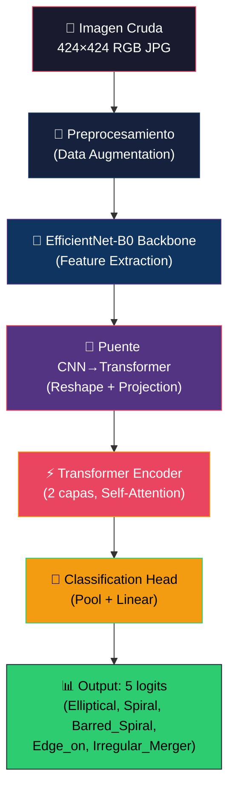

# 🔭 GalaxyMorphHybrid — Diagrama de Arquitectura Completa

## Resumen

| Propiedad | Valor |
|-----------|-------|
| **Nombre** | GalaxyMorphHybrid |
| **Backbone** | EfficientNet-B0 (pretrained ImageNet) |
| **Encoder** | Transformer Encoder (2 capas) |
| **Parámetros totales** | ~8.2M |
| **Input** | (B, 3, 224, 224) |
| **Output** | (B, 5) logits |
| **Clases** | Elliptical, Spiral, Barred_Spiral, Edge_on, Irregular_Merger |

---

## Pipeline Completo



---

## 1. Preprocesamiento (Data Augmentation)

```
Imagen Cruda: 424×424 RGB
        │
        ▼
┌─────────────────────────────────────────────┐
│  TRAIN AUGMENTATION (Astronomía)            │
│                                             │
│  1. Resize(256)                             │
│     → Escalar suavemente                    │
│                                             │
│  2. RandomCrop(224)                         │
│     → Crop seguro, evita zoom destructivo   │
│                                             │
│  3. RandomHorizontalFlip(p=0.5)             │
│                                             │
│  4. RandomVerticalFlip(p=0.5)               │
│                                             │
│  5. RandomRotation(degrees=180)             │
│                                             │
│  6. ColorJitter(b=0.2, c=0.2)               │
│     → SIN hue/saturation para preservar     │
│     el color físico (rojo=viejo, azul=joven)│
│                                             │
│  7. ToImage() + ToDtype(float32, scale=True)│
│                                             │
│  8. Normalize(μ=[.485,.456,.406],           │
│               σ=[.229,.224,.225])            │
└─────────────────────────────────────────────┘
        │
        ▼
  Tensor: (B, 3, 224, 224) float32

┌─────────────────────────────────────────────┐
│  VAL/TEST (sin augmentation)                │
│                                             │
│  1. Resize(256)                             │
│  2. CenterCrop(224)                         │
│  3. ToImage() + ToDtype(float32, scale=True)│
│  4. Normalize(ImageNet)                     │
└─────────────────────────────────────────────┘
```

---

## 2. EfficientNet-B0 Backbone (Feature Extraction)

```
Input: (B, 3, 224, 224)
  │
  ▼
┌──────────────────────────────────────────────────────┐
│  STEM (Conv inicial)                                 │
│  Conv2d(3, 32, k=3, s=2, p=1) + BN + SiLU           │
│  → (B, 32, 112, 112)                                │
└──────────────────────────────────────────────────────┘
  │
  ▼
┌──────────────────────────────────────────────────────┐
│  MBConv Block 1: expand=1, k=3, s=1                  │
│  Depthwise Separable Conv + Squeeze-and-Excitation   │
│  32 → 16 canales, repeat=1                           │
│  → (B, 16, 112, 112)                                │
├──────────────────────────────────────────────────────┤
│  MBConv Block 2: expand=6, k=3, s=2                  │
│  16 → 24 canales, repeat=2                           │
│  → (B, 24, 56, 56)                                  │
├──────────────────────────────────────────────────────┤
│  MBConv Block 3: expand=6, k=5, s=2                  │
│  24 → 40 canales, repeat=2                           │
│  → (B, 40, 28, 28)                                  │
├──────────────────────────────────────────────────────┤
│  MBConv Block 4: expand=6, k=3, s=2                  │
│  40 → 80 canales, repeat=3                           │
│  → (B, 80, 14, 14)                                  │
├──────────────────────────────────────────────────────┤
│  MBConv Block 5: expand=6, k=5, s=1                  │
│  80 → 112 canales, repeat=3                          │
│  → (B, 112, 14, 14)                                 │
├──────────────────────────────────────────────────────┤
│  MBConv Block 6: expand=6, k=5, s=2                  │
│  112 → 192 canales, repeat=4                         │
│  → (B, 192, 7, 7)                                   │
├──────────────────────────────────────────────────────┤
│  MBConv Block 7: expand=6, k=3, s=1                  │
│  192 → 320 canales, repeat=1                         │
│  → (B, 320, 7, 7)                                   │
└──────────────────────────────────────────────────────┘
  │
  ▼
┌──────────────────────────────────────────────────────┐
│  HEAD Conv (Conv final de EfficientNet)               │
│  Conv2d(320, 1280, k=1) + BN + SiLU                  │
│  → (B, 1280, 7, 7)                                  │
└──────────────────────────────────────────────────────┘
  │
  ▼
Output: (B, 1280, 7, 7) feature maps
```

> [!NOTE]
> **MBConv** = Mobile Inverted Bottleneck Convolution. Cada bloque contiene:
> 1. Expansion Conv 1×1 (expande canales × factor)
> 2. Depthwise Conv 3×3 o 5×5 (convolución separable por canal)
> 3. Squeeze-and-Excitation (atención por canal)
> 4. Projection Conv 1×1 (proyecta de vuelta)
> 5. Skip connection + Stochastic Depth (drop_connect)

---

## 3. Puente CNN → Transformer

```
Feature Maps: (B, 1280, 7, 7)
  │
  ▼
┌──────────────────────────────────────────────────────┐
│  RESHAPE                                             │
│  (B, 1280, 7, 7) → (B, 1280, 49) → (B, 49, 1280)   │
│                                                      │
│  Cada posición espacial 1×1 del feature map de 7×7   │
│  se convierte en un "token" → 49 tokens totales      │
│  Cada token tiene dimensión 1280 (canales)           │
└──────────────────────────────────────────────────────┘
  │
  ▼
┌──────────────────────────────────────────────────────┐
│  PROYECCIÓN LINEAR                                   │
│  Linear(1280, 512)                                   │
│  → (B, 49, 512)                                     │
│                                                      │
│  Reduce dimensión de 1280 a 512 para eficiencia      │
│  del Transformer                                     │
└──────────────────────────────────────────────────────┘
  │
  ▼
┌──────────────────────────────────────────────────────┐
│  POSITIONAL ENCODING (LEARNABLE)                     │
│  nn.Parameter(1, 49, 512) — inicializado trunc_normal│
│                                                      │
│  tokens = tokens + pos_embed                         │
│  → (B, 49, 512)                                     │
│                                                      │
│  Codifica la posición espacial 2D de cada parche     │
│  en el feature map original (fila, columna del 7×7)  │
└──────────────────────────────────────────────────────┘
  │
  ▼
Output: (B, 49, 512) — secuencia de 49 tokens de dim 512
```

---

## 4. Transformer Encoder (2 capas)

```
Input: (B, 49, 512) — 49 tokens de dimensión 512
  │
  ▼
┌══════════════════════════════════════════════════════┐
║  TRANSFORMER ENCODER LAYER 1                         ║
║                                                      ║
║  ┌────────────────────────────────────────────────┐  ║
║  │  LayerNorm(512)         (Pre-Norm)             │  ║
║  │          ▼                                     │  ║
║  │  Multi-Head Self-Attention                     │  ║
║  │     • 8 heads                                  │  ║
║  │     • dim_per_head = 512/8 = 64                │  ║
║  │     • Q = Linear(512→512)                      │  ║
║  │     • K = Linear(512→512)                      │  ║
║  │     • V = Linear(512→512)                      │  ║
║  │     • Attention(Q,K,V) = softmax(QK^T/√64)·V  │  ║
║  │     • Out = Linear(512→512)                    │  ║
║  │     • Dropout(0.3)                             │  ║
║  │          ▼                                     │  ║
║  │  + Residual Connection (skip)                  │  ║
║  └────────────────────────────────────────────────┘  ║
║              │                                       ║
║              ▼                                       ║
║  ┌────────────────────────────────────────────────┐  ║
║  │  LayerNorm(512)         (Pre-Norm)             │  ║
║  │          ▼                                     │  ║
║  │  Feed-Forward Network (FFN)                    │  ║
║  │     • Linear(512, 2048)     expand ×4          │  ║
║  │     • GELU activation                          │  ║
║  │     • Dropout(0.3)                             │  ║
║  │     • Linear(2048, 512)     project back       │  ║
║  │     • Dropout(0.3)                             │  ║
║  │          ▼                                     │  ║
║  │  + Residual Connection (skip)                  │  ║
║  └────────────────────────────────────────────────┘  ║
║              │                                       ║
║              ▼                                       ║
║  → (B, 49, 512)                                     ║
╚══════════════════════════════════════════════════════╝
  │
  ▼
┌══════════════════════════════════════════════════════┐
║  TRANSFORMER ENCODER LAYER 2                         ║
║  (misma estructura que Layer 1)                      ║
║                                                      ║
║  Self-Attention → FFN → Residual connections         ║
║  → (B, 49, 512)                                     ║
╚══════════════════════════════════════════════════════╝
  │
  ▼
Output: (B, 49, 512) — tokens con contexto global
```

> [!TIP]
> **¿Por qué Self-Attention ayuda?** Cada token (parche 1×1 del feature map 7×7) puede "atender" a TODOS los demás 48 tokens. Esto permite que la región del núcleo de la galaxia se relacione con la región de los brazos espirales, o que una barra central se conecte con ambos extremos — relaciones globales que una CNN con receptive field local no captura eficientemente.

---

## 5. Classification Head

```
Transformer Output: (B, 49, 512)
  │
  ▼
┌──────────────────────────────────────────────────────┐
│  GLOBAL AVERAGE POOL                                 │
│  mean(dim=1) — promedio sobre los 49 tokens          │
│  → (B, 512)                                         │
│                                                      │
│  Agrega la información de todos los parches          │
│  en un solo vector representativo                    │
└──────────────────────────────────────────────────────┘
  │
  ▼
┌──────────────────────────────────────────────────────┐
│  LayerNorm(512)                                      │
│  Normaliza la distribución del vector                │
│  → (B, 512)                                         │
└──────────────────────────────────────────────────────┘
  │
  ▼
┌──────────────────────────────────────────────────────┐
│  Dropout(0.5)                                        │
│  Regularización — apaga 50% de neuronas en training  │
│  → (B, 512)                                         │
└──────────────────────────────────────────────────────┘
  │
  ▼
┌──────────────────────────────────────────────────────┐
│  Linear(512, 5)                                      │
│  Capa final de clasificación                         │
│  → (B, 5) logits                                    │
│                                                      │
│  logit[0] = Elliptical                               │
│  logit[1] = Spiral                                   │
│  logit[2] = Barred_Spiral                            │
│  logit[3] = Edge_on                                  │
│  logit[4] = Irregular_Merger                         │
└──────────────────────────────────────────────────────┘
  │
  ▼
Output: (B, 5) — raw logits (sin softmax)
  │
  ▼
CrossEntropyLoss(label_smoothing=0.1)
```

---

## 6. Diagrama de Flujo Completo (End-to-End)

```
┌─────────────────────────────────────────────────────────────────┐
│                    GALAXYMORPH HYBRID                            │
│              EfficientNet-B0 + Transformer Encoder               │
│                     ~8.2M parámetros                            │
├─────────────────────────────────────────────────────────────────┤
│                                                                 │
│  Imagen 424×424 RGB                                             │
│       │                                                         │
│       ▼                                                         │
│  [Augmentation] Resize+RandomCrop(224), Flip H/V, Rot 180°,        │
│                 ColorJitter(brightness, contrast)                  │
│       │                                                         │
│       ▼                                                         │
│  (B, 3, 224, 224) tensor normalizado ImageNet                   │
│       │                                                         │
│       ▼                                                         │
│  ┌─────────────────────────────────────────────────────────┐    │
│  │  EFFICIENTNET-B0 BACKBONE (~5.3M params)                │    │
│  │  Stem Conv → 7× MBConv Blocks → Head Conv              │    │
│  │  (3,224,224) → (32,112,112) → ... → (1280,7,7)         │    │
│  │                                                         │    │
│  │  ⚡ Fase 1: CONGELADO (solo extrae features)            │    │
│  │  ⚡ Fase 2: Descongelar últimos 3 bloques                │    │
│  └─────────────────────────────────────────────────────────┘    │
│       │                                                         │
│       ▼                                                         │
│  (B, 1280, 7, 7) feature maps                                  │
│       │                                                         │
│       ▼                                                         │
│  ┌─────────────────────────────────────────────────────────┐    │
│  │  PUENTE CNN→TRANSFORMER (~0.7M params)                  │    │
│  │  Reshape: (B,1280,7,7) → (B,49,1280)                   │    │
│  │  Projection: Linear(1280,512) → (B,49,512)             │    │
│  │  + Positional Encoding (learnable) → (B,49,512)        │    │
│  └─────────────────────────────────────────────────────────┘    │
│       │                                                         │
│       ▼                                                         │
│  (B, 49, 512) — 49 tokens espaciales                           │
│       │                                                         │
│       ▼                                                         │
│  ┌─────────────────────────────────────────────────────────┐    │
│  │  TRANSFORMER ENCODER (~2.1M params)                     │    │
│  │  Layer 1: MHSA(8 heads, d=64) + FFN(512→2048→512)      │    │
│  │  Layer 2: MHSA(8 heads, d=64) + FFN(512→2048→512)      │    │
│  │  Pre-Norm, Dropout=0.3, GELU, Residual connections      │    │
│  └─────────────────────────────────────────────────────────┘    │
│       │                                                         │
│       ▼                                                         │
│  (B, 49, 512) — tokens con contexto global                     │
│       │                                                         │
│       ▼                                                         │
│  ┌─────────────────────────────────────────────────────────┐    │
│  │  CLASSIFICATION HEAD (~0.003M params)                   │    │
│  │  Global Avg Pool: (B,49,512) → (B,512)                 │    │
│  │  LayerNorm(512)                                         │    │
│  │  Dropout(0.5)                                           │    │
│  │  Linear(512, 5)                                         │    │
│  └─────────────────────────────────────────────────────────┘    │
│       │                                                         │
│       ▼                                                         │
│  (B, 5) logits → CrossEntropyLoss(label_smoothing=0.1)         │
│                                                                 │
├─────────────────────────────────────────────────────────────────┤
│  TRAINING STRATEGY                                              │
│  ─────────────────                                              │
│  Fase 1 (epochs 1-10):  Backbone CONGELADO                     │
│     • Solo entrena: Projection + Transformer + Head             │
│     • LR: 1e-4, AdamW, weight_decay=1e-3                       │
│     • Warmup: 3 epochs                                          │
│                                                                 │
│  Fase 2 (epochs 11-40): Backbone PARCIALMENTE DESCONGELADO      │
│     • Descongelar: MBConv Blocks 5,6,7 + Head Conv             │
│     • LR diferencial: backbone=1e-5, transformer/head=1e-4     │
│     • CosineAnnealingWarmRestarts(T_0=10)                       │
│     • Early stopping: patience=7 (monitorea Val F1 macro)       │
│     • MixUp: alpha=0.2                                          │
│                                                                 │
│  Loss: CrossEntropyLoss(label_smoothing=0.1)                   │
│  Batch: 128 | Workers: 4 | DataParallel: T4 x2                │
└─────────────────────────────────────────────────────────────────┘
```

---

## 7. Comparación con Arquitectura Anterior

| Aspecto | ResNet50 (anterior) | Hybrid (nuevo) |
|---------|-------------------|----------------|
| **Backbone** | ResNet50 | EfficientNet-B0 |
| **Params backbone** | 25.6M | 5.3M |
| **Feature dim** | 2048 | 1280 → 512 |
| **Atención global** | ❌ No | ✅ 2-layer Transformer |
| **Params totales** | ~25.6M | ~8.2M |
| **Head** | Dropout + Linear | LayerNorm + Dropout + Linear |
| **Augmentation** | Rot 15°, HFlip | Resize+Crop, Rot 180°, H/VFlip, ColorJitter |
| **Label smoothing** | ❌ No | ✅ 0.1 |
| **LR Schedule** | ❌ Fijo | ✅ CosineAnnealing + Warmup |
| **Early stopping** | ❌ No | ✅ Patience=7 |
| **Fine-tuning** | Todas las capas | 2 fases progresivo |
| **MixUp** | ❌ No | ✅ alpha=0.2 |
| **Weight decay** | 1e-5 | 1e-3 |
