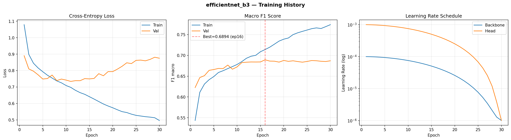
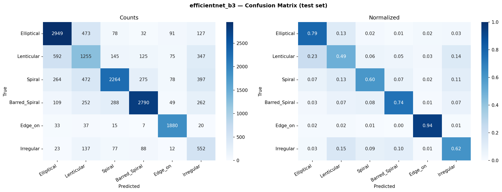

# EfficientNet-B3 — Clasificación de Morfología Galáctica

---

## Índice

1. [Introducción](#1-introducción)
2. [Arquitectura del modelo](#2-arquitectura-del-modelo)
   - 2.1 [EfficientNet: escalado compuesto](#21-efficientnet-escalado-compuesto)
   - 2.2 [Bloque MBConv con Squeeze-and-Excitation](#22-bloque-mbconv-con-squeeze-and-excitation)
   - 2.3 [Estructura interna de EfficientNet-B3](#23-estructura-interna-de-efficientnet-b3)
   - 2.4 [Cabeza de clasificación personalizada](#24-cabeza-de-clasificación-personalizada)
   - 2.5 [Parámetros totales](#25-parámetros-totales)
   - 2.6 [Salida del modelo](#26-salida-del-modelo)
3. [Configuración del experimento](#3-configuración-del-experimento)
   - 3.1 [Hardware y software](#31-hardware-y-software)
   - 3.2 [Pipeline de datos](#32-pipeline-de-datos)
   - 3.3 [Preprocesamiento de imagen](#33-preprocesamiento-de-imagen)
   - 3.4 [Aumentación de datos](#34-aumentación-de-datos)
   - 3.5 [Pesos de clase](#35-pesos-de-clase)
   - 3.6 [Optimizador y planificador de LR](#36-optimizador-y-planificador-de-lr)
   - 3.7 [Regularización y aceleraciones](#37-regularización-y-aceleraciones)
4. [Entrenamiento](#4-entrenamiento)
   - 4.1 [Curvas de aprendizaje](#41-curvas-de-aprendizaje)
   - 4.2 [Registro completo por época](#42-registro-completo-por-época)
5. [Resultados](#5-resultados)
   - 5.1 [Métricas globales](#51-métricas-globales)
   - 5.2 [Matriz de confusión (test set)](#52-matriz-de-confusión-test-set)
   - 5.3 [Rendimiento por clase](#53-rendimiento-por-clase)
6. [Análisis](#6-análisis)
   - 6.1 [Overfitting](#61-overfitting)
   - 6.2 [Clases difíciles](#62-clases-difíciles)
   - 6.3 [Épocas anómalas](#63-épocas-anómalas)
7. [Conclusiones y trabajo futuro](#7-conclusiones-y-trabajo-futuro)

---

## 1. Introducción

**EfficientNet-B3** es el tercer miembro de la familia EfficientNet propuesta por Tan y Le (2019) en _"EfficientNet: Rethinking Model Scaling for Convolutional Neural Networks"_ (ICML 2019). A diferencia de arquitecturas anteriores que escalan arbitrariamente una sola dimensión (profundidad, ancho o resolución), EfficientNet introduce el **escalado compuesto**: se escalan las tres dimensiones simultáneamente usando coeficientes derivados mediante búsqueda de arquitecturas neurales (NAS).

En este proyecto se utiliza EfficientNet-B3 como uno de los tres modelos base para clasificar morfologías galácticas según el esquema de Galaxy Zoo 2, que distingue seis categorías:

| Índice | Clase         | Descripción                                           |
| ------ | ------------- | ----------------------------------------------------- |
| 0      | Elliptical    | Elípticas suaves, sin estructura interna visible      |
| 1      | Lenticular    | Discos con abultamiento central, sin brazos espirales |
| 2      | Spiral        | Espirales con brazos bien definidos                   |
| 3      | Barred_Spiral | Espirales con barra central                           |
| 4      | Edge_on       | Galaxias vistas de canto (disco fino visible)         |
| 5      | Irregular     | Morfología perturbada o asimétrica                    |

EfficientNet-B3 fue elegido como punto de partida por su equilibrio entre capacidad representacional (~10.7 M parámetros) y eficiencia computacional, y por su excelente desempeño en tareas de clasificación de imágenes de resolución moderada.

---

## 2. Arquitectura del modelo

### 2.1 EfficientNet: escalado compuesto

El escalado compuesto parte de una red base **B0** construida con NAS y define tres coeficientes de escala $(\alpha, \beta, \gamma)$ sujetos a:

$$\alpha \cdot \beta^2 \cdot \gamma^2 \approx 2, \quad \alpha \geq 1,\ \beta \geq 1,\ \gamma \geq 1$$

Los modelos B1–B7 escalan con un multiplicador compuesto $\phi$:

$$\text{depth} = \alpha^\phi, \quad \text{width} = \beta^\phi, \quad \text{resolution} = \gamma^\phi$$

Para B3 ($\phi = 3$):

| Dimensión             | Coeficiente vs B0 | Valor en B3                |
| --------------------- | ----------------- | -------------------------- |
| Profundidad           | × 1.40            | 7 bloques por stage (base) |
| Ancho (canales)       | × 1.20            | Feature maps más anchos    |
| Resolución de entrada | × 1.30            | 300 × 300 px (original)    |

> **Nota de implementación:** En este proyecto se usa `IMAGE_SIZE = 224` (en lugar de 300) para homogeneizar el tamaño de entrada entre los tres modelos comparados. La red acepta cualquier tamaño gracias a `AdaptiveAvgPool2d`.

### 2.2 Bloque MBConv con Squeeze-and-Excitation

El bloque fundamental de EfficientNet es el **MBConv** (_Mobile Inverted Residual Bottleneck_), heredado de MobileNetV2 y enriquecido con **SE** (_Squeeze-and-Excitation_):

```
Entrada (C canales)
  │
  ├─ [Expansion] Conv 1×1 → C×t canales, BN, SiLU
  │
  ├─ [DWConv]    DepthwiseConv k×k → C×t canales, BN, SiLU
  │
  ├─ [SE]        AdaptiveAvgPool2d → FC(C×t → C×t/r) → SiLU
  │              → FC(C×t/r → C×t) → Sigmoid → escalar feature map
  │
  ├─ [Projection] Conv 1×1 → C_out canales, BN (sin activación)
  │
  └─ [Skip]      Identidad (si stride=1 y C_in == C_out) + Stochastic Depth
```

Donde:

- **t** = expansion ratio (generalmente 1 en el primer bloque, 6 en el resto)
- **k** = tamaño del kernel depthwise (3×3 o 5×5 según el stage)
- **r** = ratio de reducción SE (0.25, es decir, reduce a C/4 antes de escalar)
- **SiLU** = Sigmoid Linear Unit: $f(x) = x \cdot \sigma(x)$
- **Stochastic Depth**: durante el entrenamiento, bloques completos son omitidos con probabilidad $p_l$ que crece linealmente desde 0 hasta `drop_connect_rate` (0.3 en B3)

### 2.3 Estructura interna de EfficientNet-B3

La red completa tiene 9 etapas. Las primeras 8 producen feature maps progresivamente más profundos y estrechos; la última extrae el vector de características global.

| Stage | Tipo            | Kernel | Stride | Canales out | #Bloques | Resolución out\* |
| ----- | --------------- | ------ | ------ | ----------- | -------- | ---------------- |
| Stem  | Conv 3×3        | 3×3    | 2      | 40          | 1        | 112×112          |
| S1    | MBConv1         | 3×3    | 1      | 24          | 2        | 112×112          |
| S2    | MBConv6         | 3×3    | 2      | 32          | 3        | 56×56            |
| S3    | MBConv6         | 5×5    | 2      | 48          | 3        | 28×28            |
| S4    | MBConv6         | 3×3    | 2      | 96          | 5        | 14×14            |
| S5    | MBConv6         | 5×5    | 1      | 136         | 5        | 14×14            |
| S6    | MBConv6         | 5×5    | 2      | 232         | 6        | 7×7              |
| S7    | MBConv6         | 3×3    | 1      | 384         | 2        | 7×7              |
| Head  | Conv 1×1 + Pool | —      | —      | 1536        | 1        | 1×1              |

\* Para entrada 224×224.

Notas:

- El número de bloques por stage en B3 escala ~1.4× respecto a B0.
- Los canales siguen la progresión B0 escalada ~1.2×.
- Todos los bloques usan **BN + SiLU** (no ReLU).
- El bloque Head consiste en `Conv1×1 → BN → SiLU → AdaptiveAvgPool2d(1,1)`, produciendo un vector de 1536 dimensiones.

### 2.4 Cabeza de clasificación personalizada

La cabeza original de EfficientNet-B3 (para ImageNet, 1000 clases) es:

```
AdaptiveAvgPool2d(1, 1)
Flatten
Dropout(p=0.3)
Linear(1536, 1000)
```

Para este proyecto se reemplaza la capa `Linear` final por una nueva para 6 clases:

```python
# torchvision implementa la cabeza en base_model.classifier
# classifier[0] = Dropout(p=0.3)
# classifier[1] = Linear(1536, 1000)  ← se reemplaza

in_features = base_model.classifier[1].in_features   # 1536
base_model.classifier[1] = nn.Linear(in_features, NUM_CLASSES)  # 1536 → 6
```

La cabeza final en producción:

```
AdaptiveAvgPool2d(output_size=(1, 1))
Flatten(start_dim=1)
Dropout(p=0.3, inplace=True)
Linear(in_features=1536, out_features=6, bias=True)
```

### 2.5 Parámetros totales

| Grupo                                          | Parámetros      |
| ---------------------------------------------- | --------------- |
| Backbone (features)                            | ~10,696,232     |
| Cabeza personalizada (Dropout + Linear 1536→6) | ~9,222          |
| **Total**                                      | **~10,705,454** |

El entrenamiento usa **learning rate diferencial**: la cabeza se entrena con LR 10× mayor que el backbone, ya que sus pesos son aleatorios al inicio mientras que el backbone está preentrenado en ImageNet.

### 2.6 Salida del modelo

La red devuelve **logits crudos** — un vector de 6 valores reales sin ninguna función de activación final. No se aplica softmax ni sigmoid dentro del modelo.

```
Entrada : tensor  (B, 3, 224, 224)   float32
Salida  : tensor  (B, 6)             float32   ← logits crudos

Ejemplo con B=1 (una imagen de galaxia espiral):
  logits = [ 0.31,  -1.42,   2.87,   1.05,  -2.10,  -0.63 ]
  índice :    0       1       2       3       4       5
  clase  :  Ell.    Len.   Spiral  Bar.Sp  Edge_on  Irreg.
```

**Del logit a la probabilidad (softmax):**

$$p_c = \frac{e^{z_c}}{\sum_{k=0}^{5} e^{z_k}}$$

```python
# Inferencia — pipeline completo
model.eval()
with torch.no_grad():
    logits = model(x)                          # (B, 6)  — salida directa
    probs  = torch.softmax(logits, dim=1)      # (B, 6)  — probabilidades [0, 1], suma = 1
    pred   = logits.argmax(dim=1)              # (B,)    — índice de clase ganadora
    label  = IDX_TO_CLASS[pred.item()]         # str     — nombre legible

# Para el ejemplo anterior:
# probs ≈ [0.115, 0.020, 0.745, 0.241, 0.010, 0.045]  (suma = 1)
# pred  = 2  →  'Spiral'  ✓
```

**Durante el entrenamiento — `CrossEntropyLoss` toma logits directamente:**

```python
criterion = nn.CrossEntropyLoss(weight=class_weights)
loss = criterion(logits, labels)   # logits: (B, 6)  labels: (B,) con índices 0-5
# CrossEntropyLoss = LogSoftmax + NLLLoss internamente
# No pasar softmax antes — causaría doble-softmax y loss incorrecto
```

**Flujo completo de datos a través del modelo:**

```
(B, 3, 224, 224)
   │
   ├─ Stem Conv 3×3 (stride 2)
   │      (B, 40, 112, 112)
   ├─ Stage 1–7  (MBConv blocks)
   │      (B, 1536, 7, 7)  ← último feature map
   ├─ Head Conv 1×1 + BN + SiLU
   │      (B, 1536, 7, 7)
   ├─ AdaptiveAvgPool2d(1, 1)
   │      (B, 1536, 1, 1)
   ├─ Flatten
   │      (B, 1536)          ← vector de características
   ├─ Dropout(p=0.3)
   │      (B, 1536)
   └─ Linear(1536 → 6)       ← cabeza personalizada
          (B, 6)             ← LOGITS (salida final)
```

**Interpretación de los logits:**

| Logit                                 | Significado                             | Regla práctica                                      |
| ------------------------------------- | --------------------------------------- | --------------------------------------------------- |
| Valor alto positivo                   | La red es muy confiante en esa clase    | logit > 2 → prob > 70% cuando las demás son neutras |
| Valor cercano a 0                     | Clase neutral, sin evidencia fuerte     |                                                     |
| Valor negativo                        | La red descarta activamente esa clase   | logit < −2 → prob < 5%                              |
| Diferencia entre top-2 logits pequeña | Predicción insegura, clases confundidas | Frecuente en Lenticular vs Elliptical               |

**Métricas calculadas sobre la salida:**

```python
# F1-macro (usado como métrica principal durante entrenamiento)
from sklearn.metrics import f1_score

all_preds  = logits.argmax(dim=1).cpu().tolist()   # clase predicha
all_labels = labels.cpu().tolist()                  # clase real
f1 = f1_score(all_labels, all_preds, average='macro', zero_division=0)
# Promedia el F1 de cada clase con igual peso,
# penalizando clases con recall bajo (como Lenticular).
```

---

## 3. Configuración del experimento

### 3.1 Hardware y software

| Componente   | Valor                                                        |
| ------------ | ------------------------------------------------------------ |
| GPU          | NVIDIA RTX 5060 Ti (Blackwell GB206, 8 GB VRAM)              |
| CUDA         | 12.8                                                         |
| PyTorch      | ≥ 2.7 (`--index-url https://download.pytorch.org/whl/cu128`) |
| OS           | Windows 11                                                   |
| Entorno      | Jupyter Notebook local                                       |
| `sm_` target | sm_120 (Blackwell)                                           |

### 3.2 Pipeline de datos

**Tamaño del dataset:**

| Split     | Imágenes    |
| --------- | ----------- |
| Train     | 77,789      |
| Val       | 16,670      |
| Test      | 16,670      |
| **Total** | **111,129** |

**Parámetros de entrada:**

| Parámetro     | Valor                                                                |
| ------------- | -------------------------------------------------------------------- |
| `CROP_SIZE`   | 320 px (center crop desde 424×424)                                   |
| `IMAGE_SIZE`  | 224 px (resize después del crop)                                     |
| `BATCH_SIZE`  | 64                                                                   |
| `NUM_WORKERS` | 0 (Windows + Jupyter)                                                |
| Normalización | ImageNet mean/std: `[0.485, 0.456, 0.406]` / `[0.229, 0.224, 0.225]` |

La razón `CROP_SIZE / IMAGE_SIZE = 320/224 ≈ 1.43` asegura que el resize no produce aliasing significativo y que la región útil de la galaxia ocupa la mayoría del frame (las imágenes GZ2 de 424×424 tienen ~50 px de borde negro).

**Clase Dataset personalizada:**

```python
class GalaxyDataset(Dataset):
    def __init__(self, csv_path, images_dir, transform, class_to_idx):
        df = pd.read_csv(csv_path, usecols=['img_filename', 'morph_label'])
        self.filenames = df['img_filename'].to_numpy()    # numpy array para evitar OOM
        self.labels    = np.array([class_to_idx[lbl] for lbl in df['morph_label']])
        self.images_dir = pathlib.Path(images_dir)
        self.transform  = transform

    def __getitem__(self, idx):
        image = Image.open(self.images_dir / self.filenames[idx]).convert('RGB')
        return self.transform(image), int(self.labels[idx])
```

Se almacenan arrays NumPy en lugar de DataFrames para evitar el `copy-on-read` overhead en los worker processes.

### 3.3 Preprocesamiento de imagen

El preprocesamiento transforma cada imagen JPEG cruda en el tensor normalizado que recibe la red. Es idéntico para train, validación y test — la augmentación se aplica **encima** de este pipeline solo en entrenamiento.

**Pipeline completo (paso a paso):**

```
Archivo JPEG en disco
  424 × 424 px  ·  RGB  ·  uint8  ·  valores [0, 255]
  └── ~50 px de borde negro en todos los bordes

  PASO 1 — Image.open(...).convert('RGB')
  ↓  PIL Image (424×424, 3 canales, uint8)

  PASO 2 — CenterCrop(320)
  ↓  PIL Image (320×320)
     Elimina los ~52 px de borde negro por lado.
     El contenido galáctico ocupa ahora ~374/424 = 88% del área original.

  PASO 3 — Resize(224)
  ↓  PIL Image (224×224) con interpolación bilineal
     Escala uniforme: factor = 224/320 = 0.7×
     La galaxia sigue centrada; ratio CROP/IMAGE = 320/224 ≈ 1.43
     evita aliasing severo (nunca se baja de 0.5× en un solo paso).

  PASO 4 — ToTensor()
  ↓  torch.Tensor (3, 224, 224)  float32  valores [0.0, 1.0]
     Divide entre 255 y reordena de HWC → CHW.

  PASO 5 — Normalize(mean, std)
  ↓  torch.Tensor (3, 224, 224)  float32  valores ≈ [-2.1, 2.6]
     x_norm[c] = (x[c] − mean[c]) / std[c]
     mean = [0.485, 0.456, 0.406]   (R, G, B)  — estadísticos de ImageNet-1K
     std  = [0.229, 0.224, 0.225]   (R, G, B)

  RESULTADO: tensor listo para el modelo
  shape : (3, 224, 224)
  dtype : float32
  rango : aprox [-2.1, 2.6] por canal
```

**¿Por qué normalizar con estadísticos de ImageNet?**

Los pesos preentrenados (`IMAGENET1K_V1`) fueron optimizados con entradas normalizadas exactamente con estos valores. Si se omite la normalización o se usan estadísticos distintos, la distribución de activaciones en las primeras capas del backbone cae fuera del rango esperado, lo que degrada el fine-tuning significativamente (especialmente con un LR de backbone conservador como `1e-4`).

Aunque las imágenes de galaxias tienen distribuciones fotométricas distintas a ImageNet (fondos más oscuros, paletas más monocromáticas), el uso de los mismos estadísticos garantiza compatibilidad con los pesos preentrenados. La red aprende durante el fine-tuning a adaptar las representaciones internas al dominio astronómico.

**¿Por qué CenterCrop(320) y no Resize(224) directo?**

| Estrategia                        | Resultado                                                    |
| --------------------------------- | ------------------------------------------------------------ |
| `Resize(224)` directo             | Incluye ~50px de borde negro → ~22% del área es ruido        |
| `CenterCrop(224)`                 | Elimina borde pero también recorta brazos espirales externos |
| `CenterCrop(320) → Resize(224)` ✓ | Elimina borde, preserva estructura, escala suave (0.7×)      |
| `CenterCrop(374) → Resize(224)`   | Elimina borde exacto, escalado más agresivo (0.6×)           |

El CenterCrop(320) es un compromiso: elimina el borde negro preservando ~94% del radio galáctico útil, y la reducción posterior a 224 es lo suficientemente suave para mantener detalles morfológicos.

**Valores de pixel representativos antes y después de normalización:**

| Canal | Pixel típico (fondo cielo) | Después de norm                    |
| ----- | -------------------------- | ---------------------------------- |
| R     | 0.05 (≈ 13/255)            | (0.05 − 0.485) / 0.229 ≈ **−1.90** |
| G     | 0.05 (≈ 13/255)            | (0.05 − 0.456) / 0.224 ≈ **−1.81** |
| B     | 0.05 (≈ 13/255)            | (0.05 − 0.406) / 0.225 ≈ **−1.58** |
| R     | 0.80 (núcleo brillante)    | (0.80 − 0.485) / 0.229 ≈ **+1.38** |

El fondo del cielo (negro) produce valores negativos cercanos a −2; los núcleos galácticos brillantes producen valores positivos entre +1 y +2.5.

### 3.4 Aumentación de datos

**Train:**

```python
transforms.CenterCrop(320)
transforms.Resize(224)
transforms.RandomHorizontalFlip(p=0.5)
transforms.RandomVerticalFlip(p=0.5)
transforms.RandomRotation(degrees=180)
transforms.ColorJitter(brightness=0.15, contrast=0.15)
transforms.ToTensor()
transforms.Normalize(mean=[0.485, 0.456, 0.406], std=[0.229, 0.224, 0.225])
```

**Validación / Test** (sin augmentación):

```python
transforms.CenterCrop(320)
transforms.Resize(224)
transforms.ToTensor()
transforms.Normalize(mean=[0.485, 0.456, 0.406], std=[0.229, 0.224, 0.225])
```

**Justificación de las transformaciones:**

- `RandomHorizontalFlip` + `RandomVerticalFlip` + `RandomRotation(180°)`: Las galaxias no tienen orientación privilegiada. La rotación completa de 180° aprovecha la simetría rotacional del problema.
- `ColorJitter` moderado: Las imágenes GZ2 tienen diferentes exposiciones fotométricas según el telescopio de origen; el jitter suaviza esta variabilidad.
- Sin `RandomCrop` ni `RandomResizedCrop`: Se preserva la morfología central, que es la información discriminante clave.

### 3.5 Pesos de clase

El dataset GZ2 tiene un desbalance de clase real (ratio máximo ~4.2×). Se aplican pesos de clase en la `CrossEntropyLoss` usando la fórmula:

$$w_c = \frac{N}{K \cdot n_c}$$

donde $N$ = total de muestras en train, $K$ = 6 clases, $n_c$ = muestras de la clase $c$.

| Clase         | $n_c$   | $w_c$ |
| ------------- | ------- | ----- |
| Elliptical    | ~25,000 | 0.74  |
| Lenticular    | 16,926  | 1.09  |
| Spiral        | ~25,000 | 0.74  |
| Barred_Spiral | ~25,000 | 0.74  |
| Edge_on       | 13,276  | 1.40  |
| Irregular     | 5,927   | 3.12  |

La clase `Irregular` recibe el mayor peso (~3.12×) al ser la minoría más pronunciada.

### 3.6 Optimizador y planificador de LR

**Optimizador:** AdamW con decaimiento de pesos desacoplado

```python
optimizer = optim.AdamW(
    [
        {'params': backbone_params, 'lr': 1e-4},   # backbone: LR conservador
        {'params': head_params,     'lr': 1e-3},   # cabeza: LR agresivo (×10)
    ],
    weight_decay=1e-4,
)
```

**Planificador:** CosineAnnealingLR

$$\eta_t = \eta_{\min} + \frac{1}{2}(\eta_{\max} - \eta_{\min})\left(1 + \cos\frac{t\pi}{T}\right)$$

Con $T = 30$ épocas, $\eta_{\min} = 10^{-6}$. El LR decae suavemente desde el valor inicial hasta $10^{-6}$ al final del entrenamiento.

Al final de la época 30:

- Backbone LR: $\approx 1.0 \times 10^{-6}$ (desde $1 \times 10^{-4}$)
- Head LR: $\approx 1.0 \times 10^{-6}$ (desde $1 \times 10^{-3}$)

### 3.7 Regularización y aceleraciones

| Técnica              | Configuración                       | Motivo                                           |
| -------------------- | ----------------------------------- | ------------------------------------------------ |
| **Dropout**          | p=0.3 (antes de la cabeza lineal)   | Regularización estándar de EfficientNet          |
| **Stochastic Depth** | Activo en backbone pretrained       | Drop path por bloque durante entrenamiento       |
| **AMP (float16)**    | `torch.amp.autocast` + `GradScaler` | Reducir VRAM y acelerar en Tensor Cores          |
| **torch.compile()**  | `model = torch.compile(model)`      | Fusión de kernels, mejor throughput en Blackwell |
| **Weight Decay**     | $\lambda = 10^{-4}$                 | Penaliza pesos grandes, reduce overfitting       |
| **Semilla fija**     | `RANDOM_SEED = 42`                  | Reproducibilidad de splits y shuffling           |

**Nota sobre `torch.compile()`:** La compilación es lazy — ocurre en el primer batch de la primera época. Esto explica por qué la época 1 tardó **1,422 segundos** (~24 min) frente a los ~580s típicos del resto.

**Checkpointing:** Se guarda `latest.pth` (cada época), `best.pth` (mejor val F1), y `epoch_XXX.pth` (cada 5 épocas). Cada checkpoint incluye el estado del modelo, optimizer, scheduler, scaler, y el historial completo para reanudar correctamente.

---

## 4. Entrenamiento

### 4.1 Curvas de aprendizaje



Las tres gráficas muestran:

1. **Cross-Entropy Loss (izquierda):** La pérdida de entrenamiento (azul) desciende continuamente de 1.08 a 0.50, mientras que la pérdida de validación (naranja) converge alrededor de 0.75 y comienza a crecer a partir de la época 16, indicando **overfitting progresivo**.

2. **Macro F1 Score (centro):** El val F1 alcanza su **pico de 0.6894 en la época 16** (línea roja punteada). A partir de esa época, el train F1 sigue subiendo (hasta 0.774) pero el val F1 se estanca oscilando entre 0.683 y 0.688, confirmando que el modelo ha memorizado patrones del training set.

3. **Learning Rate Schedule (derecha):** El cosine annealing reduce el LR del backbone de $10^{-4}$ a $10^{-6}$ y el del head de $10^{-3}$ a $10^{-6}$ a lo largo de 30 épocas. La reducción agresiva del LR en las últimas épocas no logró revertir el overfitting.

### 4.2 Registro completo por época

| Época  | Train Loss | Train F1   | Val Loss   | Val F1     | LR Backbone   | Mejor   |
| ------ | ---------- | ---------- | ---------- | ---------- | ------------- | ------- |
| 1      | 1.0793     | 0.5434     | 0.8905     | 0.6226     | 9.973e-05     | ✓       |
| 2      | 0.8986     | 0.6111     | 0.8102     | 0.6466     | 9.892e-05     | ✓       |
| 3      | 0.8447     | 0.6310     | 0.7963     | 0.6513     | 9.758e-05     | ✓       |
| 4      | 0.8158     | 0.6416     | 0.7740     | 0.6640     | 9.572e-05     | ✓       |
| 5      | 0.7931     | 0.6490     | 0.7485     | 0.6659     | 9.337e-05     | ✓       |
| 6      | 0.7717     | 0.6588     | 0.7515     | 0.6686     | 9.055e-05     | ✓       |
| 7      | 0.7544     | 0.6631     | 0.7728     | 0.6683     | 8.729e-05     | —       |
| 8      | 0.7371     | 0.6682     | 0.7390     | 0.6767     | 8.362e-05     | ✓       |
| 9      | 0.7253     | 0.6731     | 0.7482     | 0.6667     | 7.960e-05     | —       |
| 10     | 0.7090     | 0.6782     | 0.7420     | 0.6723     | 7.525e-05     | — ⚠️    |
| 11     | 0.6977     | 0.6849     | 0.7341     | 0.6826     | 7.063e-05     | ✓       |
| 12     | 0.6799     | 0.6930     | 0.7385     | 0.6836     | 6.580e-05     | ✓       |
| 13     | 0.6657     | 0.6980     | 0.7384     | 0.6842     | 6.079e-05     | ✓       |
| 14     | 0.6554     | 0.7002     | 0.7511     | 0.6841     | 5.567e-05     | —       |
| 15     | 0.6410     | 0.7088     | 0.7492     | 0.6842     | 5.050e-05     | ✓       |
| **16** | **0.6266** | **0.7140** | **0.7521** | **0.6894** | **4.533e-05** | **✓ ★** |
| 17     | 0.6116     | 0.7197     | 0.7810     | 0.6863     | 4.021e-05     | —       |
| 18     | 0.5966     | 0.7270     | 0.7684     | 0.6860     | 3.520e-05     | — ⚠️    |
| 19     | 0.5844     | 0.7344     | 0.7936     | 0.6838     | 3.037e-05     | —       |
| 20     | 0.5736     | 0.7390     | 0.7938     | 0.6878     | 2.575e-05     | —       |
| 21     | 0.5615     | 0.7419     | 0.8088     | 0.6857     | 2.140e-05     | —       |
| 22     | 0.5501     | 0.7500     | 0.8260     | 0.6870     | 1.738e-05     | —       |
| 23     | 0.5447     | 0.7543     | 0.8473     | 0.6852     | 1.371e-05     | — ⚠️    |
| 24     | 0.5349     | 0.7578     | 0.8425     | 0.6837     | 1.045e-05     | —       |
| 25     | 0.5274     | 0.7610     | 0.8621     | 0.6854     | 7.630e-06     | —       |
| 26     | 0.5235     | 0.7643     | 0.8636     | 0.6876     | 5.280e-06     | —       |
| 27     | 0.5194     | 0.7662     | 0.8593     | 0.6871     | 3.420e-06     | —       |
| 28     | 0.5167     | 0.7646     | 0.8679     | 0.6858     | 2.080e-06     | —       |
| 29     | 0.5129     | 0.7692     | 0.8811     | 0.6853     | 1.270e-06     | —       |
| 30     | 0.4964     | 0.7739     | 0.8752     | 0.6870     | 1.000e-06     | —       |

⚠️ = época con interrupción (sistema en suspensión). ★ = mejor checkpoint guardado en `best.pth`.

**Tiempos de entrenamiento:**

| Épocas                                   | Tiempo                  |
| ---------------------------------------- | ----------------------- |
| Época 1 (compilación JIT)                | 1,422 s (~24 min)       |
| Épocas regulares (promedio)              | ~576 s (~9.6 min/época) |
| Época 10 (interrupción larga)            | 17,388 s (~4.8 h)       |
| Época 18 (interrupción media)            | 2,899 s (~48 min)       |
| Época 23 (interrupción media)            | 2,271 s (~38 min)       |
| **Tiempo efectivo de cómputo**           | **~16,400 s (~4.6 h)**  |
| Tiempo de pared total (con suspensiones) | ~38,944 s (~10.8 h)     |

---

## 5. Resultados

### 5.1 Métricas globales

| Métrica                        | Valor                 |
| ------------------------------ | --------------------- |
| **Val F1-macro (mejor)**       | **0.6894** (época 16) |
| Val F1-macro (final, época 30) | 0.6870                |
| Train F1-macro (época 16)      | 0.7140                |
| Train F1-macro (época 30)      | 0.7739                |
| Val Loss mínima                | 0.7341 (época 11)     |
| Gap train/val F1 (época 30)    | 0.087                 |

El modelo fue evaluado en el **test set** (16,670 imágenes, sin solapamiento con train/val) usando el checkpoint `best.pth` (época 16).

### 5.2 Matriz de confusión (test set)



La figura izquierda muestra conteos absolutos; la derecha muestra proporciones normalizadas por fila (recall por clase). Los elementos diagonales representan predicciones correctas.

**Observaciones clave de la matriz:**

- **Edge_on** (fila 5): recall de **0.94** — la clase más fácil. Las galaxias vistas de canto tienen una firma visual única (disco delgado y brillante), con pocas confusiones.
- **Lenticular** (fila 2): recall de **0.49** — la clase más difícil. El 23% se confunde con Elliptical, el 14% con Irregular, el 6% con Spiral. Esta ambigüedad es inherente a la morfología S0.
- **Spiral** (fila 3): recall de **0.60** — el 13% se confunde con Lenticular y el 11% con Irregular.
- **Barred_Spiral** (fila 4): recall de **0.74** — confusiones principalmente con Spiral (0.08) y Lenticular (0.07).
- **Elliptical** (fila 1): recall de **0.79** — el 13% se confunde con Lenticular.
- **Irregular** (fila 6): recall de **0.62** — distribuido entre Lenticular (0.15) y Barred_Spiral (0.10).

### 5.3 Rendimiento por clase

| Clase         | Recall | Predichos correctos | Total real | Principal confusión                   |
| ------------- | ------ | ------------------- | ---------- | ------------------------------------- |
| Elliptical    | 0.79   | 2,949               | 3,750      | Lenticular (13%)                      |
| Lenticular    | 0.49   | 1,255               | 2,539      | Elliptical (23%)                      |
| Spiral        | 0.60   | 2,264               | 3,750      | Lenticular (13%), Irregular (11%)     |
| Barred_Spiral | 0.74   | 2,790               | 3,750      | Spiral (8%), Lenticular (7%)          |
| Edge_on       | 0.94   | 1,880               | 1,992      | Elliptical (2%), Lenticular (2%)      |
| Irregular     | 0.62   | 552                 | 889        | Lenticular (15%), Barred_Spiral (10%) |

> **Nota de tamaños de test:** Los conteos reflejan la proporción estratificada 15% del dataset. Edge_on e Irregular tienen menos muestras en test por su menor representación en el dataset original.

---

## 6. Análisis

### 6.1 Overfitting

El gap entre train F1 y val F1 crece continuamente a partir de la época 16:

| Época | Train F1 | Val F1 | Gap                                 |
| ----- | -------- | ------ | ----------------------------------- |
| 8     | 0.668    | 0.677  | –0.008 (el modelo generaliza mejor) |
| 16    | 0.714    | 0.689  | +0.025                              |
| 20    | 0.739    | 0.688  | +0.051                              |
| 30    | 0.774    | 0.687  | +0.087                              |

La causa principal es que el modelo continúa ajustando al training set más allá del punto óptimo de generalización. Contribuyen:

1. **Ausencia de early stopping:** Se entrenaron 14 épocas innecesarias después del óptimo.
2. **Dropout bajo (0.3) en la cabeza:** Insuficiente para un problema de 6 clases con alto desbalance.
3. **LR schedule agresivo al final:** Los LR muy bajos (`~1e-6`) hacia el final impiden escapar de mínimos locales pero tampoco ofrecen regularización adicional.

**Solución aplicada en modelos posteriores:** `EarlyStoppingPatience = 5` — si val F1 no mejora durante 5 épocas consecutivas, el entrenamiento se detiene automáticamente.

### 6.2 Clases difíciles

**Lenticular (recall = 0.49)** es la clase más problemática por razones morfológicas fundamentales:

- **Ambigüedad estructural:** Las galaxias S0 (lenticulares) vistas de frente son casi indistinguibles de elípticas a 224×224 px. Solo la presencia de un disco fino es discriminante, y este detalle se pierde con la escala de entrada.
- **Vistas de canto:** Cuando una lenticular se ve de canto, su perfil es similar a una galaxia de disco pero sin brazo espiral visible — se confunde con Edge_on o incluso Irregular.
- **Pesos de clase limitados:** El peso $w=1.09$ asignado a Lenticular es insuficiente para forzar una mejora significativa dado el solapamiento fenotípico real con Elliptical.

**Spiral e Irregular** comparten otro problema: los brazos espirales poco definidos de espirales flocculent pueden parecer Irregulares, y las irregulares asimétricas con cierta estructura pueden confundirse con espirales.

### 6.3 Épocas anómalas

Tres épocas registraron tiempos anormalmente altos, indicando que el sistema entró en suspensión (sleep/hibernate) durante el entrenamiento:

| Época | Tiempo registrado | Tiempo normal esperado | Diferencia                       |
| ----- | ----------------- | ---------------------- | -------------------------------- |
| 10    | 17,388 s (4.8 h)  | ~580 s                 | +16,808 s (~4.7 h de suspensión) |
| 18    | 2,899 s (48 min)  | ~580 s                 | +2,319 s (~39 min)               |
| 23    | 2,271 s (38 min)  | ~580 s                 | +1,691 s (~28 min)               |

El entrenamiento se recuperó correctamente en todas las épocas gracias al checkpoint de última época (`latest.pth`). Las métricas de estas épocas no están comprometidas — el cómputo continuó tras el resume.

---

## 7. Conclusiones y trabajo futuro

### Logros

- EfficientNet-B3 alcanzó un **val F1-macro de 0.6894**, estableciendo el baseline del proyecto.
- El modelo es especialmente competente en clases morfológicamente distintivas: **Edge_on (0.94)**, **Barred_Spiral (0.74)**, **Elliptical (0.79)**.
- La combinación de pesos de clase + augmentación rotacional logró recall razonable incluso para clases minoritarias como **Irregular (0.62)**.

### Limitaciones

- **Overfitting:** Gap de 0.087 entre train y val F1 al final del entrenamiento.
- **Lenticular:** Recall de 0.49 — el límite inferido por ambigüedad fenotípica real.
- **Resolución:** 224×224 puede ser insuficiente para discriminar características finas (p.ej., si un disco lenticular tiene estructura de barra tenue).

### Trabajo futuro

| Aspecto          | Acción                                                                    |
| ---------------- | ------------------------------------------------------------------------- |
| Overfitting      | Early stopping (`patience=5`) — implementado en ResNet-50 y ConvNeXt-Tiny |
| Comparación      | Entrenar ResNet-50 y ConvNeXt-Tiny bajo las mismas condiciones            |
| Evaluación final | Notebook `07_evaluation.ipynb` — comparar las 3 architecturas en test set |
| Resolución       | Evaluar si `IMAGE_SIZE=300` (nativa de B3) mejora F1 en Lenticular/Spiral |
| Regularización   | Probar mayor dropout (0.4–0.5) o MixUp augmentation para clases ambiguas  |

### Checkpoints disponibles

| Archivo                                | Descripción                                           |
| -------------------------------------- | ----------------------------------------------------- |
| `models/efficientnet_b3/best.pth`      | Época 16 — **val F1 = 0.6894** — usar para inferencia |
| `models/efficientnet_b3/latest.pth`    | Época 30 — último estado del modelo                   |
| `models/efficientnet_b3/epoch_005.pth` | Snapshot época 5                                      |
| `models/efficientnet_b3/epoch_010.pth` | Snapshot época 10                                     |
| `models/efficientnet_b3/epoch_015.pth` | Snapshot época 15                                     |
| `models/efficientnet_b3/epoch_020.pth` | Snapshot época 20                                     |
| `models/efficientnet_b3/epoch_025.pth` | Snapshot época 25                                     |
| `models/efficientnet_b3/epoch_030.pth` | Snapshot época 30                                     |

> **Descarga del modelo:** El checkpoint `best.pth` está disponible públicamente en Kaggle:
> [https://www.kaggle.com/models/jeancdevx/galaxy-morph-efficientnet-b3](https://www.kaggle.com/models/jeancdevx/galaxy-morph-efficientnet-b3)

---

_Generado el 14 de mayo de 2026. Entrenamiento realizado en NVIDIA RTX 5060 Ti (Windows 11, CUDA 12.8, PyTorch ≥ 2.7)._
