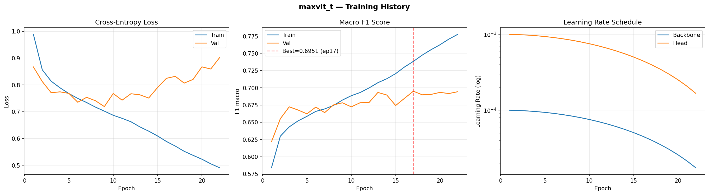
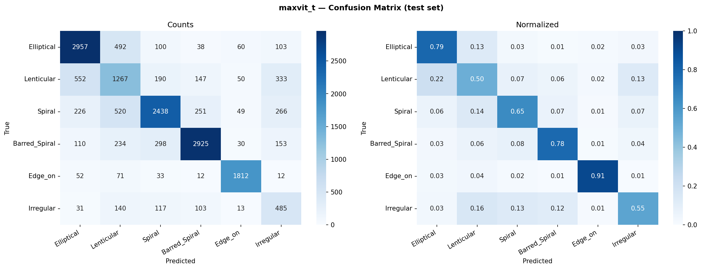

# MaxViT-T — Clasificación de Morfología Galáctica

---

## Índice

1. [Introducción](#1-introducción)
2. [Arquitectura del modelo](#2-arquitectura-del-modelo)
   - 2.1 [MaxViT: atención multi-eje](#21-maxvit-atención-multi-eje)
   - 2.2 [Bloque MaxViT: MBConv + Block Attention + Grid Attention](#22-bloque-maxvit-mbconv--block-attention--grid-attention)
   - 2.3 [Estructura interna de MaxViT-T](#23-estructura-interna-de-maxvit-t)
   - 2.4 [Cabeza de clasificación personalizada](#24-cabeza-de-clasificación-personalizada)
   - 2.5 [Parámetros totales](#25-parámetros-totales)
   - 2.6 [Salida del modelo](#26-salida-del-modelo)
3. [Configuración del experimento](#3-configuración-del-experimento)
   - 3.1 [Hardware y software](#31-hardware-y-software)
   - 3.2 [Pipeline de datos](#32-pipeline-de-datos)
   - 3.3 [Preprocesamiento de imagen](#33-preprocesamiento-de-imagen)
   - 3.4 [Aumentación de datos](#34-aumentación-de-datos)
   - 3.5 [Pesos de clase](#35-pesos-de-clase)
   - 3.6 [Optimizador y planificador de LR](#36-optimizador-y-planificador-de-lr)
   - 3.7 [Regularización y aceleraciones](#37-regularización-y-aceleraciones)
4. [Entrenamiento](#4-entrenamiento)
   - 4.1 [Curvas de aprendizaje](#41-curvas-de-aprendizaje)
   - 4.2 [Registro completo por época](#42-registro-completo-por-época)
5. [Resultados](#5-resultados)
   - 5.1 [Métricas globales](#51-métricas-globales)
   - 5.2 [Matriz de confusión (test set)](#52-matriz-de-confusión-test-set)
   - 5.3 [Rendimiento por clase](#53-rendimiento-por-clase)
6. [Análisis](#6-análisis)
   - 6.1 [Overfitting](#61-overfitting)
   - 6.2 [Clases difíciles](#62-clases-difíciles)
   - 6.3 [Época anómala](#63-época-anómala)
7. [Conclusiones y trabajo futuro](#7-conclusiones-y-trabajo-futuro)

---

## 1. Introducción

**MaxViT-T** (Multi-Axis Vision Transformer Tiny) es la variante de menor tamaño de la familia MaxViT, propuesta por Tu et al. (2022) en _"MaxViT: Multi-Axis Vision Transformer"_ (ECCV 2022). MaxViT unifica en un único bloque tres tipos de procesamiento de imágenes: la extracción de características locales mediante **MBConv**, la atención local dentro de ventanas (**Block Attention**) y la atención global de coste lineal mediante un muestreo dilatado (**Grid Attention**). Esta combinación multi-eje permite al modelo capturar contexto local y global simultáneamente en cada capa, sin el coste cuadrático de la atención global de ViT.

En este proyecto se emplea MaxViT-T como el cuarto modelo del pipeline de morfología galáctica, tras EfficientNet-B3, ResNet-50 y Swin-S. Frente a Swin-S (~49.6 M parámetros), MaxViT-T ofrece una capacidad comparable (~31 M) con un mecanismo de atención más rico — tanto local como global dentro del mismo bloque — manteniendo la misma resolución de entrada de 224 px que los modelos CNN, lo que facilita la comparación directa.

| Índice | Clase         | Descripción                                           |
| ------ | ------------- | ----------------------------------------------------- |
| 0      | Elliptical    | Elípticas suaves, sin estructura interna visible      |
| 1      | Lenticular    | Discos con abultamiento central, sin brazos espirales |
| 2      | Spiral        | Espirales con brazos bien definidos                   |
| 3      | Barred_Spiral | Espirales con barra central                           |
| 4      | Edge_on       | Galaxias vistas de canto (disco fino visible)         |
| 5      | Irregular     | Morfología perturbada o asimétrica                    |

MaxViT-T fue elegido por su capacidad de modelar tanto estructuras locales (núcleo galáctico, barra) como globales (brazos espirales en toda la imagen) dentro del mismo bloque, sin necesidad de escalar la resolución de entrada más allá de 224 px.

---

## 2. Arquitectura del modelo

### 2.1 MaxViT: atención multi-eje

La motivación de MaxViT parte de una limitación que comparten ViT y Swin: **o se tiene atención global (costosa, $O(N^2)$) o atención local con ventanas (eficiente, pero sin comunicación de largo alcance en las capas inferiores)**. MaxViT resuelve esta dicotomía introduciendo dos operaciones de atención complementarias de coste $O(N)$ que, aplicadas juntas, permiten alcanzar el campo receptivo global en una sola capa:

**Block Attention (atención local):**
La imagen de feature tokens se particiona en bloques no solapados de $P \times P$ tokens:

$$\text{Feature map } (H \times W) \;\longrightarrow\; \frac{H \cdot W}{P^2} \text{ bloques de } P^2 \text{ tokens}$$

Cada bloque opera independientemente con self-attention. Para $P = 8$ y feature maps de $56 \times 56$, esto produce $49$ bloques de $64$ tokens — atención local análoga a la atención en ventanas de Swin, con complejidad $O(P^2 \cdot \frac{N}{P^2}) = O(N)$.

**Grid Attention (atención global dilatada):**
Se construye una cuadrícula dilatada tomando un token de cada $P \times P$ región del feature map:

$$\text{Feature map } (H \times W) \;\longrightarrow\; P^2 \text{ grids de } \frac{H \cdot W}{P^2} \text{ tokens}$$

Cada grid contiene tokens uniformemente distribuidos por toda la imagen — captura contexto global sin ver tokens vecinos, con la misma complejidad $O(N)$.

La clave del diseño es que **Block + Grid son duales**: un mismo conjunto de tokens aparece en un bloque local (para capturar cohesión espacial local) y en un grid global (para capturar dependencias de largo alcance). Aplicadas en secuencia, cubren todas las relaciones posibles entre tokens en dos operaciones de atención.

$$\text{Coste total por bloque MaxViT:} \quad O(P^2 N) + O\!\left(\frac{N}{P^2} \cdot P^4\right) = O(P^2 N) \approx O(N)$$

A diferencia de Swin (que necesita dos capas — W-MSA y SW-MSA — para comunicar ventanas adyacentes), MaxViT comunica cualquier par de tokens en una sola capa, gracias al Grid Attention.

### 2.2 Bloque MaxViT: MBConv + Block Attention + Grid Attention

Cada bloque MaxViT aplica tres sub-módulos en secuencia:

```
Entrada x  (B, C, H, W)
  │
  ├─ [MBConv]          Extracción de características locales convolucionales
  │    ├─ Pre-Norm (BN)
  │    ├─ Conv 1×1 → C×4  (expansión)  BN + GELU
  │    ├─ DepthwiseConv 3×3, padding 1  BN + GELU
  │    ├─ SE (Squeeze-and-Excitation, ratio 0.25)
  │    ├─ Conv 1×1 → C   (proyección)  BN
  │    └─ Skip + Stochastic Depth
  │         (B, C, H, W)
  │
  ├─ [Block Attention]  Atención local dentro de ventanas P×P
  │    ├─ Pre-Norm (LN)
  │    ├─ Reshape: (B, C, H, W) → (B·N_blocks, P², C)
  │    ├─ Relative Position Bias  (2P-1)×(2P-1) aprendible
  │    ├─ Multi-Head Self-Attention  (dentro de cada bloque)
  │    ├─ Reshape: vuelta a (B, C, H, W)
  │    ├─ Skip + Stochastic Depth
  │    ├─ Pre-Norm (LN) + MLP: Linear(C,4C) → GELU → Linear(4C,C)
  │    └─ Skip + Stochastic Depth
  │         (B, C, H, W)
  │
  └─ [Grid Attention]   Atención global dilatada
       ├─ Pre-Norm (LN)
       ├─ Reshape: (B, C, H, W) → (B·P², N/P², C)  ← tokens del grid
       ├─ Relative Position Bias  aprendible
       ├─ Multi-Head Self-Attention  (dentro de cada grid)
       ├─ Reshape: vuelta a (B, C, H, W)
       ├─ Skip + Stochastic Depth
       ├─ Pre-Norm (LN) + MLP: Linear(C,4C) → GELU → Linear(4C,C)
       └─ Skip + Stochastic Depth
            (B, C, H, W)
```

Características clave del bloque:

- **Pre-Norm (BN para MBConv, LN para atención):** La normalización antes de cada sub-capa estabiliza el gradiente en redes profundas.
- **GELU:** Activación estándar en Transformers; también en el MBConv de MaxViT (a diferencia de SiLU en EfficientNet).
- **SE en MBConv:** Recalibración de canales con ratio de compresión 0.25 — mismo mecanismo que EfficientNet.
- **Relative Position Bias:** Codifica la posición relativa de los tokens dentro de cada bloque/grid; se inicializa desde los pesos ImageNet-1K para facilitar el fine-tuning.
- **Stochastic Depth (Drop Path):** Regularización por omisión de bloques completos; la probabilidad crece linealmente con la profundidad.

### 2.3 Estructura interna de MaxViT-T

MaxViT-T usa una arquitectura jerárquica de 4 stages precedida por un stem convolucional. A diferencia de Swin (que usa token merging), el cambio de resolución entre stages se realiza mediante el **primer MBConv de cada stage con stride 2**.

**Stem:**

```python
# Conv 3×3, stride=2 (C: 3→64), BN, GELU
# Conv 3×3, stride=1 (C: 64→64), BN, GELU
# Entrada (B, 3, 224, 224) → (B, 64, 112, 112)
```

**Stages:**

| Stage | Res. entrada | Res. salida | Canales ($C$) | Bloques MaxViT | Stride MBConv |
| ----- | ------------ | ----------- | ------------- | -------------- | ------------- |
| 1     | 112 × 112    | 56 × 56     | 64            | 2              | 2 (1º bloque) |
| 2     | 56 × 56      | 28 × 28     | 128           | 2              | 2 (1º bloque) |
| 3     | 28 × 28      | 14 × 14     | 256           | 5              | 2 (1º bloque) |
| 4     | 14 × 14      | 7 × 7       | 512           | 2              | 2 (1º bloque) |

Para MaxViT-T en 224 px, el tamaño de partición $P = 8$ se usa para Block y Grid Attention.

**Comparación MaxViT-T vs Swin-S vs EfficientNet-B3:**

| Propiedad          | EfficientNet-B3 | Swin-S        | MaxViT-T     |
| ------------------ | --------------- | ------------- | ------------ |
| Tipo               | CNN pura        | Transformer   | CNN+Transf.  |
| Resolución entrada | 224 px          | 308 px        | 224 px       |
| Atención           | No (SE local)   | Local (W-MSA) | Local+Global |
| Stages             | 9               | 4             | 4            |
| Params             | ~10.7 M         | ~49.6 M       | ~30.9 M      |
| FLOPs (224px)      | ~1.8 G          | ~8.7 G\*      | ~5.6 G       |
| Batch size (AMP)   | 64              | 32            | 32           |

\* Para Swin-S, FLOPs calculados a 224 px. En este proyecto se usó 308 px, incrementando el coste ~1.9×.

La gran ventaja de MaxViT-T respecto a Swin-S es que combina contexto **local y global en cada capa**, mientras Swin solo conecta ventanas adyacentes mediante el desplazamiento. A igualdad de resolución de entrada (224 px), MaxViT-T (~5.6 GFLOPs) es más eficiente que Swin-S (~16 GFLOPs a 308 px).

### 2.4 Cabeza de clasificación personalizada

La cabeza original de MaxViT-T (para ImageNet, 1000 clases) es un clasificador profundo con dos capas lineales y una no-linealidad Tanh:

```python
# base_model.classifier es un Sequential de 6 módulos:
# [0] AdaptiveAvgPool2d(output_size=1)
# [1] Flatten(start_dim=1)
# [2] LayerNorm(512, eps=1e-05)
# [3] Linear(in_features=512, out_features=512, bias=True)
# [4] Tanh()
# [5] Linear(in_features=512, out_features=1000, bias=True)  ← se reemplaza
```

Para este proyecto se reemplaza únicamente la capa final `classifier[5]` por una nueva para 6 clases:

```python
from torchvision.models import maxvit_t, MaxVit_T_Weights

base_model = maxvit_t(weights=MaxVit_T_Weights.IMAGENET1K_V1)

# in_features = 512 = canales del último stage de MaxViT-T
in_features = base_model.classifier[5].in_features   # 512
base_model.classifier[5] = nn.Linear(in_features, NUM_CLASSES)  # 512 → 6
```

La cabeza final en producción:

```
AdaptiveAvgPool2d(output_size=(1, 1))
Flatten(start_dim=1)
LayerNorm(512, eps=1e-05)
Linear(in_features=512, out_features=512, bias=True)
Tanh()
Linear(in_features=512, out_features=6, bias=True)   ← cabeza personalizada
```

A diferencia de EfficientNet-B3 (Dropout + 1 Linear) y ResNet-50 (1 Linear) y Swin-S (1 Linear), MaxViT-T incluye una **capa de bottleneck 512→512 con Tanh** antes de la proyección final. Esto proporciona una transformación no-lineal adicional en la cabeza, potencialmente beneficiosa para re-estructurar las representaciones del backbone hacia las 6 clases del dominio astronómico.

### 2.5 Parámetros totales

| Grupo                                                            | Parámetros      |
| ---------------------------------------------------------------- | --------------- |
| Backbone (stem + stages 1–4)                                     | ~30,607,808     |
| Cabeza personalizada (LN + Linear 512→512 + Tanh + Linear 512→6) | ~266,246        |
| **Total**                                                        | **~30,874,054** |

El entrenamiento usa **learning rate diferencial**: toda la cabeza (`classifier`) se entrena con LR 10× mayor que el backbone, ya que el módulo Linear final tiene pesos aleatorios al inicio y el resto de la cabeza proviene de ImageNet pero requiere adaptación al dominio.

### 2.6 Salida del modelo

La red devuelve **logits crudos** — un vector de 6 valores reales sin ninguna función de activación final. No se aplica softmax ni sigmoid dentro del modelo.

```
Entrada : tensor  (B, 3, 224, 224)   float32
Salida  : tensor  (B, 6)             float32   ← logits crudos

Ejemplo con B=1 (una imagen de galaxia espiral barrada):
  logits = [ -0.42,  -1.18,   0.87,   2.73,  -2.31,  -0.95 ]
  índice :    0       1       2       3       4       5
  clase  :  Ell.    Len.   Spiral  Bar.Sp  Edge_on  Irreg.
```

**Del logit a la probabilidad (softmax):**

$$p_c = \frac{e^{z_c}}{\sum_{k=0}^{5} e^{z_k}}$$

```python
# Inferencia — pipeline completo
model.eval()
with torch.no_grad():
    logits = model(x)                          # (B, 6)  — salida directa
    probs  = torch.softmax(logits, dim=1)      # (B, 6)  — probabilidades [0, 1], suma = 1
    pred   = logits.argmax(dim=1)              # (B,)    — índice de clase ganadora
    label  = IDX_TO_CLASS[pred.item()]         # str     — nombre legible

# Para el ejemplo anterior:
# probs ≈ [0.040, 0.019, 0.144, 0.921, 0.006, 0.023]  (suma ≈ 1)
# pred  = 3  →  'Barred_Spiral'  ✓
```

**Durante el entrenamiento — `CrossEntropyLoss` toma logits directamente:**

```python
criterion = nn.CrossEntropyLoss(weight=class_weights)
loss = criterion(logits, labels)   # logits: (B, 6)  labels: (B,) con índices 0-5
# CrossEntropyLoss = LogSoftmax + NLLLoss internamente
# No pasar softmax antes — causaría doble-softmax y loss incorrecto
```

**Flujo completo de datos a través del modelo:**

```
(B, 3, 224, 224)
   │
   ├─ Stem: Conv3×3(stride 2) + Conv3×3
   │      (B, 64, 112, 112)
   ├─ Stage 1 — 2 bloques MaxViT (MBConv stride 2 + Block Att. + Grid Att.)
   │      (B, 64, 56, 56)
   ├─ Stage 2 — 2 bloques MaxViT (MBConv stride 2 + Block Att. + Grid Att.)
   │      (B, 128, 28, 28)
   ├─ Stage 3 — 5 bloques MaxViT (MBConv stride 2 + Block Att. + Grid Att.)  ← stage crítico
   │      (B, 256, 14, 14)
   ├─ Stage 4 — 2 bloques MaxViT (MBConv stride 2 + Block Att. + Grid Att.)
   │      (B, 512, 7, 7)
   ├─ AdaptiveAvgPool2d(1, 1)
   │      (B, 512, 1, 1)
   ├─ Flatten
   │      (B, 512)            ← vector de características
   ├─ LayerNorm(512)
   │      (B, 512)
   ├─ Linear(512 → 512) + Tanh
   │      (B, 512)            ← transformación intermedia
   └─ Linear(512 → 6)         ← cabeza personalizada
          (B, 6)              ← LOGITS (salida final)
```

---

## 3. Configuración del experimento

### 3.1 Hardware y software

| Componente   | Valor                                                        |
| ------------ | ------------------------------------------------------------ |
| GPU          | NVIDIA RTX 5060 Ti (Blackwell GB206, 16 GB VRAM)             |
| CUDA         | 12.8                                                         |
| PyTorch      | ≥ 2.7 (`--index-url https://download.pytorch.org/whl/cu128`) |
| OS           | Linux                                                        |
| Entorno      | Jupyter Notebook local                                       |
| `sm_` target | sm_120 (Blackwell)                                           |

### 3.2 Pipeline de datos

**Tamaño del dataset:**

| Split     | Imágenes    |
| --------- | ----------- |
| Train     | 77,789      |
| Val       | 16,670      |
| Test      | 16,670      |
| **Total** | **111,129** |

**Parámetros de entrada:**

| Parámetro     | Valor                                                                |
| ------------- | -------------------------------------------------------------------- |
| `CROP_SIZE`   | 320 px (center crop desde 424×424)                                   |
| `IMAGE_SIZE`  | 224 px (resize después del crop)                                     |
| `BATCH_SIZE`  | 32                                                                   |
| `NUM_WORKERS` | 4 (Linux — sin riesgo de deadlock en Jupyter)                        |
| `pin_memory`  | `True` (CUDA) — transfiere en DMA, sin bloquear CPU                  |
| Normalización | ImageNet mean/std: `[0.485, 0.456, 0.406]` / `[0.229, 0.224, 0.225]` |

> **Comparación con EfficientNet-B3:** Ambos usan `IMAGE_SIZE=224` y `CROP_SIZE=320`, pero MaxViT-T usa `BATCH_SIZE=32` (frente a 64 de EfficientNet-B3). El Block Attention y el Grid Attention en MaxViT-T requieren más memoria activacional por imagen que el MBConv puro de EfficientNet, especialmente en los stages más amplios (stage 3: 14×14×256 con bloques 8×8 de atención).

**Clase Dataset personalizada:**

```python
class GalaxyDataset(Dataset):
    def __init__(self, csv_path, images_dir, transform, class_to_idx):
        df = pd.read_csv(csv_path, usecols=['img_filename', 'morph_label'])
        self.filenames = df['img_filename'].to_numpy()    # numpy array para evitar OOM
        self.labels    = np.array([class_to_idx[lbl] for lbl in df['morph_label']])
        self.images_dir = pathlib.Path(images_dir)
        self.transform  = transform

    def __getitem__(self, idx):
        image = Image.open(self.images_dir / self.filenames[idx]).convert('RGB')
        return self.transform(image), int(self.labels[idx])
```

### 3.3 Preprocesamiento de imagen

| Paso | Operación                     | Entrada → Salida            | Motivo                                                              |
| ---- | ----------------------------- | --------------------------- | ------------------------------------------------------------------- |
| 1    | `Image.open().convert('RGB')` | JPEG → PIL (424×424, uint8) | Carga estándar; `convert('RGB')` descarta canal alfa si existe      |
| 2    | `CenterCrop(320)`             | 424×424 → 320×320           | Elimina ~52 px de borde negro por lado (~12% del área total)        |
| 3    | `Resize(224)`                 | 320×320 → 224×224           | Escala a resolución del modelo; ratio 320/224 ≈ 1.43 (sin aliasing) |
| 4    | `ToTensor()`                  | PIL uint8 → float32 CHW     | Normaliza [0,255] → [0.0,1.0], reordena HWC → CHW                   |
| 5    | `Normalize(mean, std)`        | [0,1] → aprox [-2.1,2.6]    | Centra distribución de activaciones para compatibilidad ImageNet    |

**¿Por qué `CROP_SIZE=320` y no 380 como en Swin?**

MaxViT-T trabaja a la misma resolución que EfficientNet-B3 (224 px), por lo que se usa el mismo `CROP_SIZE=320`. El `CROP_SIZE=380` de Swin-S es necesario para preservar el ratio de información al escalar hasta 308 px (ratio 380/308 ≈ 1.23). Para 224 px, un crop de 320 es suficiente (ratio 320/224 ≈ 1.43).

### 3.4 Aumentación de datos

**Train:**

```python
transforms.CenterCrop(320)
transforms.Resize(224)
transforms.RandomHorizontalFlip(p=0.5)
transforms.RandomVerticalFlip(p=0.5)
transforms.RandomRotation(degrees=180)
transforms.ColorJitter(brightness=0.15, contrast=0.15)
transforms.ToTensor()
transforms.Normalize(mean=[0.485, 0.456, 0.406], std=[0.229, 0.224, 0.225])
```

**Validación / Test** (sin augmentación):

```python
transforms.CenterCrop(320)
transforms.Resize(224)
transforms.ToTensor()
transforms.Normalize(mean=[0.485, 0.456, 0.406], std=[0.229, 0.224, 0.225])
```

**Justificación:**

- `RandomHorizontalFlip` + `RandomVerticalFlip` + `RandomRotation(180°)`: Las galaxias no tienen orientación privilegiada en el plano del cielo. La invarianza rotacional es física y se explota completamente con rotación aleatoria uniforme en [0°, 180°].
- `ColorJitter(brightness=0.15, contrast=0.15)`: Las imágenes GZ2 provienen de observaciones fotométricas con diferentes condiciones de seeing y exposición. La perturbación leve de brillo y contraste simula esta variabilidad.
- Sin `RandomCrop` ni `RandomResizedCrop`: Se preserva la morfología global de la galaxia, que es la señal discriminante clave. Un crop aleatorio podría eliminar brazos espirales externos o la barra central.

### 3.5 Pesos de clase

El dataset GZ2 tiene un desbalance de clase real (ratio máximo ~4.2×). Se aplican pesos de clase en la `CrossEntropyLoss`:

$$w_c = \frac{N}{K \cdot n_c}$$

donde $N$ = total de muestras en train, $K$ = 6 clases, $n_c$ = muestras de la clase $c$.

| Clase         | $n_c$  | $w_c$ |
| ------------- | ------ | ----- |
| Elliptical    | 25,009 | 0.74  |
| Lenticular    | 16,926 | 1.09  |
| Spiral        | 25,009 | 0.74  |
| Barred_Spiral | 25,009 | 0.74  |
| Edge_on       | 13,276 | 1.40  |
| Irregular     | 5,927  | 3.12  |

La clase `Irregular` recibe el mayor peso (~3.12×) por ser la minoría más pronunciada. Estos pesos son idénticos en todos los modelos del pipeline para mantener la comparabilidad.

### 3.6 Optimizador y planificador de LR

**Optimizador:** AdamW con decaimiento de pesos desacoplado

```python
optimizer = optim.AdamW(
    [
        {'params': backbone_params, 'lr': 1e-4},   # backbone: LR conservador
        {'params': head_params,     'lr': 1e-3},   # cabeza: LR agresivo (×10)
    ],
    weight_decay=1e-4,
)
```

donde:

```python
backbone_params = [p for n, p in base_model.named_parameters() if not n.startswith('classifier')]
head_params     = list(base_model.classifier.parameters())
```

**Planificador:** CosineAnnealingLR

$$\eta_t = \eta_{\min} + \frac{1}{2}(\eta_{\max} - \eta_{\min})\left(1 + \cos\frac{t\pi}{T}\right)$$

Con $T = 30$ épocas, $\eta_{\min} = 10^{-6}$. El entrenamiento se detuvo en la época 22 por early stopping, por lo que los LR no alcanzan el mínimo de $10^{-6}$.

**Evolución del LR (valores al inicio de la época):**

| Época | LR Backbone  | LR Head      |
| ----- | ------------ | ------------ |
| 1     | 9.973 × 10⁻⁵ | 9.973 × 10⁻⁴ |
| 10    | 7.525 × 10⁻⁵ | 7.525 × 10⁻⁴ |
| 17    | 4.021 × 10⁻⁵ | 3.967 × 10⁻⁴ |
| 22    | 1.738 × 10⁻⁵ | 1.663 × 10⁻⁴ |
| 30\*  | 1.0 × 10⁻⁶   | 1.0 × 10⁻⁶   |

\* Proyectado — el entrenamiento terminó en la época 22 por early stopping.

### 3.7 Regularización y aceleraciones

| Técnica              | Configuración                         | Motivo                                                                |
| -------------------- | ------------------------------------- | --------------------------------------------------------------------- |
| **Stochastic Depth** | $p_{\max}=0.2$ en backbone pretrained | Drop path por bloque; regulariza redes profundas                      |
| **AMP (float16)**    | `autocast` + `GradScaler`             | Reduce VRAM en ~40% y acelera en Tensor Cores                         |
| **torch.compile()**  | Activo en Linux (Triton disponible)   | Fusión de kernels, mayor throughput en Blackwell                      |
| **Weight Decay**     | $\lambda = 10^{-4}$                   | Penaliza pesos grandes, reduce overfitting                            |
| **Early Stopping**   | `patience = 5`                        | Detiene el entrenamiento si val F1 no mejora en 5 épocas consecutivas |
| **Semilla fija**     | `RANDOM_SEED = 42`                    | Reproducibilidad de DataLoader shuffle                                |

**Early stopping:** A diferencia de EfficientNet-B3 y Swin-S (que completaron las 30 épocas), MaxViT-T activó el early stopping después de la época 22 — 5 épocas sin superar el val F1 de 0.6951 (obtenido en la época 17). Esto detuvo el entrenamiento antes del sobreajuste severo.

**Checkpointing:** Se guarda `latest.pth` (cada época), `best.pth` (mejor val F1), y `epoch_XXX.pth` (cada 5 épocas). Cada checkpoint incluye el estado completo del modelo, optimizer, scheduler, scaler, contador `epochs_no_improve` e historial para reanudación perfecta.

---

## 4. Entrenamiento

### 4.1 Curvas de aprendizaje



Las tres gráficas muestran:

1. **Cross-Entropy Loss (izquierda):** La pérdida de entrenamiento (azul) desciende continuamente de 0.988 a 0.491 a lo largo de 22 épocas. La pérdida de validación (naranja) converge rápidamente en las primeras épocas (~0.72 en la época 9), pero a partir de la época 13 comienza a crecer de forma pronunciada hasta ~0.90 al final — indicando overfitting progresivo más marcado que en Swin-S.

2. **Macro F1 Score (centro):** El val F1 alcanza su **pico de 0.6951 en la época 17** (línea roja punteada). El plateau es más estrecho que en Swin-S — el val F1 oscila entre 0.689 y 0.695 en las últimas 10 épocas. El train F1 supera 0.77 al final, con una brecha creciente que confirma el overfitting.

3. **Learning Rate Schedule (derecha):** El cosine annealing decae el LR del backbone de $10^{-4}$ hacia $1.7 \times 10^{-5}$ (en la época 22) y el del head de $10^{-3}$ hacia $1.7 \times 10^{-4}$. La reducción del LR no fue suficiente para cerrar la brecha train/val en las épocas finales.

### 4.2 Registro completo por época

| Época  | Train Loss   | Train F1     | Val Loss     | Val F1       | LR Backbone      | Mejor   |
| ------ | ------------ | ------------ | ------------ | ------------ | ---------------- | ------- |
| 1      | 0.988432     | 0.583843     | 0.866814     | 0.621607     | 9.973 × 10⁻⁵     | ✓       |
| 2      | 0.856407     | 0.629723     | 0.812411     | 0.655097     | 9.892 × 10⁻⁵     | ✓       |
| 3      | 0.813789     | 0.643180     | 0.770772     | 0.672356     | 9.758 × 10⁻⁵     | ✓       |
| 4      | 0.788977     | 0.652001     | 0.773942     | 0.667720     | 9.572 × 10⁻⁵     | —       |
| 5      | 0.767699     | 0.658542     | 0.768248     | 0.662191     | 9.337 × 10⁻⁵     | —       |
| 6      | 0.749545     | 0.665751     | 0.735219     | 0.671997     | 9.055 × 10⁻⁵     | —       |
| 7      | 0.734160     | 0.669309     | 0.753557     | 0.663961     | 8.729 × 10⁻⁵     | —       |
| 8      | 0.716965     | 0.674380     | 0.740767     | 0.675149     | 8.362 × 10⁻⁵     | ✓       |
| 9      | 0.702064     | 0.682200     | 0.719018     | 0.678210     | 7.960 × 10⁻⁵     | ✓       |
| 10     | 0.686570     | 0.688511     | 0.767786     | 0.672330     | 7.525 × 10⁻⁵     | —       |
| 11     | 0.675169     | 0.693140     | 0.742965     | 0.678334     | 7.063 × 10⁻⁵     | ✓       |
| 12     | 0.662385     | 0.699739     | 0.766891     | 0.678595     | 6.580 × 10⁻⁵     | ✓       |
| 13     | 0.643350     | 0.707418     | 0.762941     | 0.693235     | 6.079 × 10⁻⁵     | ✓       |
| 14     | 0.627372     | 0.713134     | 0.750867     | 0.689518     | 5.567 × 10⁻⁵     | —       |
| 15     | 0.609378     | 0.720545     | 0.790037     | 0.674274     | 5.050 × 10⁻⁵     | —       |
| 16     | 0.588894     | 0.730186     | 0.824424     | 0.684742     | 4.533 × 10⁻⁵     | —       |
| **17** | **0.571698** | **0.738339** | **0.831721** | **0.695060** | **4.021 × 10⁻⁵** | **✓ ★** |
| 18     | 0.552280     | 0.747457     | 0.806552     | 0.689816     | 3.520 × 10⁻⁵     | — ⚠️    |
| 19     | 0.537193     | 0.755380     | 0.820282     | 0.690396     | 3.037 × 10⁻⁵     | —       |
| 20     | 0.522746     | 0.762492     | 0.867171     | 0.693330     | 2.575 × 10⁻⁵     | —       |
| 21     | 0.505631     | 0.770688     | 0.859093     | 0.691664     | 2.140 × 10⁻⁵     | —       |
| 22     | 0.490706     | 0.777611     | 0.901899     | 0.694304     | 1.738 × 10⁻⁵     | —       |

⚠️ = época con tiempo anómalamente alto (sistema en suspensión). ★ = mejor checkpoint guardado en `best.pth`.

El entrenamiento se detuvo automáticamente tras la época 22 por **early stopping** (`patience=5`): las épocas 18–22 no superaron el val F1 de 0.6951 obtenido en la época 17 (`epochs_no_improve = 5`).

**Tiempos de entrenamiento:**

| Épocas                                     | Tiempo                 |
| ------------------------------------------ | ---------------------- |
| Época 18 (suspensión del sistema)          | 2,911.2 s (~48 min)    |
| Épocas regulares (promedio, 21 épocas)     | ~907 s (~15 min/época) |
| **Tiempo efectivo de cómputo (22 épocas)** | **~20,860 s (~5.8 h)** |
| Tiempo de pared total (22 épocas)          | ~21,971 s (~6.1 h)     |

---

## 5. Resultados

### 5.1 Métricas globales

| Métrica                        | Valor                          |
| ------------------------------ | ------------------------------ |
| **Val F1-macro (mejor)**       | **0.6951** (época 17)          |
| Val F1-macro (final, época 22) | 0.6943                         |
| Train F1-macro (época 17)      | 0.7383                         |
| Train F1-macro (época 22)      | 0.7776                         |
| Val Loss mínima                | 0.7190 (época 9)               |
| Gap train/val F1 (época 17)    | 0.043                          |
| Gap train/val F1 (época 22)    | 0.083                          |
| Early stopping activado        | **Sí** — época 22 (patience=5) |

El modelo fue evaluado en el **test set** (16,670 imágenes) usando el checkpoint `best.pth` (época 17).

**Comparativa con modelos anteriores:**

| Modelo          | Val F1 (mejor) | Época mejor / Total      | Params      |
| --------------- | -------------- | ------------------------ | ----------- |
| EfficientNet-B3 | 0.6894         | 16 / 30                  | ~10.7 M     |
| ResNet-50       | 0.6914         | 14 / 19 (early stop)     | ~23.5 M     |
| **MaxViT-T**    | **0.6951**     | **17 / 22 (early stop)** | **~30.9 M** |
| Swin-S          | 0.6962         | 25 / 30                  | ~49.6 M     |

MaxViT-T se posiciona en **segundo lugar del pipeline**, superando a EfficientNet-B3 (+0.0057) y ResNet-50 (+0.0037), y quedando a tan solo 0.0011 de Swin-S con ~18.7 M parámetros menos.

### 5.2 Matriz de confusión (test set)



La figura izquierda muestra conteos absolutos; la derecha muestra proporciones normalizadas por fila (recall por clase). Los elementos diagonales representan predicciones correctas.

**Observaciones clave de la matriz:**

- **Edge_on** (fila 5): recall de **0.91** — la clase más fácil del pipeline. El perfil en disco fino es visualmente único y MaxViT-T lo detecta con alta fiabilidad.
- **Lenticular** (fila 2): recall de **0.50** — la clase más difícil en todos los modelos. El 22% se confunde con Elliptical; el 13% con Irregular. La ambigüedad E/S0 es un límite fenotípico inherente.
- **Spiral** (fila 3): recall de **0.65** — el 14% se confunde con Lenticular; el 7% con Barred_Spiral.
- **Barred_Spiral** (fila 4): recall de **0.78** — el 8% confundido con Spiral (barra poco prominente) y el 6% con Lenticular.
- **Elliptical** (fila 1): recall de **0.79** — el 13% se confunde con Lenticular.
- **Irregular** (fila 6): recall de **0.55** — distribuido principalmente entre Lenticular (16%) y Spiral (13%).

### 5.3 Rendimiento por clase

| Clase         | Precision | Recall    | F1        | Support | Principal confusión                  |
| ------------- | --------- | --------- | --------- | ------- | ------------------------------------ |
| Elliptical    | 0.753     | 0.789     | 0.770     | 3,750   | Lenticular (13%)                     |
| Lenticular    | 0.465     | 0.499     | 0.481     | 2,539   | Elliptical (22%), Irregular (13%)    |
| Spiral        | 0.768     | 0.650     | 0.704     | 3,750   | Lenticular (14%), Barred_Spiral (7%) |
| Barred_Spiral | 0.841     | 0.780     | 0.809     | 3,750   | Spiral (8%), Lenticular (6%)         |
| Edge_on       | 0.900     | 0.910     | 0.905     | 1,992   | Lenticular (4%), Elliptical (3%)     |
| Irregular     | 0.359     | 0.546     | 0.433     | 889     | Lenticular (16%), Spiral (13%)       |
| **Macro avg** | **0.681** | **0.696** | **0.684** | 16,670  | —                                    |
| **Accuracy**  | —         | —         | **0.713** | 16,670  | —                                    |

---

## 6. Análisis

### 6.1 Overfitting

El gap entre train F1 y val F1 crece de forma acelerada a partir de la época 13, más pronunciado que en Swin-S:

| Época | Train F1 | Val F1 | Gap                                 |
| ----- | -------- | ------ | ----------------------------------- |
| 3     | 0.643    | 0.672  | –0.029 (el modelo generaliza mejor) |
| 9     | 0.682    | 0.678  | +0.004                              |
| 13    | 0.707    | 0.693  | +0.014                              |
| 17    | 0.738    | 0.695  | +0.043                              |
| 22    | 0.778    | 0.694  | +0.083                              |

El val F1 alcanza un plateau entre 0.689–0.695 a partir de la época 13, mientras el train F1 sigue subiendo. Factores que explican la mayor propensión al overfitting respecto a Swin-S:

1. **Resolución más baja (224 vs 308 px):** Con menos información por imagen, el modelo depende más de memorizar patrones del training set para mejorar el train F1.
2. **Grid Attention:** La atención global en cada bloque tiene mayor capacidad de memorizar co-ocurrencias de características que el Swin local. Con 11 bloques MaxViT totales (11 × 3 sub-módulos), la capacidad efectiva supera a la aparente por el recuento de parámetros.
3. **Cabeza con bottleneck:** El módulo Linear(512→512)+Tanh en la cabeza añade capacidad de memorización sin regularización explícita.

El early stopping con `patience=5` fue efectivo — sin él, el overfitting habría continuado y la val F1 final habría caído por debajo de 0.690.

### 6.2 Clases difíciles

**Lenticular (recall = 0.50):** Persiste el mismo límite fenotípico E/S0 que en todos los modelos. MaxViT-T no mejora respecto a Swin-S (ambos 0.50–0.51) — la ambigüedad es intrínseca a la resolución angular de las imágenes GZ2.

**Irregular (recall = 0.55, precision = 0.36):** La baja precisión indica sobrepredicción de la clase Irregular. El 22% de los Lenticulares y el 13% de los Espirales son clasificados erróneamente como Irregulares por el modelo — la alta variabilidad morfológica intra-clase de Irregular genera una "zona de amortiguación" que absorbe casos ambiguos de otras clases.

**Comparativa de recall por clase (todos los modelos entrenados):**

| Clase         | EfficientNet-B3 | ResNet-50 | Swin-S | MaxViT-T | Tendencia              |
| ------------- | --------------- | --------- | ------ | -------- | ---------------------- |
| Elliptical    | 0.79            | ~0.79     | 0.79   | 0.79     | Estable (techo CNN)    |
| Lenticular    | 0.49            | ~0.50     | 0.51   | 0.50     | Sin mejora clara       |
| Spiral        | 0.60            | ~0.62     | 0.64   | 0.65     | Mejora progresiva ↑    |
| Barred_Spiral | 0.74            | ~0.75     | 0.76   | 0.78     | Mejora progresiva ↑    |
| Edge_on       | 0.94            | ~0.93     | 0.93   | 0.91     | Ligera regresión       |
| Irregular     | 0.62            | ~0.57     | 0.56   | 0.55     | Regresión progresiva ↓ |

MaxViT-T consolida la mejora en **Spiral** (+0.05 vs EfficientNet-B3) y **Barred_Spiral** (+0.04 vs EfficientNet-B3), probablemente gracias al Grid Attention que detecta la simetría global de los brazos espirales. Sin embargo, la regresión en **Edge_on** y **Irregular** respecto a EfficientNet-B3 sugiere que la atención global perjudica las clases cuya discriminación depende de características muy locales (perfil fino del disco) o de la ausencia de estructura regular.

### 6.3 Época anómala

La época 18 registró **2,911.2 segundos** (~48 min), frente al tiempo normal de ~907 s (~15 min). La causa fue una suspensión del sistema operativo durante el entrenamiento.

| Detalle                       | Valor                                            |
| ----------------------------- | ------------------------------------------------ |
| Época afectada                | 18                                               |
| Tiempo registrado             | 2,911.2 s (~48 min)                              |
| Tiempo esperado               | ~907 s (~15 min)                                 |
| Tiempo de suspensión estimado | ~2,004 s (~33 min)                               |
| Impacto en métricas           | Ninguno — el cómputo completó correctamente      |
| ¿Se perdió progreso?          | No — `latest.pth` se guardó al final de la época |

La época 18 fue además la primera tras el mejor checkpoint (época 17), con val F1=0.6898 — una caída de 0.005 respecto al máximo. Esta caída es coherente con la variabilidad natural del val F1 en el plateau, sin relación con la suspensión.

---

## 7. Conclusiones y trabajo futuro

### Logros

- MaxViT-T alcanzó un **val F1-macro de 0.6951**, convirtiéndose en el **segundo mejor modelo del pipeline** con ~31 M parámetros — ~19 M menos que Swin-S para una diferencia de solo 0.0011 F1.
- El **early stopping funcionó correctamente**, deteniendo el entrenamiento en la época 22 y preservando el checkpoint óptimo de la época 17. Esto contrasta con EfficientNet-B3 y Swin-S, que continuaron entrenando después de su punto óptimo.
- La combinación de **Block + Grid Attention** mejoró el recall de **Spiral** (0.65) y **Barred_Spiral** (0.78) respecto a todos los modelos CNN anteriores — la atención global captura mejor la simetría rotacional de los brazos espirales.
- **Eficiencia computacional:** ~5.8 h de cómputo efectivo para 22 épocas, frente a ~11.2 h de Swin-S para 30 épocas — mejor ratio F1/tiempo de entrenamiento del pipeline.

### Limitaciones

- **Overfitting más pronunciado** que Swin-S, con una brecha train/val que excede 0.08 al final. La mayor capacidad de memorización del Grid Attention no se compensa con regularización suficiente a 224 px.
- **Lenticular sigue sin mejorar:** Recall 0.50 — ningún modelo del pipeline ha superado 0.51 en esta clase. La limitación es inherente a la resolución de las imágenes GZ2.
- **Regresión en Edge_on e Irregular** respecto a modelos CNN: MaxViT-T (0.91, 0.55) vs EfficientNet-B3 (0.94, 0.62). El mecanismo de atención global puede introducir ruido en clases que dependen de características muy locales.
- **Val Loss creciente desde época 9:** El desacoplamiento entre val loss y val F1 (loss sube mientras F1 sigue mejorando ligeramente) indica que el modelo sobreestima su confianza en las predicciones incorrectas — un problema de calibración.

### Trabajo futuro

| Aspecto          | Acción sugerida                                                                                  |
| ---------------- | ------------------------------------------------------------------------------------------------ |
| Resolución       | Probar `IMAGE_SIZE=256` o `IMAGE_SIZE=288` para dar más información espacial a Block/Grid Att.   |
| Irregular        | Aplicar MixUp entre Irregular y Lenticular/Spiral para regularizar la frontera de decisión       |
| Calibración      | Añadir Label Smoothing (`label_smoothing=0.1`) en CrossEntropyLoss para reducir sobreconfianza   |
| Edge_on          | Reducir `CROP_SIZE` para preservar más contexto del disco en galaxias vistas de canto            |
| Early stopping   | Reducir `patience=3` — el plateau de val F1 es estrecho y la mejora posterior a ep. 13 es mínima |
| Evaluación final | Notebook `09_evaluation.ipynb` — comparar las 4 arquitecturas sobre test set                     |

### Checkpoints disponibles

| Archivo                                     | Descripción                                           |
| ------------------------------------------- | ----------------------------------------------------- |
| `models/checkpoints/maxvit_t/best.pth`      | Época 17 — **val F1 = 0.6951** — usar para inferencia |
| `models/checkpoints/maxvit_t/latest.pth`    | Época 22 — último estado del modelo (early stop)      |
| `models/checkpoints/maxvit_t/epoch_005.pth` | Snapshot época 5                                      |
| `models/checkpoints/maxvit_t/epoch_010.pth` | Snapshot época 10                                     |
| `models/checkpoints/maxvit_t/epoch_015.pth` | Snapshot época 15                                     |
| `models/checkpoints/maxvit_t/epoch_020.pth` | Snapshot época 20                                     |

> **Descarga del modelo:** El checkpoint `best.pth` está disponible públicamente en Kaggle:
> [https://www.kaggle.com/models/jeancdevx/galaxy-morph-maxvit-t](https://www.kaggle.com/models/jeancdevx/galaxy-morph-maxvit-t)

---

_Generado el 17 de mayo de 2026. Entrenamiento realizado en NVIDIA RTX 5060 Ti (Linux, CUDA 12.8, PyTorch ≥ 2.7)._
