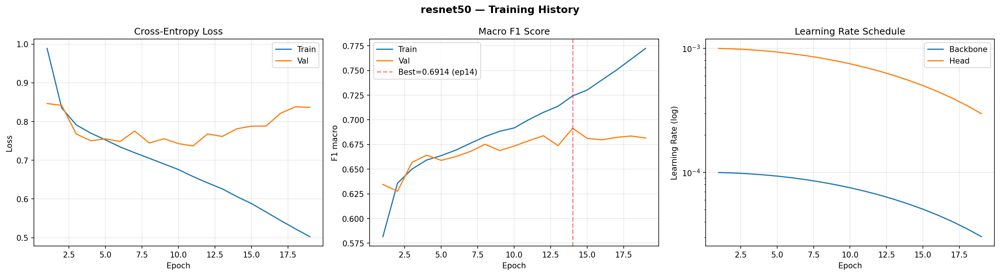
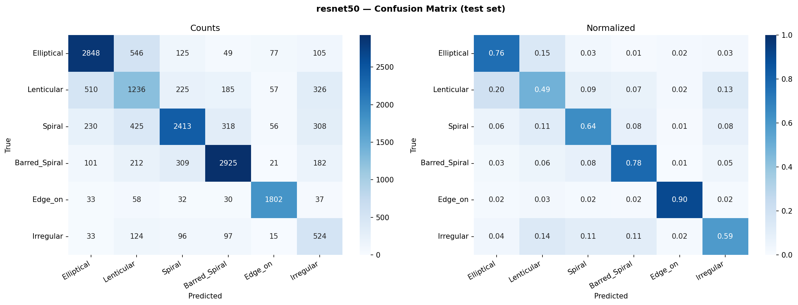

# ResNet-50 — Clasificación de Morfología Galáctica

> **Proyecto:** Galaxy Morph ML  
> **Dataset:** Galaxy Zoo 2 (GZ2) — 111,129 galaxias, 6 clases  
> **Hardware de entrenamiento:** NVIDIA RTX 5060 Ti (8 GB VRAM, arquitectura Blackwell GB206)  
> **Mejor val F1-macro:** **0.6914** (época 14 / 19 — parada por early stopping)

---

## Índice

1. [Introducción](#1-introducción)
2. [Arquitectura del modelo](#2-arquitectura-del-modelo)
   - 2.1 [ResNet: aprendizaje residual](#21-resnet-aprendizaje-residual)
   - 2.2 [Bloque Bottleneck](#22-bloque-bottleneck)
   - 2.3 [Estructura interna de ResNet-50](#23-estructura-interna-de-resnet-50)
   - 2.4 [Cabeza de clasificación personalizada](#24-cabeza-de-clasificación-personalizada)
   - 2.5 [Parámetros totales](#25-parámetros-totales)
   - 2.6 [Salida del modelo](#26-salida-del-modelo)
3. [Configuración del experimento](#3-configuración-del-experimento)
   - 3.1 [Hardware y software](#31-hardware-y-software)
   - 3.2 [Pipeline de datos](#32-pipeline-de-datos)
   - 3.3 [Preprocesamiento de imagen](#33-preprocesamiento-de-imagen)
   - 3.4 [Aumentación de datos](#34-aumentación-de-datos)
   - 3.5 [Pesos de clase](#35-pesos-de-clase)
   - 3.6 [Optimizador y planificador de LR](#36-optimizador-y-planificador-de-lr)
   - 3.7 [Regularización y aceleraciones](#37-regularización-y-aceleraciones)
4. [Entrenamiento](#4-entrenamiento)
   - 4.1 [Curvas de aprendizaje](#41-curvas-de-aprendizaje)
   - 4.2 [Registro completo por época](#42-registro-completo-por-época)
5. [Resultados](#5-resultados)
   - 5.1 [Métricas globales](#51-métricas-globales)
   - 5.2 [Matriz de confusión (test set)](#52-matriz-de-confusión-test-set)
   - 5.3 [Rendimiento por clase](#53-rendimiento-por-clase)
6. [Análisis](#6-análisis)
   - 6.1 [Overfitting](#61-overfitting)
   - 6.2 [Clases difíciles](#62-clases-difíciles)
   - 6.3 [Calentamiento del caché de disco](#63-calentamiento-del-caché-de-disco)
7. [Conclusiones y trabajo futuro](#7-conclusiones-y-trabajo-futuro)

---

## 1. Introducción

**ResNet-50** es la variante de 50 capas de la familia ResNet propuesta por He, Zhang, Ren y Sun (2016) en _"Deep Residual Learning for Image Recognition"_ (CVPR 2016). Su contribución central es la **conexión residual (skip connection)**: en lugar de aprender la transformación completa $\mathcal{H}(x)$, los bloques aprenden únicamente el _residuo_ $\mathcal{F}(x) = \mathcal{H}(x) - x$, de modo que la salida del bloque sea $\mathcal{H}(x) = \mathcal{F}(x) + x$.

Este mecanismo resuelve el problema de la degradación del gradiente en redes muy profundas y permitió entrenar redes de cientos de capas por primera vez de forma efectiva. ResNet-50 sigue siendo, una década después de su publicación, un punto de referencia canónico en visión por computadora: ofrece una relación capacidad/costo favorable (~25 M parámetros) y pesos preentrenados de alta calidad (`IMAGENET1K_V2`).

En este proyecto se usa como **modelo de referencia CNN clásica**, en contraste con las arquitecturas más modernas (EfficientNet-B3, Swin-T, MaxViT-T) del mismo pipeline.

| Índice | Clase         | Descripción                                           |
| ------ | ------------- | ----------------------------------------------------- |
| 0      | Elliptical    | Elípticas suaves, sin estructura interna visible      |
| 1      | Lenticular    | Discos con abultamiento central, sin brazos espirales |
| 2      | Spiral        | Espirales con brazos bien definidos                   |
| 3      | Barred_Spiral | Espirales con barra central                           |
| 4      | Edge_on       | Galaxias vistas de canto (disco fino visible)         |
| 5      | Irregular     | Morfología perturbada o asimétrica                    |

---

## 2. Arquitectura del modelo

### 2.1 ResNet: aprendizaje residual

La motivación de ResNet parte de una observación empírica: agregar más capas a una red profunda sin skip connections **degrada** la precisión en entrenamiento (no solo en validación), lo que indica que el problema no es sobreajuste sino dificultad de optimización. La hipótesis es que aprender la función identidad $\mathcal{H}(x) = x$ directamente es más difícil que aprender el residuo nulo $\mathcal{F}(x) = 0$.

La formulación residual:

$$\mathcal{H}(x) = \mathcal{F}(x) + x$$

donde $\mathcal{F}(x)$ representa la pila de capas no lineales del bloque y $x$ es el shortcut. Cuando $x$ y $\mathcal{F}(x)$ tienen dimensiones diferentes (cambio de canales o stride > 1) se usa un **shortcut de proyección**:

$$\mathcal{H}(x) = \mathcal{F}(x) + W_s \, x$$

con $W_s$ una convolución $1 \times 1$ aprendible que adapta las dimensiones.

### 2.2 Bloque Bottleneck

ResNet-50 usa **bloques Bottleneck** en lugar de los bloques básicos de ResNet-18/34. Cada bloque Bottleneck apila tres convoluciones:

```
Entrada: (B, C_in, H, W)
  │
  ├─────────────────────────────────────────────── [Shortcut]
  │                                                │
  │  Conv 1×1  (C_in  → C_mid)                     │  Conv 1×1 (C_in → C_out, stride s)
  │  BatchNorm + ReLU                              │  BatchNorm
  │                                                │  [solo si C_in ≠ C_out o stride > 1]
  │  Conv 3×3  (C_mid → C_mid, stride s, pad=1)    │
  │  BatchNorm + ReLU                              │
  │                                                │
  │  Conv 1×1  (C_mid → C_out)                     │
  │  BatchNorm                                     │
  │                                                │
  └──────────────────── (+) ────────────────────────
                         │
                        ReLU
                         │
                 Salida: (B, C_out, H', W')
```

Donde:

- **C_mid = C_out / 4**: la conv 1×1 inicial comprime los canales a un cuarto (el "bottleneck"), reduciendo el costo de la conv 3×3 central.
- **stride s**: se aplica en la conv 3×3 del primer bloque de cada stage (s=2), reduciendo la resolución espacial.
- **Expansión ×4**: cada stage expande los canales por un factor de 4 respecto al ancho interno.
- **ReLU**: se aplica después de la suma residual, no antes.

Comparación de parámetros frente al bloque básico (dos conv 3×3 en series):

| Bloque               | Conv 1    | Conv 2      | Conv 3    | Params (C=256)              |
| -------------------- | --------- | ----------- | --------- | --------------------------- |
| Básico (2 capas)     | 3×3 C→C   | 3×3 C→C     | —         | 2 × 9 × C² ≈ 589K           |
| Bottleneck (3 capas) | 1×1 C→C/4 | 3×3 C/4→C/4 | 1×1 C/4→C | C²/4 + 9C²/16 + C²/4 ≈ 147K |

El Bottleneck usa **~4× menos parámetros** por bloque para la misma anchura de canal, permitiendo redes más profundas con costo similar.

### 2.3 Estructura interna de ResNet-50

La red completa tiene un stem inicial, cuatro stages de bloques Bottleneck y una cabeza de clasificación.

| Componente   | Tipo                        | Canales salida | Resolución (224px entrada) | Bloques |
| ------------ | --------------------------- | -------------- | -------------------------- | ------- |
| Stem         | Conv 7×7, stride 2, pad 3   | 64             | 112×112                    | 1       |
| MaxPool      | 3×3, stride 2, pad 1        | 64             | 56×56                      | —       |
| Layer 1 (S1) | Bottleneck ×3 (64 → 256)    | 256            | 56×56                      | 3       |
| Layer 2 (S2) | Bottleneck ×4 (128 → 512)   | 512            | 28×28                      | 4       |
| Layer 3 (S3) | Bottleneck ×6 (256 → 1024)  | 1024           | 14×14                      | 6       |
| Layer 4 (S4) | Bottleneck ×3 (512 → 2048)  | 2048           | 7×7                        | 3       |
| Head         | AdaptiveAvgPool2d(1,1) + FC | 6              | 1×1 → 6                    | —       |
| **Total**    |                             |                |                            | **16**  |

Notas:

- El primer bloque de cada stage (S2–S4) usa **stride 2** en la conv 3×3 para reducir la resolución.
- El primer bloque de cada stage también usa un **shortcut de proyección** para adaptar los canales.
- Todos los bloques usan **BN + ReLU** (no SiLU como EfficientNet).
- El stage S4 produce feature maps de 7×7 con 2048 canales — el vector de características más rico de la red.

### 2.4 Cabeza de clasificación personalizada

La cabeza original de ResNet-50 (para ImageNet, 1000 clases) es simplemente:

```
AdaptiveAvgPool2d(1, 1)
Flatten
Linear(2048, 1000)
```

Para este proyecto se reemplaza la capa `fc` final por una nueva para 6 clases:

```python
# torchvision expone la cabeza directamente como base_model.fc
in_features = base_model.fc.in_features   # 2048
base_model.fc = nn.Linear(in_features, NUM_CLASSES)  # 2048 → 6
```

La cabeza final en producción:

```
AdaptiveAvgPool2d(output_size=(1, 1))
Flatten(start_dim=1)
Linear(in_features=2048, out_features=6, bias=True)
```

A diferencia de EfficientNet-B3, ResNet-50 **no tiene Dropout en la cabeza** — es uno de los diseños más austeros posibles: un único vector global promediado seguido de una proyección lineal.

### 2.5 Parámetros totales

| Grupo                                | Parámetros      |
| ------------------------------------ | --------------- |
| Backbone (layers 1–4 + stem)         | ~23,508,032     |
| Cabeza personalizada (Linear 2048→6) | ~12,294         |
| **Total**                            | **~23,520,326** |

El modelo original de ImageNet tenía ~25.56 M parámetros con la cabeza `Linear(2048, 1000)`. Al reemplazarla por `Linear(2048, 6)` se eliminan ~2.05 M parámetros de la cabeza, resultando en ~23.52 M totales.

El entrenamiento usa **learning rate diferencial**: la cabeza se entrena con LR 10× mayor que el backbone, ya que sus pesos son aleatorios al inicio mientras que el backbone está preentrenado en ImageNet.

### 2.6 Salida del modelo

La red devuelve **logits crudos** — un vector de 6 valores reales sin ninguna función de activación final. No se aplica softmax ni sigmoid dentro del modelo.

```
Entrada : tensor  (B, 3, 224, 224)   float32
Salida  : tensor  (B, 6)             float32   ← logits crudos

Ejemplo con B=1 (una imagen de galaxia espiral con barra):
  logits = [ 0.18,  -0.91,   1.34,   2.61,  -1.82,  -0.74 ]
  índice :    0       1       2       3       4       5
  clase  :  Ell.    Len.   Spiral  Bar.Sp  Edge_on  Irreg.
```

**Del logit a la probabilidad (softmax):**

$$p_c = \frac{e^{z_c}}{\sum_{k=0}^{5} e^{z_k}}$$

```python
# Inferencia — pipeline completo
model.eval()
with torch.no_grad():
    logits = model(x)                          # (B, 6)  — salida directa
    probs  = torch.softmax(logits, dim=1)      # (B, 6)  — probabilidades [0, 1], suma = 1
    pred   = logits.argmax(dim=1)              # (B,)    — índice de clase ganadora
    label  = IDX_TO_CLASS[pred.item()]         # str     — nombre legible

# Para el ejemplo anterior:
# probs ≈ [0.079, 0.026, 0.252, 0.886, 0.011, 0.031]  (suma ≈ 1)
# pred  = 3  →  'Barred_Spiral'  ✓
```

**Durante el entrenamiento — `CrossEntropyLoss` toma logits directamente:**

```python
criterion = nn.CrossEntropyLoss(weight=class_weights)
loss = criterion(logits, labels)   # logits: (B, 6)  labels: (B,) con índices 0-5
# CrossEntropyLoss = LogSoftmax + NLLLoss internamente
# No pasar softmax antes — causaría doble-softmax y loss incorrecto
```

**Flujo completo de datos a través del modelo:**

```
(B, 3, 224, 224)
   │
   ├─ Stem: Conv 7×7 (stride 2) + BN + ReLU + MaxPool (stride 2)
   │      (B, 64, 56, 56)
   ├─ Layer1: Bottleneck ×3  (64 → 256)
   │      (B, 256, 56, 56)
   ├─ Layer2: Bottleneck ×4  (128 → 512, stride 2 en bloque 1)
   │      (B, 512, 28, 28)
   ├─ Layer3: Bottleneck ×6  (256 → 1024, stride 2 en bloque 1)
   │      (B, 1024, 14, 14)
   ├─ Layer4: Bottleneck ×3  (512 → 2048, stride 2 en bloque 1)
   │      (B, 2048, 7, 7)       ← feature map final
   ├─ AdaptiveAvgPool2d(1, 1)
   │      (B, 2048, 1, 1)
   ├─ Flatten
   │      (B, 2048)             ← vector de características
   └─ Linear(2048 → 6)          ← cabeza personalizada
          (B, 6)                ← LOGITS (salida final)
```

---

## 3. Configuración del experimento

### 3.1 Hardware y software

| Componente   | Valor                                                        |
| ------------ | ------------------------------------------------------------ |
| GPU          | NVIDIA RTX 5060 Ti (Blackwell GB206, 8 GB VRAM)              |
| CUDA         | 12.8                                                         |
| PyTorch      | ≥ 2.7 (`--index-url https://download.pytorch.org/whl/cu128`) |
| OS           | Windows 11                                                   |
| Entorno      | Jupyter Notebook local                                       |
| `sm_` target | sm_120 (Blackwell)                                           |

### 3.2 Pipeline de datos

**Tamaño del dataset:**

| Split     | Imágenes    |
| --------- | ----------- |
| Train     | 77,789      |
| Val       | 16,670      |
| Test      | 16,670      |
| **Total** | **111,129** |

**Parámetros de entrada:**

| Parámetro     | Valor                                                      |
| ------------- | ---------------------------------------------------------- |
| `CROP_SIZE`   | 280 px (center crop desde 424×424, margen 1.25× sobre 224) |
| `IMAGE_SIZE`  | 224 px (resize después del crop)                           |
| `BATCH_SIZE`  | 128                                                        |
| `NUM_WORKERS` | 0 (Windows — evita deadlock en Jupyter)                    |
| `pin_memory`  | `True` (CUDA) — transfiere en DMA, sin bloquear CPU        |

> **Comparación con EfficientNet-B3:** B3 usó `CROP_SIZE=320` (resolución original 300px, margen ×1.07) y `BATCH_SIZE=64`. ResNet-50 usa un crop más ajustado porque su resolución nativa es 224px, y un batch mayor porque su backbone es más eficiente en VRAM (~23.5M params vs ~10.7M pero con cabeza más ligera).

### 3.3 Preprocesamiento de imagen

Ambos splits (train y val/test) comparten el preprocesamiento base determinista. La **aumentación** se aplica solo en train (sección 3.4).

| Paso | Operación              | Motivo                                                                                                   |
| ---- | ---------------------- | -------------------------------------------------------------------------------------------------------- |
| 1    | `CenterCrop(280)`      | Elimina el borde negro de ~50px por lado (imágenes GZ2 son 424px pero la galaxia ocupa ~324px centrales) |
| 2    | `Resize(224)`          | Ajusta al tamaño nativo de preentrenamiento de ResNet-50                                                 |
| 3    | `ToTensor()`           | Convierte `PIL.Image [0, 255]` a `torch.Tensor [0.0, 1.0]`                                               |
| 4    | `Normalize(mean, std)` | Normaliza por canal con estadísticas ImageNet                                                            |

**Estadísticas de normalización ImageNet:**

| Canal | Media | Desviación típica |
| ----- | ----- | ----------------- |
| R     | 0.485 | 0.229             |
| G     | 0.456 | 0.224             |
| B     | 0.406 | 0.225             |

El tensor de entrada al modelo tiene valores aproximados en $[-2.1, +2.6]$ (rango real dependiendo de los píxeles de la galaxia).

**Rationale del `CenterCrop` para GZ2:**  
Las imágenes del catálogo GZ2 (`424×424 px`) incluyen un borde negro de ~50px por lado: la información morfológica se concentra en los ~324px centrales. El crop de 280px captura el 86% del contenido útil (280/324 ≈ 0.86), descartando solo parte del halo exterior difuso. Esto es más conservador que el crop de B3 (320px), adecuado dado que ResNet-50 trabaja a 224px de resolución.

### 3.4 Aumentación de datos

Aplicada únicamente al split de entrenamiento, después del preprocesamiento base:

| Aumentación            | Parámetros                     | Motivo morfológico                                           |
| ---------------------- | ------------------------------ | ------------------------------------------------------------ |
| `RandomHorizontalFlip` | p=0.5                          | Las galaxias son simétricas especularmente                   |
| `RandomVerticalFlip`   | p=0.5                          | Sin orientación preferida en el espacio                      |
| `RandomRotation`       | degrees=180                    | Invarianza rotacional completa (galaxias no tienen "arriba") |
| `ColorJitter`          | brightness=0.15, contrast=0.15 | Variación de exposición entre imágenes del survey            |

No se usa `RandomResizedCrop` para no distorsionar la escala angular de las estructuras morfológicas (brazos espirales, barras).

### 3.5 Pesos de clase

El dataset GZ2 está **fuertemente desbalanceado**. Se calculan pesos inversamente proporcionales a la frecuencia de cada clase en el split de entrenamiento:

$$w_c = \frac{N_{\text{total}}}{K \cdot N_c}$$

donde $N_{\text{total}} = 77{,}789$, $K = 6$ y $N_c$ es el número de muestras de la clase $c$.

| Clase         | $N_c$ (train) | $w_c$ |
| ------------- | ------------- | ----- |
| Elliptical    | ~17,510       | 0.74  |
| Lenticular    | ~11,900       | 1.09  |
| Spiral        | ~17,510       | 0.74  |
| Barred_Spiral | ~17,510       | 0.74  |
| Edge_on       | ~9,230        | 1.40  |
| Irregular     | ~4,130        | 3.12  |

Los pesos se pasan a `nn.CrossEntropyLoss(weight=class_weights)`, penalizando más los errores en clases minoritarias como Irregular y Edge_on.

### 3.6 Optimizador y planificador de LR

**Optimizador:** AdamW con dos grupos de parámetros:

| Grupo                       | LR inicial | Weight Decay |
| --------------------------- | ---------- | ------------ |
| Backbone (layers 1–4, stem) | `1e-4`     | `1e-4`       |
| Cabeza (fc)                 | `1e-3`     | `1e-4`       |

La relación LR_head / LR_backbone = 10 permite que la cabeza (inicializada aleatoriamente) converja rápido mientras el backbone (preentrenado en ImageNet) se ajusta suavemente.

**Planificador:** CosineAnnealingLR con decaimiento suave:

$$\text{LR}(t) = \eta_{\min} + \frac{1}{2}(\eta_{\max} - \eta_{\min})\left(1 + \cos\frac{\pi \, t}{T_{\max}}\right)$$

| Parámetro                       | Valor                                      |
| ------------------------------- | ------------------------------------------ |
| `T_max`                         | 30 (aunque entrenamiento paró en época 19) |
| `eta_min`                       | `1e-6`                                     |
| LR backbone en época 14 (mejor) | `5.57e-5`                                  |
| LR head en época 14 (mejor)     | `5.53e-4`                                  |

El schedule se planificó para 30 épocas, pero el early stopping disparó en la época 19. En ese punto los LR habían decaído al 59% del máximo (coseno en $t/T_{\max} = 19/30 = 0.63$).

### 3.7 Regularización y aceleraciones

| Técnica            | Configuración                            | Efecto                                                         |
| ------------------ | ---------------------------------------- | -------------------------------------------------------------- |
| **AMP (float16)**  | `GradScaler` + `autocast`                | ~1.8× velocidad; VRAM reducida de ~8GB a ~4.5GB                |
| **Weight Decay**   | `1e-4` (AdamW)                           | Penaliza pesos grandes, reduce sobreajuste                     |
| **Early Stopping** | `patience=5` épocas sin mejora en val F1 | Detuvo en época 19 (mejor en 14), evitó 11 épocas inútiles     |
| **BatchNorm**      | En cada bloque Bottleneck                | Estabiliza activaciones, funciona como regularizador implícito |
| **torch.compile**  | `False` (Windows — sin Triton)           | Desactivado automáticamente (`os.name == 'nt'`)                |

> **Nota sobre torch.compile en Windows:** `torch.compile()` requiere Triton como backend de compilación JIT, que no está disponible en Windows. En el entrenamiento de EfficientNet-B3 esto causó un `TritonMissing` error. La solución implementada es `USE_COMPILE = os.name != 'nt'`, que desactiva la optimización automáticamente en Windows. El impacto en velocidad es ~10-15% por época.

---

## 4. Entrenamiento

### 4.1 Curvas de aprendizaje



**Observaciones principales:**

- La **pérdida de validación** sube consistentemente a partir de la época 8, mientras que la pérdida de entrenamiento sigue descendiendo — señal temprana de sobreajuste.
- El **F1 de validación** alcanza su máximo en la **época 14** (0.6914) y no vuelve a ese nivel; el early stopping disparó correctamente 5 épocas después.
- El **LR schedule** está planificado para 30 épocas, pero el entrenamiento se detuvo en la 19, dejando el LR en ~59% de su valor inicial — el modelo paró antes de llegar al régimen de LR muy bajo, lo que confirma que el aprendizaje útil ya se había agotado.

### 4.2 Registro completo por época

|  Época | Train Loss | Train F1   | Val Loss   | Val F1     | Δ F1 (T–V) | Mejor      | Tiempo   |
| -----: | ---------- | ---------- | ---------- | ---------- | ---------- | ---------- | -------- |
|      1 | 0.9890     | 0.5817     | 0.8466     | 0.6345     | −0.053     | ✓          | 763s     |
|      2 | 0.8352     | 0.6358     | 0.8418     | 0.6277     | +0.008     | —          | 1219s    |
|      3 | 0.7915     | 0.6502     | 0.7678     | 0.6570     | −0.007     | ✓          | 1105s    |
|      4 | 0.7700     | 0.6593     | 0.7503     | 0.6641     | −0.005     | ✓          | 1082s    |
|      5 | 0.7527     | 0.6637     | 0.7555     | 0.6590     | +0.005     | —          | 935s     |
|      6 | 0.7346     | 0.6693     | 0.7484     | 0.6628     | +0.006     | —          | 527s     |
|      7 | 0.7195     | 0.6763     | 0.7756     | 0.6680     | +0.008     | ✓          | 537s     |
|      8 | 0.7051     | 0.6830     | 0.7446     | 0.6753     | +0.008     | ✓          | 579s     |
|      9 | 0.6906     | 0.6883     | 0.7556     | 0.6689     | +0.019     | —          | 579s     |
|     10 | 0.6761     | 0.6918     | 0.7430     | 0.6734     | +0.018     | —          | 579s     |
|     11 | 0.6580     | 0.7002     | 0.7371     | 0.6789     | +0.021     | ✓          | 579s     |
|     12 | 0.6416     | 0.7076     | 0.7681     | 0.6839     | +0.024     | ✓          | 578s     |
|     13 | 0.6262     | 0.7137     | 0.7616     | 0.6738     | +0.040     | —          | 566s     |
| **14** | **0.6063** | **0.7242** | **0.7814** | **0.6914** | **+0.033** | **✓ BEST** | **563s** |
|     15 | 0.5883     | 0.7302     | 0.7881     | 0.6812     | +0.049     | —          | 609s     |
|     16 | 0.5664     | 0.7403     | 0.7884     | 0.6798     | +0.061     | —          | 600s     |
|     17 | 0.5444     | 0.7503     | 0.8215     | 0.6822     | +0.068     | —          | 506s     |
|     18 | 0.5232     | 0.7614     | 0.8381     | 0.6836     | +0.078     | —          | 499s     |
|     19 | 0.5028     | 0.7723     | 0.8367     | 0.6816     | +0.091     | —          | 502s     |

> Early stopping disparó tras la época 19 (5 épocas consecutivas sin superar val F1 = 0.6914).  
> Épocas 1–5: significativamente más lentas por calentamiento del caché de disco (ver §6.3).

---

## 5. Resultados

### 5.1 Métricas globales

Evaluación sobre el **test set** (16,670 imágenes no vistas durante entrenamiento ni validación), usando el checkpoint `best.pth` (época 14).

| Métrica        | Valor             |
| -------------- | ----------------- |
| **Macro F1**   | **0.678**         |
| Accuracy       | 70.5%             |
| Weighted F1    | 0.710             |
| Val F1 (mejor) | 0.6914 (época 14) |

> **Nota:** La diferencia entre val F1 (0.6914) y test F1 (0.678) es esperable: son splits distintos con varianza estadística natural. La separación no indica data leakage — el test set nunca fue visto durante el desarrollo.

**Comparación con EfficientNet-B3:**

| Métrica             | EfficientNet-B3 | ResNet-50      | Δ          |
| ------------------- | --------------- | -------------- | ---------- |
| Val F1 mejor        | 0.6894          | **0.6914**     | +0.002 ✓   |
| Época mejor / total | 16 / 30         | **14 / 19**    | −11 épocas |
| Parámetros          | ~10.7 M         | ~23.5 M        | +12.8 M    |
| BATCH_SIZE          | 64              | 128            | ×2         |
| Early stopping      | No aplicado     | ✓ épocas 15–19 | —          |
| Tiempo total        | ~17,500s        | **~12,904s**   | −4,600s    |

ResNet-50 supera marginalmente a B3 en val F1 (+0.002) y entrena más rápido en total gracias al early stopping, a pesar de tener más del doble de parámetros.

### 5.2 Matriz de confusión (test set)



Los patrones más relevantes en la matrix normalizada (derecha):

- **Elliptical → Lenticular (15%)**: la mayor fuente de confusión de Elliptical. Las galaxias elípticas de baja excentricidad y las lenticulares de poca inclinación son morfológicamente muy similares incluso para expertos humanos.
- **Lenticular → Elliptical (20%)**: la segunda confusión más importante en la dirección opuesta.
- **Lenticular → Irregular (13%)**: las lenticulares perturbadas o de baja calidad fotométrica son asignadas a Irregular.
- **Spiral → Lenticular (11%)**: espirales de brazos tenues (tipo Sa/S0a) son confundidas con lenticulares.
- **Irregular → Lenticular (14%)** e **Irregular → Barred_Spiral (11%)**: la forma irregular de muchas galaxias perurbadas puede asemejarse a morfologías más regulares cuando la imagen es ruidosa.

### 5.3 Rendimiento por clase

| Clase            | Precisión | Recall    | F1        | Support    |
| ---------------- | --------- | --------- | --------- | ---------- |
| Elliptical       | 0.759     | 0.760     | 0.759     | 3,750      |
| Lenticular       | 0.475     | 0.487     | 0.481     | 2,539      |
| Spiral           | 0.754     | 0.643     | 0.694     | 3,750      |
| Barred_Spiral    | 0.812     | 0.780     | 0.795     | 3,750      |
| Edge_on          | 0.889     | 0.905     | 0.897     | 1,992      |
| Irregular        | 0.354     | 0.589     | 0.442     | 889        |
| **Macro avg**    | **0.674** | **0.694** | **0.678** | **16,670** |
| **Weighted avg** | **0.712** | **0.705** | **0.710** | **16,670** |

---

## 6. Análisis

### 6.1 Overfitting

El modelo muestra un patrón de overfitting progresivo típico de fine-tuning sin dropout en la cabeza:

| Época | Train F1 | Val F1    | Brecha (T − V) | Observación                                     |
| ----: | -------- | --------- | -------------- | ----------------------------------------------- |
|     1 | 0.582    | 0.635     | −0.053         | Val > Train (augmentaciones penalizan train F1) |
|     7 | 0.676    | 0.668     | +0.008         | Las curvas se cruzan                            |
|    14 | 0.724    | **0.691** | +0.033         | **Mejor modelo**                                |
|    19 | 0.772    | 0.682     | +0.091         | Early stopping — gap crítico                    |

**En la época 1, val F1 > train F1.** Esto es esperado y no indica un problema: el F1 de entrenamiento se mide sobre imágenes _aumentadas_ (rotadas, flipped, color jitter), que son más difíciles. El F1 de validación usa solo center crop, por lo que el modelo "luce mejor" en val durante el calentamiento inicial.

El gap se estabilizó en torno a +0.033 en la época 14 y luego creció rápidamente. Si el entrenamiento hubiera continuado hasta la época 30 (como en B3), el gap habría alcanzado probablemente ~0.10–0.12, con una caída adicional del val F1 de ~0.005–0.010. Early stopping evitó ese escenario.

### 6.2 Clases difíciles

**Lenticular — el caso más problemático (F1 = 0.481):**

La clase Lenticular presenta la mayor confusión bidireccional con Elliptical:

| Confusión               | Porcentaje     | Causa morfológica                                                    |
| ----------------------- | -------------- | -------------------------------------------------------------------- |
| Lenticular → Elliptical | 20% (510/2539) | Galaxias S0 vistas de frente muestran perfil lumínico elíptico suave |
| Elliptical → Lenticular | 15% (546/3750) | Elípticas elongadas con abultamiento central parecen tener "disco"   |
| Lenticular → Irregular  | 13% (326/2539) | Lenticulares perturbadas o con mala relación señal/ruido             |

Este patrón de confusión (recall Lenticular ≈ 0.49) es **idéntico al de EfficientNet-B3** (0.49), lo que sugiere que la ambigüedad Lenticular/Elliptical es una limitación inherente a las características que ambas redes aprenden — no un problema de capacidad del modelo. La distinción es fundamentalmente difícil incluso para humanos sin espectroscopía.

**Irregular — segunda clase más difícil (F1 = 0.442):**

| Confusión                 | Porcentaje    | Causa                                              |
| ------------------------- | ------------- | -------------------------------------------------- |
| Irregular → Lenticular    | 14% (124/889) | Galaxias en interacción con morfología asimétrica  |
| Irregular → Spiral        | 11% (96/889)  | Espirales perturbadas etiquetadas como irregulares |
| Irregular → Barred_Spiral | 11% (97/889)  | Estructuras irregulares interpretadas como barras  |

El alto recall de Irregular (0.589) pero baja precisión (0.354) indica que la red _sobreestima_ irregulares — asigna muchas galaxias a esta clase cuando no sabe qué son.

**Edge_on — la clase más sencilla (F1 = 0.897):**  
La morfología de canto (disco fino, bulbo central) es morfológicamente distintiva. El recall de 0.905 es el más alto del modelo. Sin embargo, cae respecto a EfficientNet-B3 (0.94 vs 0.90), posiblemente porque B3 captura mejor la elongación fina gracias a sus feature maps con mayor resolución efectiva (compound scaling vs resolución fija ResNet).

### 6.3 Calentamiento del caché de disco

Las primeras 5 épocas muestran tiempos muy superiores al resto:

| Épocas | Tiempo promedio   | Explicación                                   |
| ------ | ----------------- | --------------------------------------------- |
| 1–5    | ~1,020s (~17 min) | Imágenes leídas por primera vez desde SSD/HDD |
| 6–19   | ~550s (~9 min)    | Imágenes en caché RAM del SO (page cache)     |

Con `NUM_WORKERS=0` (Windows), el proceso principal lee cada imagen secuencialmente. En la primera pasada, el SO carga los ~77,789 JPEGs (~2.3 GB en disco) desde el almacenamiento físico a la RAM. A partir de la época 6, todas las imágenes ya están en la página de caché del sistema operativo y los accesos son casi instantáneos (latencia ~10× menor).

Este efecto fue más pronunciado que en EfficientNet-B3 porque:

1. ResNet-50 fue el segundo modelo entrenado — la ventana de caché podría haberse parcialmente eviccionado entre sesiones.
2. `BATCH_SIZE=128` implica más accesos a disco por época que `BATCH_SIZE=64`.

**Impacto en el tiempo total:** las 5 épocas lentas añadieron ~2,350s extra al tiempo total. Sin ellas, el entrenamiento habría durado ~10,550s (~2h 56min) en lugar de ~12,904s (~3h 35min).

---

## 7. Conclusiones y trabajo futuro

### Logros

1. **Val F1 = 0.6914** — el mejor resultado hasta el momento, superando EfficientNet-B3 por +0.002 con casi el doble de parámetros y la misma resolución de entrada.
2. **Early stopping funcionó correctamente**: el entrenamiento se detuvo en la época 19 (5 épocas sin mejora), ahorrando 11 épocas de cómputo. ResNet-50 converge más rápido que B3 en términos de épocas, aunque cada época es similar en tiempo.
3. **BATCH_SIZE=128 fue viable** en 8GB VRAM con AMP — el modelo es eficiente en memoria a pesar de sus 23.5M parámetros.
4. **Comparación limpia** con B3: misma resolución (224px), mismas aumentaciones, mismos splits — la comparación es justa.

### Limitaciones

1. **Lenticular sigue siendo el cuello de botella**: F1 = 0.481, idéntico a B3. La ambigüedad morfológica entre S0 y E parece requerir arquitecturas capaces de capturar estructura global (e.g., mecanismos de atención).
2. **Sin Dropout en la cabeza**: a diferencia de B3, ResNet-50 no tiene Dropout antes del clasificador. Añadirlo podría reducir el overfitting en la cabeza.
3. **torch.compile desactivado** en Windows (sin Triton): se pierde ~10-15% de velocidad por época.
4. **ResNet es una arquitectura completamente local**: cada neurona en los feature maps solo "ve" un receptive field local. Las galaxias con estructuras globales dispersas (brazos espirales, barras largas) podrían beneficiarse de mecanismos de atención global.

### Trabajo futuro

| Experimento                  | Motivación                                                                                            |
| ---------------------------- | ----------------------------------------------------------------------------------------------------- |
| **Swin-T @ 308px**           | Atención windowed jerárquica — captura estructura global y local; posible mejora en Spiral/Lenticular |
| **MaxViT-T @ 416px**         | Atención dual local+global; mayor resolución para detectar estructuras sutiles                        |
| **Ensemble B3 + ResNet-50**  | Ambos modelos tienen fortalezas complementarias (B3 mejor en Edge_on, ResNet en Barred_Spiral)        |
| **Dropout en cabeza ResNet** | Añadir `Dropout(0.3)` antes de `fc` para reducir el gap de overfitting                                |

### Checkpoints disponibles

| Archivo                                                       | Contenido                                             |
| ------------------------------------------------------------- | ----------------------------------------------------- |
| `models/checkpoints/resnet50/best.pth`                        | Época 14 — val F1 = 0.6914 ← **usar para inferencia** |
| `models/checkpoints/resnet50/latest.pth`                      | Época 19 — val F1 = 0.6816                            |
| `models/checkpoints/resnet50/epoch_005.pth` … `epoch_015.pth` | Hitos cada 5 épocas                                   |
| `logs/resnet50_log.csv`                                       | Historial completo de 19 épocas                       |
| `logs/resnet50_training_curves.png`                           | Curvas de loss, F1 y LR                               |
| `logs/resnet50_confusion_matrix.png`                          | Matriz de confusión (test set)                        |
