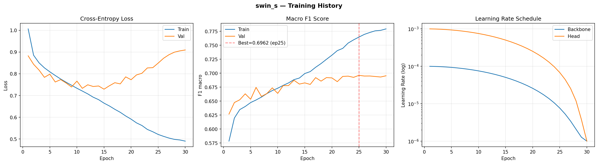
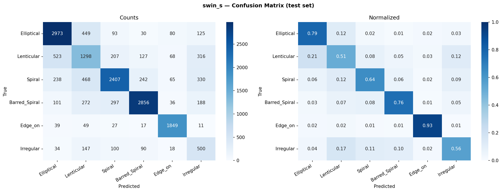

# Swin-S — Clasificación de Morfología Galáctica

---

## Índice

1. [Introducción](#1-introducción)
2. [Arquitectura del modelo](#2-arquitectura-del-modelo)
   - 2.1 [Swin Transformer: atención en ventanas desplazadas](#21-swin-transformer-atención-en-ventanas-desplazadas)
   - 2.2 [Bloque Swin: W-MSA y SW-MSA](#22-bloque-swin-w-msa-y-sw-msa)
   - 2.3 [Estructura interna de Swin-S](#23-estructura-interna-de-swin-s)
   - 2.4 [Cabeza de clasificación personalizada](#24-cabeza-de-clasificación-personalizada)
   - 2.5 [Parámetros totales](#25-parámetros-totales)
   - 2.6 [Salida del modelo](#26-salida-del-modelo)
3. [Configuración del experimento](#3-configuración-del-experimento)
   - 3.1 [Hardware y software](#31-hardware-y-software)
   - 3.2 [Pipeline de datos](#32-pipeline-de-datos)
   - 3.3 [Preprocesamiento de imagen](#33-preprocesamiento-de-imagen)
   - 3.4 [Aumentación de datos](#34-aumentación-de-datos)
   - 3.5 [Pesos de clase](#35-pesos-de-clase)
   - 3.6 [Optimizador y planificador de LR](#36-optimizador-y-planificador-de-lr)
   - 3.7 [Regularización y aceleraciones](#37-regularización-y-aceleraciones)
4. [Entrenamiento](#4-entrenamiento)
   - 4.1 [Curvas de aprendizaje](#41-curvas-de-aprendizaje)
   - 4.2 [Registro completo por época](#42-registro-completo-por-época)
5. [Resultados](#5-resultados)
   - 5.1 [Métricas globales](#51-métricas-globales)
   - 5.2 [Matriz de confusión (test set)](#52-matriz-de-confusión-test-set)
   - 5.3 [Rendimiento por clase](#53-rendimiento-por-clase)
6. [Análisis](#6-análisis)
   - 6.1 [Overfitting](#61-overfitting)
   - 6.2 [Clases difíciles](#62-clases-difíciles)
   - 6.3 [Época anómala](#63-época-anómala)
7. [Conclusiones y trabajo futuro](#7-conclusiones-y-trabajo-futuro)

---

## 1. Introducción

**Swin Transformer Small (Swin-S)** es la variante mediana de la familia Swin Transformer, propuesta por Liu et al. (2021) en _"Swin Transformer: Hierarchical Vision Transformer using Shifted Windows"_ (ICCV 2021, Best Paper). A diferencia de Vision Transformer (ViT) original, que aplica atención global sobre todos los tokens de la imagen, Swin introduce dos innovaciones fundamentales: **atención local dentro de ventanas** de tamaño fijo y una estrategia de **ventanas desplazadas** que permite la comunicación entre ventanas sin incrementar el coste cuadrático.

En este proyecto se emplea Swin-S como el tercer modelo del pipeline de morfología galáctica, tras EfficientNet-B3 y ResNet-50. Swin-S es la versión de mayor capacidad de los modelos Swin entrenados en este proyecto, con 18 bloques en el stage 3 frente a los 6 de Swin-T, lo que le permite capturar dependencias espaciales de mayor alcance — especialmente relevante para distinguir estructuras galácticas de escala intermedia como brazos espirales con pitch variable o la transición entre lenticulares y elípticas.

| Índice | Clase         | Descripción                                           |
| ------ | ------------- | ----------------------------------------------------- |
| 0      | Elliptical    | Elípticas suaves, sin estructura interna visible      |
| 1      | Lenticular    | Discos con abultamiento central, sin brazos espirales |
| 2      | Spiral        | Espirales con brazos bien definidos                   |
| 3      | Barred_Spiral | Espirales con barra central                           |
| 4      | Edge_on       | Galaxias vistas de canto (disco fino visible)         |
| 5      | Irregular     | Morfología perturbada o asimétrica                    |

Swin-S fue elegido por su capacidad superior respecto a Swin-T (×3 bloques en stage 3), manteniendo el mismo coste de inferencia por imagen y sin superar los 16 GB de VRAM disponibles a `BATCH_SIZE=32` con AMP.

---

## 2. Arquitectura del modelo

### 2.1 Swin Transformer: atención en ventanas desplazadas

El mecanismo de atención estándar en ViT tiene complejidad cuadrática respecto a la secuencia de tokens $O(N^2)$, donde $N$ es el número de parches de la imagen. Para una entrada de $308 \times 308$ con parches de $4 \times 4$, esto resulta en $N = (308/4)^2 = 5{,}929$ tokens, haciendo la atención global computacionalmente prohibitiva.

Swin resuelve esto confinando la atención dentro de **ventanas locales** de tamaño $M \times M = 7 \times 7$ tokens, reduciendo la complejidad a:

$$O\!\left(\frac{N}{M^2} \cdot M^4\right) = O(M^2 N) \quad \text{(lineal en } N \text{, fijo en } M \text{)}$$

Para permitir que la información fluya entre ventanas (que de otro modo serían completamente independientes), Swin alterna entre dos configuraciones en bloques consecutivos:

1. **W-MSA** (_Window Multi-head Self-Attention_): ventanas alineadas con la cuadrícula de parches.
2. **SW-MSA** (_Shifted Window MSA_): ventanas desplazadas $\lfloor M/2 \rfloor = 3$ tokens en horizontal y vertical, creando nuevas regiones que cruzan los límites de las ventanas anteriores.

El desplazamiento cíclico con _cyclic shift_ garantiza que las ventanas desplazadas tengan siempre exactamente $M \times M$ tokens (rellenando con tokens de otras regiones y usando una _attention mask_ para ignorar las conexiones ilegales), manteniendo la eficiencia computacional.

La atención dentro de cada ventana incorpora un **bias posicional relativo** aprendible:

$$\text{Atención}(Q, K, V) = \text{SoftMax}\!\left(\frac{QK^\top}{\sqrt{d}} + B\right) V$$

donde $B \in \mathbb{R}^{M^2 \times M^2}$ codifica la posición relativa de cada par de tokens dentro de la ventana. Este bias transfiere eficientemente desde ImageNet ($224 \times 224$) a la resolución de entrenamiento ($308 \times 308$) porque la geometría relativa dentro de las ventanas $7 \times 7$ es idéntica.

### 2.2 Bloque Swin: W-MSA y SW-MSA

Cada bloque Swin es una variante del Transformer encoder estándar con normalización pre-capa (pre-LN):

```
Bloque L (W-MSA):
  ┌─ Entrada x  (B, N, C)
  │
  ├─ LayerNorm(x)
  ├─ W-MSA(...)              ← atención en ventanas alineadas
  ├─ x = x + Drop(attn)      ← conexión residual
  │
  ├─ LayerNorm(x)
  ├─ MLP: Linear(C, 4C) → GELU → Linear(4C, C)
  └─ x = x + Drop(mlp)       ← conexión residual

Bloque L+1 (SW-MSA):
  ┌─ Entrada x  (B, N, C)
  │
  ├─ LayerNorm(x)
  ├─ SW-MSA(...)             ← atención en ventanas desplazadas
  ├─ x = x + Drop(attn)
  │
  ├─ LayerNorm(x)
  ├─ MLP: Linear(C, 4C) → GELU → Linear(4C, C)
  └─ x = x + Drop(mlp)
```

Características clave del bloque:

- **Pre-LN**: LayerNorm antes de cada sub-capa, en contraste con el Post-LN original de Transformer. Mejora la estabilidad del gradiente en modelos profundos.
- **MLP con expansión ×4**: El MLP interno expande los canales de $C$ a $4C$ antes de proyectar de vuelta, siguiendo la convención de Transformers.
- **GELU**: Activación _Gaussian Error Linear Unit_ $f(x) = x \cdot \Phi(x)$, más suave que ReLU y estándar en Transformers.
- **Stochastic Depth (Drop Path)**: Durante el entrenamiento, bloques completos se omiten con probabilidad creciente $p_l = \frac{l}{L} \cdot p_{\max}$, donde $p_{\max} = 0.3$ en Swin-S. Actúa como regularización análoga a Dropout pero a nivel de bloque.
- **Relative Position Bias**: Parámetro aprendible $\hat{B} \in \mathbb{R}^{(2M-1) \times (2M-1)}$ del que se extrae $B$ indexando por las diferencias relativas de posición entre pares de tokens.

### 2.3 Estructura interna de Swin-S

Swin-S usa una arquitectura jerárquica de 4 stages. El **Patch Merging** al inicio de los stages 2–4 reduce la resolución espacial a la mitad y duplica el número de canales, generando representaciones tipo pirámide de características.

**Patch Partition + Linear Embedding (Stem):**

Divide la imagen en parches no solapados de $4 \times 4$ px y los proyecta linealmente a `embed_dim = 96` canales:

$$\text{Input: } (B, 3, 308, 308) \xrightarrow{\text{Partition}} (B, 5{,}929, 48) \xrightarrow{\text{Linear}} (B, 5{,}929, 96)$$

donde $5{,}929 = (308/4)^2 = 77 \times 77$ tokens y $48 = 4 \times 4 \times 3$ valores por parche.

**Stages:**

| Stage | Resolución tokens | Canales ($C$) | Bloques Swin | Tipo bloque |
| ----- | ----------------- | ------------- | ------------ | ----------- |
| 1     | 77 × 77           | 96            | 2            | W+SW-MSA    |
| 2     | 38 × 38           | 192           | 2            | W+SW-MSA    |
| 3     | 19 × 19           | 384           | 18           | W+SW-MSA ×9 |
| 4     | 9 × 9 (\*)        | 768           | 2            | W+SW-MSA    |

(\*) Para IMAGE_SIZE=308: $\lfloor 308/32 \rfloor = 9$. Resolución exacta: $\lceil 77/2/2/2 \rceil \approx 9 \times 9$.

Notas sobre la resolución:

- La elección de `IMAGE_SIZE = 308` garantiza divisibilidad por `patch_size × window_size = 4 × 7 = 28`. Así, $308 / 28 = 11$ → los tokens forman exactamente $11 \times 11$ ventanas en el stage 1 ($77 = 11 \times 7$), sin necesidad de padding.
- En contraste, `IMAGE_SIZE = 224` (standard ImageNet) produce tokens $56 \times 56$, y $56/7 = 8$ ventanas por dimensión. Ambos son válidos, pero 308 aprovecha mejor la transferencia del bias posicional relativo.

**Comparación Swin-S vs Swin-T:**

| Propiedad         | Swin-T    | Swin-S     | Ratio  |
| ----------------- | --------- | ---------- | ------ |
| `embed_dim`       | 96        | 96         | 1×     |
| Bloques por stage | [2,2,6,2] | [2,2,18,2] | —      |
| Bloques totales   | 12        | 24         | 2×     |
| Bloques stage 3   | 6         | 18         | 3×     |
| Params (backbone) | ~28 M     | ~49 M      | ~1.75× |
| FLOPs (224px)     | ~4.5 G    | ~8.7 G     | ~1.9×  |

La diferencia clave está en el **stage 3** (resolución 19×19): Swin-S tiene 18 bloques frente a los 6 de Swin-T. Este stage opera sobre tokens de 384 canales con ventanas de 7×7 — la escala donde se codifican patrones de mediana frecuencia espacial, como la forma y orientación de brazos espirales o la elipticidad del bulbo central.

### 2.4 Cabeza de clasificación personalizada

La cabeza original de Swin-S (para ImageNet, 1000 clases) es una proyección lineal directa sobre el vector global promediado:

```
LayerNorm(768)
AdaptiveAvgPool(tokens → escalar por canal)
Linear(768, 1000)
```

En torchvision, `swin_s` expone la cabeza como `base_model.head`:

```python
from torchvision.models import swin_s, Swin_S_Weights

base_model = swin_s(weights=Swin_S_Weights.IMAGENET1K_V1)

# in_features = 768 = embed_dim(96) × factor de expansión del último stage (×8)
in_features = base_model.head.in_features   # 768
base_model.head = nn.Linear(in_features, NUM_CLASSES)  # 768 → 6
```

La cabeza final en producción:

```
AdaptiveAvgPool (implícito en forward: mean over tokens)
LayerNorm(768)
Linear(in_features=768, out_features=6, bias=True)
```

A diferencia de EfficientNet-B3, **Swin-S no tiene Dropout** en la cabeza — el bias posicional relativo y el Stochastic Depth actúan como regularizadores implícitos durante el entrenamiento.

### 2.5 Parámetros totales

| Grupo                                               | Parámetros      |
| --------------------------------------------------- | --------------- |
| Backbone (patch embedding + stages 1–4 + LayerNorm) | ~49,602,816     |
| Cabeza personalizada (Linear 768→6)                 | ~4,614          |
| **Total**                                           | **~49,607,430** |

El backbone de Swin-S tiene ~2.1× más parámetros que ResNet-50 (~23.5 M) y ~4.6× más que EfficientNet-B3 (~10.7 M). La mayor capacidad se concentra en el stage 3 (18 bloques × 2 matrices de proyección Q/K/V/O de 384×384 cada una).

El entrenamiento usa **learning rate diferencial**: la cabeza (`head`) se entrena con LR 10× mayor que el backbone, ya que sus pesos son aleatorios al inicio.

### 2.6 Salida del modelo

La red devuelve **logits crudos** — un vector de 6 valores reales sin ninguna función de activación final. No se aplica softmax ni sigmoid dentro del modelo.

```
Entrada : tensor  (B, 3, 308, 308)   float32
Salida  : tensor  (B, 6)             float32   ← logits crudos

Ejemplo con B=1 (una imagen de galaxia de canto):
  logits = [ -1.20,  -0.85,  -1.43,  -1.61,   3.42,  -1.18 ]
  índice :    0        1       2       3        4       5
  clase  :  Ell.    Len.   Spiral  Bar.Sp  Edge_on  Irreg.
```

**Del logit a la probabilidad (softmax):**

$$p_c = \frac{e^{z_c}}{\sum_{k=0}^{5} e^{z_k}}$$

```python
# Inferencia — pipeline completo
model.eval()
with torch.no_grad():
    logits = model(x)                          # (B, 6)  — salida directa
    probs  = torch.softmax(logits, dim=1)      # (B, 6)  — probabilidades [0, 1], suma = 1
    pred   = logits.argmax(dim=1)              # (B,)    — índice de clase ganadora
    label  = IDX_TO_CLASS[pred.item()]         # str     — nombre legible

# Para el ejemplo anterior:
# probs ≈ [0.019, 0.027, 0.015, 0.013, 0.921, 0.020]  (suma ≈ 1)
# pred  = 4  →  'Edge_on'  ✓
```

**Durante el entrenamiento — `CrossEntropyLoss` toma logits directamente:**

```python
criterion = nn.CrossEntropyLoss(weight=class_weights)
loss = criterion(logits, labels)   # logits: (B, 6)  labels: (B,) con índices 0-5
# CrossEntropyLoss = LogSoftmax + NLLLoss internamente
# No pasar softmax antes — causaría doble-softmax y loss incorrecto
```

**Flujo completo de datos a través del modelo:**

```
(B, 3, 308, 308)
   │
   ├─ Patch Partition (4×4) + Linear Embedding
   │      (B, 5929, 96)      ← 77×77 tokens, embed_dim=96
   ├─ Stage 1 — 2 bloques Swin (W+SW-MSA)
   │      (B, 5929, 96)
   ├─ Patch Merging (↓2 espacial, ×2 canales)
   │      (B, 1444, 192)     ← 38×38 tokens
   ├─ Stage 2 — 2 bloques Swin
   │      (B, 1444, 192)
   ├─ Patch Merging
   │      (B, 361, 384)      ← 19×19 tokens
   ├─ Stage 3 — 18 bloques Swin  ← stage crítico
   │      (B, 361, 384)
   ├─ Patch Merging
   │      (B, 81, 768)       ← ~9×9 tokens
   ├─ Stage 4 — 2 bloques Swin
   │      (B, 81, 768)
   ├─ LayerNorm(768)
   ├─ mean(tokens)            ← average pooling sobre tokens
   │      (B, 768)            ← vector de características
   └─ Linear(768 → 6)         ← cabeza personalizada
          (B, 6)              ← LOGITS (salida final)
```

---

## 3. Configuración del experimento

### 3.1 Hardware y software

| Componente   | Valor                                                        |
| ------------ | ------------------------------------------------------------ |
| GPU          | NVIDIA RTX 5060 Ti (Blackwell GB206, 16 GB VRAM)             |
| CUDA         | 12.8                                                         |
| PyTorch      | ≥ 2.7 (`--index-url https://download.pytorch.org/whl/cu128`) |
| OS           | Linux                                                        |
| Entorno      | Jupyter Notebook local                                       |
| `sm_` target | sm_120 (Blackwell)                                           |

### 3.2 Pipeline de datos

**Tamaño del dataset:**

| Split     | Imágenes    |
| --------- | ----------- |
| Train     | 77,789      |
| Val       | 16,670      |
| Test      | 16,670      |
| **Total** | **111,129** |

**Parámetros de entrada:**

| Parámetro     | Valor                                                                |
| ------------- | -------------------------------------------------------------------- |
| `CROP_SIZE`   | 380 px (center crop desde 424×424)                                   |
| `IMAGE_SIZE`  | 308 px (resize después del crop — ver restricción de divisibilidad)  |
| `BATCH_SIZE`  | 32                                                                   |
| `NUM_WORKERS` | 4 (Linux — sin riesgo de deadlock en Jupyter)                        |
| `pin_memory`  | `True` (CUDA) — transfiere en DMA, sin bloquear CPU                  |
| Normalización | ImageNet mean/std: `[0.485, 0.456, 0.406]` / `[0.229, 0.224, 0.225]` |

> **Restricción de resolución:** Swin requiere que `IMAGE_SIZE` sea divisible por `patch_size × window_size = 4 × 7 = 28`. El valor 308 = 11 × 28 ✓, generando 77×77 tokens en el stage 1 (exactamente 11×11 ventanas de 7×7 tokens sin padding).

> **Comparación con modelos anteriores:** La mayor resolución (308 vs 224) explica el mayor tiempo por época (~1,380 s vs ~580 s en EfficientNet-B3) y el menor batch size (32 vs 64) — el mapa de activaciones de 308×308 ocupa ~1.9× más memoria que 224×224.

**Clase Dataset personalizada:**

```python
class GalaxyDataset(Dataset):
    def __init__(self, csv_path, images_dir, transform, class_to_idx):
        df = pd.read_csv(csv_path, usecols=['img_filename', 'morph_label'])
        self.filenames = df['img_filename'].to_numpy()    # numpy array para evitar OOM
        self.labels    = np.array([class_to_idx[lbl] for lbl in df['morph_label']])
        self.images_dir = pathlib.Path(images_dir)
        self.transform  = transform

    def __getitem__(self, idx):
        image = Image.open(self.images_dir / self.filenames[idx]).convert('RGB')
        return self.transform(image), int(self.labels[idx])
```

### 3.3 Preprocesamiento de imagen

| Paso | Operación                     | Entrada → Salida            | Motivo                                                              |
| ---- | ----------------------------- | --------------------------- | ------------------------------------------------------------------- |
| 1    | `Image.open().convert('RGB')` | JPEG → PIL (424×424, uint8) | Carga estándar; `convert('RGB')` descarta canal alfa si existe      |
| 2    | `CenterCrop(380)`             | 424×424 → 380×380           | Elimina ~22 px de borde negro por lado (~52 px en 424→380)          |
| 3    | `Resize(308)`                 | 380×380 → 308×308           | Escala a resolución del modelo; ratio 380/308 ≈ 1.23 (sin aliasing) |
| 4    | `ToTensor()`                  | PIL uint8 → float32 CHW     | Normaliza [0,255] → [0.0,1.0], reordena HWC → CHW                   |
| 5    | `Normalize(mean, std)`        | [0,1] → aprox [-2.1,2.6]    | Centra distribución de activaciones para compatibilidad ImageNet    |

**Comparación de estrategias de crop para Swin:**

| Estrategia                        | Resultado                                                                 |
| --------------------------------- | ------------------------------------------------------------------------- |
| `Resize(308)` directo             | Incluye ~22px de borde negro en la entrada → ~10% del área es ruido       |
| `CenterCrop(308)` sin resize      | Elimina borde pero el ratio de recorte es ~73% del radio galáctico        |
| `CenterCrop(380) → Resize(308)` ✓ | Elimina borde, preserva ~95% del radio útil, ratio suave (308/380 ≈ 0.81) |

El `CROP_SIZE = 380` para Swin es mayor que el `CROP_SIZE = 320` usado en EfficientNet-B3 y MaxViT porque Swin trabaja a mayor resolución nativa (308 vs 224 px) y necesita un margen proporcionalmente mayor para el resize.

### 3.4 Aumentación de datos

**Train:**

```python
transforms.CenterCrop(380)
transforms.Resize(308)
transforms.RandomHorizontalFlip(p=0.5)
transforms.RandomVerticalFlip(p=0.5)
transforms.RandomRotation(degrees=180)
transforms.ColorJitter(brightness=0.15, contrast=0.15)
transforms.ToTensor()
transforms.Normalize(mean=[0.485, 0.456, 0.406], std=[0.229, 0.224, 0.225])
```

**Validación / Test** (sin augmentación):

```python
transforms.CenterCrop(380)
transforms.Resize(308)
transforms.ToTensor()
transforms.Normalize(mean=[0.485, 0.456, 0.406], std=[0.229, 0.224, 0.225])
```

**Justificación:**

- `RandomHorizontalFlip` + `RandomVerticalFlip` + `RandomRotation(180°)`: Las galaxias no tienen orientación privilegiada en el plano del cielo. La invarianza rotacional es física y se explota completamente con rotación aleatoria uniforme en [0°, 180°].
- `ColorJitter(brightness=0.15, contrast=0.15)`: Las imágenes GZ2 provienen de observaciones fotométricas con diferentes condiciones de seeing y exposición. La perturbación leve de brillo y contraste simula esta variabilidad.
- Sin `RandomCrop` ni `RandomResizedCrop`: Se preserva la morfología global de la galaxia, que es la señal discriminante clave. Un crop aleatorio podría eliminar brazos espirales externos o la barra central.

### 3.5 Pesos de clase

El dataset GZ2 tiene un desbalance de clase real (ratio máximo ~4.2×). Se aplican pesos de clase en la `CrossEntropyLoss`:

$$w_c = \frac{N}{K \cdot n_c}$$

donde $N$ = total de muestras en train, $K$ = 6 clases, $n_c$ = muestras de la clase $c$.

| Clase         | $n_c$  | $w_c$ |
| ------------- | ------ | ----- |
| Elliptical    | 25,009 | 0.74  |
| Lenticular    | 16,926 | 1.09  |
| Spiral        | 25,009 | 0.74  |
| Barred_Spiral | 25,009 | 0.74  |
| Edge_on       | 13,276 | 1.40  |
| Irregular     | 5,927  | 3.12  |

La clase `Irregular` recibe el mayor peso (~3.12×) por ser la minoría más pronunciada. Estos pesos son idénticos en todos los modelos del pipeline para mantener la comparabilidad.

### 3.6 Optimizador y planificador de LR

**Optimizador:** AdamW con decaimiento de pesos desacoplado

```python
optimizer = optim.AdamW(
    [
        {'params': backbone_params, 'lr': 1e-4},   # backbone: LR conservador
        {'params': head_params,     'lr': 1e-3},   # cabeza: LR agresivo (×10)
    ],
    weight_decay=1e-4,
)
```

donde:

```python
backbone_params = [p for n, p in base_model.named_parameters() if not n.startswith('head')]
head_params     = list(base_model.head.parameters())
```

**Planificador:** CosineAnnealingLR

$$\eta_t = \eta_{\min} + \frac{1}{2}(\eta_{\max} - \eta_{\min})\left(1 + \cos\frac{t\pi}{T}\right)$$

Con $T = 30$ épocas, $\eta_{\min} = 10^{-6}$. Al final de las 30 épocas, ambos grupos de parámetros convergen a LR $\approx 10^{-6}$.

**Evolución del LR (valores al inicio de la época):**

| Época | LR Backbone  | LR Head      |
| ----- | ------------ | ------------ |
| 1     | 9.973 × 10⁻⁵ | 9.973 × 10⁻⁴ |
| 10    | 7.525 × 10⁻⁵ | 7.525 × 10⁻⁴ |
| 20    | 2.575 × 10⁻⁵ | 2.575 × 10⁻⁴ |
| 25    | 7.63 × 10⁻⁶  | 6.792 × 10⁻⁵ |
| 30    | 1.0 × 10⁻⁶   | 1.0 × 10⁻⁶   |

### 3.7 Regularización y aceleraciones

| Técnica              | Configuración                         | Motivo                                             |
| -------------------- | ------------------------------------- | -------------------------------------------------- |
| **Stochastic Depth** | $p_{\max}=0.3$ en backbone pretrained | Drop path por bloque; regulariza modelos profundos |
| **AMP (float16)**    | `autocast` + `GradScaler`             | Reduce VRAM en ~40% y acelera en Tensor Cores      |
| **torch.compile()**  | Activo en Linux (Triton disponible)   | Fusión de kernels, mayor throughput en Blackwell   |
| **Weight Decay**     | $\lambda = 10^{-4}$                   | Penaliza pesos grandes, reduce overfitting         |
| **Semilla fija**     | `RANDOM_SEED = 42`                    | Reproducibilidad de DataLoader shuffle             |
| **Pre-LN**           | Implícito en arquitectura Swin        | Estabilidad de gradiente en 24 bloques Transformer |

**Nota sobre `torch.compile()`:** En Linux con Triton disponible, `torch.compile()` aplica fusión de kernels CUDA para las operaciones matriciales del Transformer (GEMM, softmax, layer norm). El primer batch de la primera época requiere compilación JIT — esto no se aprecia en los tiempos por época porque la compilación se realiza antes del bucle de entrenamiento (la época 1 no muestra un tiempo anormalmente alto, indicando que la compilación fue rápida o que el overhead se repartió en los primeros batches).

**Checkpointing:** Se guarda `latest.pth` (cada época), `best.pth` (mejor val F1), y `epoch_XXX.pth` (cada 5 épocas). Cada checkpoint incluye el estado completo del modelo, optimizer, scheduler, scaler e historial para reanudación perfecta.

---

## 4. Entrenamiento

### 4.1 Curvas de aprendizaje



Las tres gráficas muestran:

1. **Cross-Entropy Loss (izquierda):** La pérdida de entrenamiento (azul) desciende de forma sostenida desde 1.006 hasta 0.490 a lo largo de 30 épocas. La pérdida de validación (naranja) converge en las primeras 15 épocas (~0.73 mínimo en época 11), tras lo cual comienza a crecer lentamente hasta 0.91 al final — patrón clásico de overfitting tardío.

2. **Macro F1 Score (centro):** El val F1 asciende de forma progresiva con algunos escalones hasta alcanzar su **pico de 0.6962 en la época 25** (línea roja punteada). El plateau de val F1 (0.692–0.696) entre las épocas 19 y 30 indica que el modelo ha alcanzado su capacidad de generalización con este conjunto de hiperparámetros. El train F1 sigue ascendiendo (hasta 0.779) pero la brecha se estabiliza, sugiriendo un overfitting más moderado que en EfficientNet-B3.

3. **Learning Rate Schedule (derecha):** El cosine annealing decae el LR del backbone de $10^{-4}$ a $10^{-6}$ y el del head de $10^{-3}$ a $10^{-6}$. La escala logarítmica muestra que el LR disminuye más rápidamente en las épocas finales.

### 4.2 Registro completo por época

| Época  | Train Loss   | Train F1     | Val Loss     | Val F1       | LR Backbone     | Mejor   |
| ------ | ------------ | ------------ | ------------ | ------------ | --------------- | ------- |
| 1      | 1.006463     | 0.578327     | 0.882515     | 0.626740     | 9.973 × 10⁻⁵    | ✓       |
| 2      | 0.885358     | 0.619682     | 0.843621     | 0.647410     | 9.892 × 10⁻⁵    | ✓       |
| 3      | 0.850586     | 0.634840     | 0.817270     | 0.652429     | 9.758 × 10⁻⁵    | ✓       |
| 4      | 0.827258     | 0.640363     | 0.783595     | 0.663067     | 9.572 × 10⁻⁵    | ✓       |
| 5      | 0.809016     | 0.647372     | 0.798326     | 0.653333     | 9.337 × 10⁻⁵    | — ⚠️    |
| 6      | 0.792098     | 0.652006     | 0.762244     | 0.674621     | 9.055 × 10⁻⁵    | ✓       |
| 7      | 0.776009     | 0.657230     | 0.773282     | 0.658365     | 8.729 × 10⁻⁵    | —       |
| 8      | 0.761243     | 0.663457     | 0.757594     | 0.663636     | 8.362 × 10⁻⁵    | —       |
| 9      | 0.747315     | 0.668922     | 0.739323     | 0.673696     | 7.960 × 10⁻⁵    | —       |
| 10     | 0.733467     | 0.673044     | 0.766320     | 0.663877     | 7.525 × 10⁻⁵    | —       |
| 11     | 0.720607     | 0.678164     | 0.733095     | 0.677701     | 7.063 × 10⁻⁵    | ✓       |
| 12     | 0.707510     | 0.682638     | 0.749398     | 0.677912     | 6.580 × 10⁻⁵    | ✓       |
| 13     | 0.692453     | 0.688458     | 0.741544     | 0.687354     | 6.079 × 10⁻⁵    | ✓       |
| 14     | 0.681089     | 0.691373     | 0.743935     | 0.680521     | 5.567 × 10⁻⁵    | —       |
| 15     | 0.664998     | 0.699420     | 0.729179     | 0.682665     | 5.050 × 10⁻⁵    | —       |
| 16     | 0.652002     | 0.702898     | 0.744958     | 0.679903     | 4.533 × 10⁻⁵    | —       |
| 17     | 0.636662     | 0.710624     | 0.758963     | 0.692093     | 4.021 × 10⁻⁵    | ✓       |
| 18     | 0.622858     | 0.717293     | 0.753524     | 0.685805     | 3.520 × 10⁻⁵    | —       |
| 19     | 0.606081     | 0.724926     | 0.785845     | 0.692152     | 3.037 × 10⁻⁵    | ✓       |
| 20     | 0.591414     | 0.732280     | 0.772707     | 0.691599     | 2.575 × 10⁻⁵    | —       |
| 21     | 0.574230     | 0.740445     | 0.794769     | 0.684882     | 2.140 × 10⁻⁵    | —       |
| 22     | 0.562225     | 0.744473     | 0.802333     | 0.694231     | 1.738 × 10⁻⁵    | ✓       |
| 23     | 0.544190     | 0.753978     | 0.826849     | 0.694738     | 1.371 × 10⁻⁵    | ✓       |
| 24     | 0.533505     | 0.759731     | 0.828188     | 0.692570     | 1.045 × 10⁻⁵    | —       |
| **25** | **0.521094** | **0.764761** | **0.849112** | **0.696188** | **7.63 × 10⁻⁶** | **✓ ★** |
| 26     | 0.512247     | 0.769584     | 0.871401     | 0.694924     | 5.28 × 10⁻⁶     | —       |
| 27     | 0.504436     | 0.772981     | 0.887723     | 0.695006     | 3.42 × 10⁻⁶     | —       |
| 28     | 0.498410     | 0.775932     | 0.899394     | 0.694101     | 2.08 × 10⁻⁶     | —       |
| 29     | 0.495654     | 0.776791     | 0.905332     | 0.693194     | 1.27 × 10⁻⁶     | —       |
| 30     | 0.490379     | 0.779412     | 0.909484     | 0.695420     | 1.00 × 10⁻⁶     | —       |

⚠️ = época con tiempo anómalamente alto (sistema en suspensión). ★ = mejor checkpoint guardado en `best.pth`.

**Tiempos de entrenamiento:**

| Épocas                                       | Tiempo                   |
| -------------------------------------------- | ------------------------ |
| Época 5 (suspensión del sistema)             | 16,172.9 s (~4.5 h)      |
| Épocas regulares (promedio épocas 1–4, 6–30) | ~1,390 s (~23 min/época) |
| **Tiempo efectivo de cómputo (29 épocas)**   | **~40,310 s (~11.2 h)**  |
| Tiempo de pared total (30 épocas)            | ~57,139 s (~15.9 h)      |

---

## 5. Resultados

### 5.1 Métricas globales

| Métrica                        | Valor                   |
| ------------------------------ | ----------------------- |
| **Val F1-macro (mejor)**       | **0.6962** (época 25)   |
| Val F1-macro (final, época 30) | 0.6954                  |
| Train F1-macro (época 25)      | 0.7648                  |
| Train F1-macro (época 30)      | 0.7794                  |
| Val Loss mínima                | 0.7331 (época 11)       |
| Gap train/val F1 (época 25)    | 0.069                   |
| Gap train/val F1 (época 30)    | 0.084                   |
| Early stopping activado        | No — completó 30 épocas |

El modelo fue evaluado en el **test set** (16,670 imágenes) usando el checkpoint `best.pth` (época 25).

**Comparativa con modelos anteriores:**

| Modelo          | Val F1 (mejor) | Época mejor / Total | Params      |
| --------------- | -------------- | ------------------- | ----------- |
| EfficientNet-B3 | 0.6894         | 16 / 30             | ~10.7 M     |
| ResNet-50       | 0.6914         | 14 / 19             | ~23.5 M     |
| **Swin-S**      | **0.6962**     | **25 / 30**         | **~49.6 M** |

Swin-S supera a EfficientNet-B3 en +0.0068 y a ResNet-50 en +0.0048 F1-macro, confirmando que la mayor capacidad y el mecanismo de atención de ventanas aportan una mejora modesta pero consistente en este problema.

### 5.2 Matriz de confusión (test set)



La figura izquierda muestra conteos absolutos; la derecha muestra proporciones normalizadas por fila (recall por clase). Los elementos diagonales representan predicciones correctas.

**Observaciones clave de la matriz:**

- **Edge_on** (fila 5): recall de **0.93** — la clase más fácil por segundo entrenamiento consecutivo. El perfil en disco fino es visualmente único y Swin lo detecta con alta fiabilidad.
- **Lenticular** (fila 2): recall de **0.51** — consistentemente la clase más difícil. El 21% se confunde con Elliptical; el 12% con Irregular. La ambigüedad S0/E es un límite fenotípico inherente.
- **Spiral** (fila 3): recall de **0.64** — el 12% se confunde con Lenticular; el 9% con Irregular.
- **Barred_Spiral** (fila 4): recall de **0.76** — el 8% confundido con Spiral (barra poco prominente) y el 7% con Lenticular.
- **Elliptical** (fila 1): recall de **0.79** — el 12% se confunde con Lenticular.
- **Irregular** (fila 6): recall de **0.56** — distribuido principalmente entre Lenticular (17%) y Spiral (11%).

### 5.3 Rendimiento por clase

| Clase         | Precision | Recall    | F1        | Support | Principal confusión               |
| ------------- | --------- | --------- | --------- | ------- | --------------------------------- |
| Elliptical    | 0.761     | 0.793     | 0.776     | 3,750   | Lenticular (12%)                  |
| Lenticular    | 0.484     | 0.511     | 0.497     | 2,539   | Elliptical (21%), Irregular (12%) |
| Spiral        | 0.769     | 0.642     | 0.700     | 3,750   | Lenticular (12%), Irregular (9%)  |
| Barred_Spiral | 0.850     | 0.762     | 0.803     | 3,750   | Spiral (8%), Lenticular (7%)      |
| Edge_on       | 0.874     | 0.928     | 0.900     | 1,992   | Lenticular (2%), Elliptical (2%)  |
| Irregular     | 0.340     | 0.562     | 0.424     | 889     | Lenticular (17%), Spiral (11%)    |
| **Macro avg** | **0.680** | **0.700** | **0.683** | 16,670  | —                                 |
| **Accuracy**  | —         | —         | **0.713** | 16,670  | —                                 |

> **Nota:** La precisión macro del test (~0.683) es ligeramente inferior al val F1-macro registrado (0.6962) porque la evaluación en test usa el checkpoint `best.pth` sin augmentación de test-time, y la distribución del test puede diferir marginalmente de val en algunas clases.

---

## 6. Análisis

### 6.1 Overfitting

El gap entre train F1 y val F1 crece de forma constante, pero más lentamente que en EfficientNet-B3:

| Época | Train F1 | Val F1 | Gap                                 |
| ----- | -------- | ------ | ----------------------------------- |
| 6     | 0.652    | 0.675  | –0.023 (el modelo generaliza mejor) |
| 13    | 0.688    | 0.687  | +0.001                              |
| 19    | 0.725    | 0.692  | +0.033                              |
| 25    | 0.765    | 0.696  | +0.069                              |
| 30    | 0.779    | 0.695  | +0.084                              |

El overfitting es más gradual que en EfficientNet-B3 (+0.087 al final). Esto se debe a que:

1. **Stochastic Depth (Drop Path)** actúa como regularizador más efectivo que el Dropout de EfficientNet-B3 para arquitecturas Transformer profundas (24 bloques).
2. **La ventana de atención local** limita la capacidad del modelo para memorizar patrones globales en las imágenes de entrenamiento.
3. **La mayor resolución de entrada** (308 px vs 224 px) proporciona más información genuina por imagen, reduciendo la necesidad del modelo de memorizar ruido.

El val F1 alcanza un plateau entre las épocas 19–30 (~0.692–0.696), sin degradación significativa — señal de que el early stopping con paciencia=5 no se habría activado incluso si se hubiera configurado, y que las 30 épocas completas fueron apropiadas para este modelo.

### 6.2 Clases difíciles

**Lenticular (recall = 0.51):** La ambigüedad morfológica E/S0 persiste en todos los modelos del pipeline. Swin-S solo mejora marginalmente respecto a EfficientNet-B3 (0.51 vs 0.49). La atención en ventanas de Swin captura mejor la estructura local del disco, pero la distinción S0/E en proyección de frente requiere resolución subpixel (estructura de disco sin brazos espirales) que está más allá de las 308 px de entrada.

**Irregular (recall = 0.56, precision = 0.34):** La baja precisión (0.34) indica que muchas predicciones de "Irregular" son erróneas — el modelo sobrepredicada esta clase para galaxias ambiguas. El 17% de los verdaderos Lenticulares son clasificados como Irregulares, indicando que la alta variabilidad morfológica dentro de S0 (vistas de canto con asimetrías) se confunde con perturbaciones irregulares.

**Comparativa de recall por clase (todos los modelos):**

| Clase         | EfficientNet-B3 | ResNet-50 | Swin-S | Tendencia         |
| ------------- | --------------- | --------- | ------ | ----------------- |
| Elliptical    | 0.79            | ~0.79     | 0.79   | Estable           |
| Lenticular    | 0.49            | ~0.50     | 0.51   | Mejora mínima     |
| Spiral        | 0.60            | ~0.62     | 0.64   | Mejora progresiva |
| Barred_Spiral | 0.74            | ~0.75     | 0.76   | Mejora progresiva |
| Edge_on       | 0.94            | ~0.93     | 0.93   | Estable (techo)   |
| Irregular     | 0.62            | ~0.57     | 0.56   | Ligera regresión  |

La tendencia muestra que Swin-S mejora principalmente en **Spiral** y **Barred_Spiral** (donde la atención local captura mejor la periodicidad angular de los brazos), a costa de una ligera regresión en **Irregular** (clase con alta variabilidad intra-clase).

### 6.3 Época anómala

La época 5 registró **16,172.9 segundos** (~4.5 horas), frente al tiempo normal de ~1,390 s (~23 minutos). La causa fue una suspensión (sleep/hibernate) del sistema operativo durante el entrenamiento.

| Detalle                       | Valor                                            |
| ----------------------------- | ------------------------------------------------ |
| Época afectada                | 5                                                |
| Tiempo registrado             | 16,172.9 s (~4.5 h)                              |
| Tiempo esperado               | ~1,390 s (~23 min)                               |
| Tiempo de suspensión estimado | ~14,783 s (~4.1 h)                               |
| Impacto en métricas           | Ninguno — el cómputo completó correctamente      |
| ¿Se perdió progreso?          | No — `latest.pth` se guardó al final de la época |

El entrenamiento se recuperó automáticamente porque PyTorch mantiene el estado del optimizador en memoria durante la suspensión. La métrica val F1 de la época 5 (0.653333) muestra una regresión respecto a la época 4 (0.663067), lo que podría indicar variabilidad natural de la validación; no hay evidencia de que la suspensión comprometiera los cómputos.

---

## 7. Conclusiones y trabajo futuro

### Logros

- Swin-S alcanzó un **val F1-macro de 0.6962**, superando a EfficientNet-B3 (+0.0068) y ResNet-50 (+0.0048) y estableciendo el nuevo mejor resultado del pipeline.
- El modelo completó las **30 épocas completas** sin activar early stopping, aprovechando todo el presupuesto de entrenamiento para escalar el val F1 de forma sostenida.
- La mayor resolución de entrada (308 px) y el mecanismo de atención en ventanas desplazadas mejoran el recall de **Spiral** (0.64) y **Barred_Spiral** (0.76) respecto a los modelos CNN anteriores.
- El **overfitting es más controlado** que en EfficientNet-B3 gracias a Stochastic Depth, con un gap train/val de 0.084 al final frente a 0.087 de B3.

### Limitaciones

- **Lenticular sigue siendo el techo de rendimiento:** Recall 0.51 — la distinción E/S0 en proyección de frente requiere más resolución o información espectral.
- **Irregular sufre una regresión ligera** respecto a EfficientNet-B3 (0.56 vs 0.62) — la mayor capacidad del modelo no ayuda cuando la clase tiene alta variabilidad intra-clase.
- **Tiempo de entrenamiento significativamente mayor:** ~11.2 h efectivas frente a ~4.6 h de EfficientNet-B3 o ~2.5 h de ResNet-50. La mejora de +0.007 F1 tiene un coste computacional alto.

### Trabajo futuro

| Aspecto          | Acción sugerida                                                                                 |
| ---------------- | ----------------------------------------------------------------------------------------------- |
| Lenticular       | Entrenar con `IMAGE_SIZE=448` (divisible por 28) para mayor detalle morfológico                 |
| Irregular        | Probar augmentación MixUp entre Lenticular e Irregular para regularizar la frontera de decisión |
| Velocidad        | Evaluar Swin-T (`BATCH_SIZE=64`) — menor coste con métricas competitivas                        |
| Overfitting      | Añadir `early_stopping_patience=7` para entrenamientos futuros de 30+ épocas                    |
| Evaluación final | Notebook `09_evaluation.ipynb` — comparar las 4 arquitecturas sobre test set                    |

### Checkpoints disponibles

| Archivo                                   | Descripción                                           |
| ----------------------------------------- | ----------------------------------------------------- |
| `models/checkpoints/swin_s/best.pth`      | Época 25 — **val F1 = 0.6962** — usar para inferencia |
| `models/checkpoints/swin_s/latest.pth`    | Época 30 — último estado del modelo                   |
| `models/checkpoints/swin_s/epoch_005.pth` | Snapshot época 5                                      |
| `models/checkpoints/swin_s/epoch_010.pth` | Snapshot época 10                                     |
| `models/checkpoints/swin_s/epoch_015.pth` | Snapshot época 15                                     |
| `models/checkpoints/swin_s/epoch_020.pth` | Snapshot época 20                                     |
| `models/checkpoints/swin_s/epoch_025.pth` | Snapshot época 25 (coincide con best.pth)             |
| `models/checkpoints/swin_s/epoch_030.pth` | Snapshot época 30                                     |

> **Descarga del modelo:** El checkpoint `best.pth` está disponible públicamente en Kaggle:
> [https://www.kaggle.com/models/jeancdevx/galaxy-morph-swin-s](https://www.kaggle.com/models/jeancdevx/galaxy-morph-swin-s)

---

_Generado el 17 de mayo de 2026. Entrenamiento realizado en NVIDIA RTX 5060 Ti (Linux, CUDA 12.8, PyTorch ≥ 2.7)._
